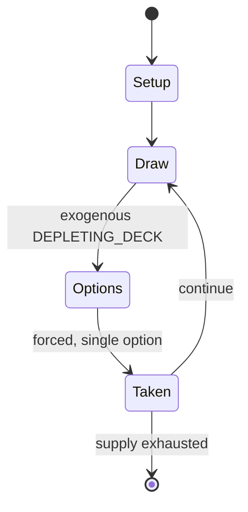

# Grobhäusern

`grobh_usern` &nbsp; state: **DEEPENED** &nbsp; method: **heuristic**

## Found layer (recorded, not trusted)

| field | value |
| --- | --- |
| wikidata | Q5609903 |
| wikipedia | Grobhäusern |
| genres (source) | -- |
| instance of (source) | -- |
| country of origin | -- |

## Declared layer (orders bench work)

| field | value |
| --- | --- |
| year created | -- |
| epoch | -- |
| region | -- |
| media | GAMBLING |
| players | -- |
| age band | -- |
| exogenous process | DEPLETING_DECK |
| loss shape | -- |
| live axes | - |
| horizon | -- |
| scoring shape | -- |
| information | -- |
| interaction | -- |
| turn structure | PHASE_STRUCTURED |
| tractability | EXACT_WITH_CUT |
| randomness | DECK_SHUFFLE |
| luck factor | 0.48 |
| rules complexity | 2.5 |
| strategic depth | 2.25 |
| novelty | 0.7699 |
| solved status | -- |
| strategies | spatial_packing |
| algorithms | -- |

## Object model

```
Episode
  players      : ?
  turn_structure: PHASE_STRUCTURED
  horizon       : ?
  scoring       : ?

State          -- opaque; no medium or axis evidence was found
Player         -- an agent that selects among legal successors
```

## State transition diagram



## Research item -- turn trace

```
# Grobhäusern -- simulated turn events
# generated from the DECLARED vector, not from a rulebook.
# structure: exo=DEPLETING_DECK loss=None horizon=None scoring=None axes=-

t=0    SETUP        players=2  pot=0  capacity=7
t=1    DRAW         p1 draw from deck -> outcome #5  (p=0.236)
t=2    FORCED       p1 single legal option taken (pot_gain=+1.6)
t=3    ENDTURN      turn passes to p2
t=4    DRAW         p2 draw from deck -> outcome #6  (p=0.053)
t=5    FORCED       p2 single legal option taken (pot_gain=+1.8)
t=6    DRAW         p2 draw from deck -> outcome #1  (p=0.047)
t=7    FORCED       p2 single legal option taken (pot_gain=+0.6)
t=8    DRAW         p2 draw from deck -> outcome #2  (p=0.281)
t=9    FORCED       p2 single legal option taken (pot_gain=+1.1)
t=10   DRAW         p2 draw from deck -> outcome #1  (p=0.205)
t=11   FORCED       p2 single legal option taken (pot_gain=+1.7)
t=12   DRAW         p2 draw from deck -> outcome #3  (p=0.055)
t=13   FORCED       p2 single legal option taken (pot_gain=+1.1)
t=14   ENDTURN      turn passes to p1
t=15   DRAW         p1 draw from deck -> outcome #5  (p=0.116)
t=16   FORCED       p1 single legal option taken (pot_gain=+0.6)
t=17   ENDTURN      turn passes to p2
t=18   DRAW         p2 draw from deck -> outcome #6  (p=0.164)
t=19   FORCED       p2 single legal option taken (pot_gain=+0.6)
t=20   ENDTURN      turn passes to p1
t=21   DRAW         p1 draw from deck -> outcome #6  (p=0.265)
t=22   FORCED       p1 single legal option taken (pot_gain=+0.9)
t=23   DRAW         p1 draw from deck -> outcome #4  (p=0.161)
t=24   FORCED       p1 single legal option taken (pot_gain=+0.6)
t=25   DRAW         p1 draw from deck -> outcome #1  (p=0.156)
t=26   FORCED       p1 single legal option taken (pot_gain=+1.6)

terminal: VARIABLE
```

## Conditions

| kind | threshold | effect | trigger |
| --- | --- | --- | --- |
| BOUNDARY | -- | -- | Calling means to increase one's bet to the maximum bet so far, and folding means leaving the game and forfeiting one's bet. |

## Source extract

Grobhäusern, also Grobhaus, is an historical German vying game in which players bet and then
compare their 4-card combinations. It is played by two to eight players using a 32-card piquet
pack. The game was illegal in most places. It was popular in rural Upper Saxony in the late 18th
century. A variant played in Danubian Austria-Hungary was Färbeln.   == History == Grobhäusern
is mentioned as early as 1749 as a "pleasant German game" alongside Rummel, Scherwentzeln and
Contra. But it was often viewed as a gambling game and consequently banned as, for example, in
1771 in a Duchy of Anhalt ordinance. Grobhäusern and Trischak are described as "similar to", but
nevertheless "different from" Scherwenzel by Adelung in 1780. As of the late 18th century,
Grobhäusern was played in rural Upper Saxony, and Scherwenzel was played in rural areas of
Germany, Poland, Silesia and Bohemia. The use of Jacks (and to a lesser extent 9s) as wildcards
in Scherwenzel may be related to the elevation of Jacks (and to a lesser extent 9s) to trumps in
various European card games. Adelung suggested that Scherwenzel is the origin of the designation
wenzel for Jacks as highest trumps.   == Rules == For the firs

<sub>Wikipedia, CC BY-SA. Retained as evidence for the structural
classification above. Every rule inferred from it is HYPOTHESIZED
until audited against a rulebook.</sub>
