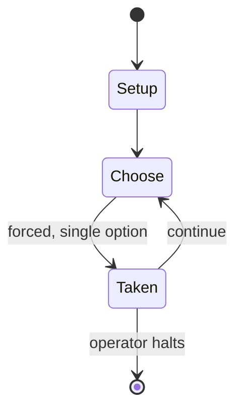

# GURPS Fantasy

*tabletop role-playing game setting*

`gurps_fantasy` &nbsp; state: **DEEPENED** &nbsp; method: **heuristic**

## Found layer (recorded, not trusted)

| field | value |
| --- | --- |
| wikidata | Q10287813 |
| wikipedia | GURPS Fantasy |
| genres (source) | tabletop role-playing game |
| instance of (source) | campaign setting, tabletop role-playing game |
| country of origin | United States |

## Declared layer (orders bench work)

| field | value |
| --- | --- |
| year created | 1986 |
| epoch | DIGITAL |
| region | NORTH_AMERICA |
| media | RPG |
| players | -- |
| age band | -- |
| exogenous process | -- |
| loss shape | -- |
| live axes | - |
| horizon | OPEN_ENDED |
| scoring shape | -- |
| information | -- |
| interaction | -- |
| turn structure | -- |
| tractability | SAMPLING_ONLY |
| randomness | -- |
| luck factor | 0.35 |
| rules complexity | 3.38 |
| strategic depth | 2.0 |
| novelty | 0.4677 |
| solved status | -- |
| strategies | -- |
| algorithms | -- |

## Object model

```
Episode
  players      : ?
  turn_structure: ?
  horizon       : OPEN_ENDED
  scoring       : ?

Character      -- persistent stat block owned by a player
GameMaster     -- adjudicating agent outside the scoring loop
Scenario       -- authored state the players traverse
```

## State transition diagram



## Research item -- turn trace

```
# GURPS Fantasy -- simulated turn events
# generated from the DECLARED vector, not from a rulebook.
# structure: exo=None loss=None horizon=OPEN_ENDED scoring=None axes=-

t=0    SETUP        players=2  pot=0  capacity=5
t=1    FORCED       p1 single legal option taken (pot_gain=+1.2)
t=2    FORCED       p1 single legal option taken (pot_gain=+1.3)
t=3    FORCED       p1 single legal option taken (pot_gain=+1.9)
t=4    FORCED       p1 single legal option taken (pot_gain=+0.7)
t=5    ENDTURN      turn passes to p2
t=6    FORCED       p2 single legal option taken (pot_gain=+0.7)
t=7    FORCED       p2 single legal option taken (pot_gain=+1.0)
t=8    ENDTURN      turn passes to p1
t=9    FORCED       p1 single legal option taken (pot_gain=+1.2)
t=10   FORCED       p1 single legal option taken (pot_gain=+1.8)
t=11   ENDTURN      turn passes to p2
t=12   FORCED       p2 single legal option taken (pot_gain=+1.2)
t=13   FORCED       p2 single legal option taken (pot_gain=+0.7)
t=14   FORCED       p2 single legal option taken (pot_gain=+1.4)
t=15   ENDTURN      turn passes to p1
t=16   FORCED       p1 single legal option taken (pot_gain=+0.5)
t=17   ENDTURN      turn passes to p2
t=18   FORCED       p2 single legal option taken (pot_gain=+1.4)
t=19   ENDTURN      turn passes to p1
t=20   FORCED       p1 single legal option taken (pot_gain=+1.6)
t=21   ENDTURN      turn passes to p2
t=22   FORCED       p2 single legal option taken (pot_gain=+1.5)
t=23   FORCED       p2 single legal option taken (pot_gain=+1.8)
t=24   FORCED       p2 single legal option taken (pot_gain=+0.9)
t=25   FORCED       p2 single legal option taken (pot_gain=+1.6)
t=26   FORCED       p2 single legal option taken (pot_gain=+1.7)

terminal: OPEN_ENDED
```

## Source extract

GURPS Fantasy is a fantasy genre sourcebook for the GURPS (Generic Universal Role-Playing
System), written by Steve Jackson, and first published by Steve Jackson Games in 1986. It
presents a magic system and background information for the fantasy campaign world of Yrth. A
second edition was published in 1990 as GURPS Fantasy: The Magical World of Yrth. The fourth
edition of GURPS separates the magic from the setting into the setting book GURPS Banestorm.
== Contents == The GURPS Basic Set (1986), contained no magic rules, and was supplemented by the
first edition of GURPS Fantasy in 1986. This contained a detailed magic system and the
background campaign world of Yrth. It also contained character creation, nonhuman races, magical
creatures, and monsters. The second edition of GURPS Fantasy separated out GURPS Magic. The
fantasy world of Yrth, was first introduced in Orcslayerin 1985, the only supplement for Steve
Jackson's Man to Man.  The second edition, GURPS Fantasy: The Magical World of Yrth, 1990,
second edition 1995, was based on the campaign-setting in the first edition of GURPS Fantasy.
The world of Yrth is described in much greater detail; the descriptions of the various

<sub>Wikipedia, CC BY-SA. Retained as evidence for the structural
classification above. Every rule inferred from it is HYPOTHESIZED
until audited against a rulebook.</sub>
