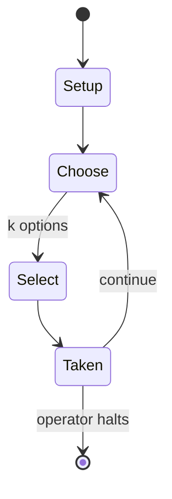

# GURPS Supers

*tabletop role-playing game*

`gurps_supers` &nbsp; state: **DEEPENED** &nbsp; method: **heuristic**

## Found layer (recorded, not trusted)

| field | value |
| --- | --- |
| wikidata | Q10293062 |
| wikipedia | GURPS Supers |
| genres (source) | tabletop role-playing game |
| instance of (source) | literary work, tabletop role-playing game |
| country of origin | United States |

## Declared layer (orders bench work)

| field | value |
| --- | --- |
| year created | 1989 |
| epoch | DIGITAL |
| region | NORTH_AMERICA |
| media | RPG |
| players | -- |
| age band | -- |
| exogenous process | -- |
| loss shape | -- |
| live axes | SELECT, TRADE |
| horizon | OPEN_ENDED |
| scoring shape | -- |
| information | -- |
| interaction | -- |
| turn structure | -- |
| tractability | SAMPLING_ONLY |
| randomness | -- |
| luck factor | 0.35 |
| rules complexity | 3.96 |
| strategic depth | 2.0 |
| novelty | 0.4787 |
| solved status | -- |
| strategies | -- |
| algorithms | -- |

## Object model

```
Episode
  players      : ?
  turn_structure: ?
  horizon       : OPEN_ENDED
  scoring       : ?

Character      -- persistent stat block owned by a player
GameMaster     -- adjudicating agent outside the scoring loop
Scenario       -- authored state the players traverse
OptionSet      -- the choices available after an exogenous draw
Offer          -- proposed exchange between two agents
```

## State transition diagram



## Research item -- turn trace

```
# GURPS Supers -- simulated turn events
# generated from the DECLARED vector, not from a rulebook.
# structure: exo=None loss=None horizon=OPEN_ENDED scoring=None axes=SELECT,TRADE

t=0    SETUP        players=2  pot=0  capacity=6
t=1    SELECT       p1 4 options; take #2  (pot_gain=+2.3, capacity=-2)
t=2    SELECT       p1 2 options; take #2  (pot_gain=+1.6, capacity=-1)
t=3    TRADE        p1 offers 2:1 exchange to p2
t=4    SELECT       p1 2 options; take #2  (pot_gain=+3.2, capacity=-2)
t=5    SELECT       p1 3 options; take #2  (pot_gain=+2.3, capacity=-1)
t=6    SELECT       p1 1 options; take #1  (pot_gain=+1.0, capacity=-2)
t=7    SELECT       p1 4 options; take #1  (pot_gain=+0.8, capacity=-0)
t=8    SELECT       p1 3 options; take #2  (pot_gain=+1.2, capacity=-1)
t=9    SELECT       p1 3 options; take #3  (pot_gain=+1.5, capacity=-2)
t=10   TRADE        p1 offers 2:1 exchange to p2
t=11   SELECT       p1 1 options; take #1  (pot_gain=+0.8, capacity=-0)
t=12   SELECT       p1 2 options; take #2  (pot_gain=+1.2, capacity=-0)
t=13   TRADE        p1 offers 2:1 exchange to p2
t=14   ENDTURN      turn passes to p2
t=15   SELECT       p2 2 options; take #1  (pot_gain=+3.4, capacity=-1)
t=16   SELECT       p2 4 options; take #4  (pot_gain=+3.4, capacity=-1)
t=17   TRADE        p2 offers 2:1 exchange to p1
t=18   SELECT       p2 1 options; take #1  (pot_gain=+1.2, capacity=-1)
t=19   TRADE        p2 offers 2:1 exchange to p1
t=20   SELECT       p2 3 options; take #1  (pot_gain=+0.8, capacity=-1)
t=21   SELECT       p2 2 options; take #2  (pot_gain=+3.3, capacity=-1)
t=22   TRADE        p2 offers 2:1 exchange to p1
t=23   ENDTURN      turn passes to p1
t=24   SELECT       p1 3 options; take #1  (pot_gain=+1.3, capacity=-0)
t=25   TRADE        p1 offers 2:1 exchange to p2
t=26   SELECT       p1 3 options; take #2  (pot_gain=+2.2, capacity=-2)

terminal: OPEN_ENDED
```

## Source extract

GURPS Supers is a superhero roleplaying game written by Loyd Blankenship and published by Steve
Jackson Games in 1989.   == Contents == GURPS Supers is a supplement of rules for comic-book
superhero characters and campaigns for GURPS. The first edition book includes new combat rules,
24 superpowers, bionic superlimbs, gadgets and equipment, and rules for creating new powers,
sample heroes and villains, and a briefly described campaign world. The second edition book is
revised and corrected. GURPS Supers deals with super-powered characters in a modern-day setting,
and contains all the necessary rules to create superheroes for the GURPS basic system. The book
also contains suggestions for running a superhero campaign, and a detailed background setting
with the UN controlling most superheroes.   == Setting == The official "house setting" for GURPS
Supers is the "IST World", described briefly in chapter 7 of GURPS Supers and later appearing in
its own full-length supplement, GURPS International Super Teams.   == System == GURPS Supers is
a supplement for the GURPS roleplaying game and uses that basic rule system. The supplement
offers additional rules and options for characters with su

<sub>Wikipedia, CC BY-SA. Retained as evidence for the structural
classification above. Every rule inferred from it is HYPOTHESIZED
until audited against a rulebook.</sub>
