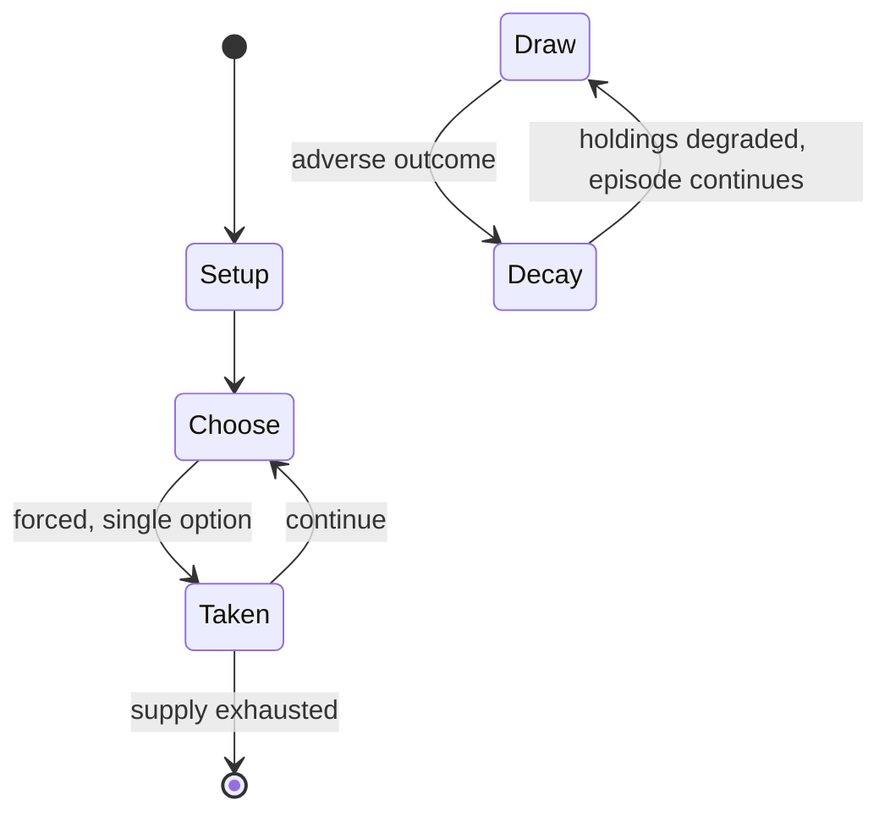

# Gutidara

*Bangladeshi traditional game*

`gutidara` &nbsp; state: **DEEPENED** &nbsp; method: **heuristic**

## Found layer (recorded, not trusted)

| field | value |
| --- | --- |
| wikidata | Q130501357 |
| wikipedia | Gutidara |
| genres (source) | -- |
| instance of (source) | traditional game |
| country of origin | Bangladesh |

## Declared layer (orders bench work)

| field | value |
| --- | --- |
| year created | -- |
| epoch | -- |
| region | SOUTH_ASIA |
| media | - |
| players | -- |
| age band | -- |
| exogenous process | -- |
| loss shape | PARTIAL_DECAY |
| live axes | TIMING |
| horizon | -- |
| scoring shape | -- |
| information | IMPERFECT |
| interaction | COMPETITIVE |
| turn structure | -- |
| tractability | SAMPLING_ONLY |
| randomness | -- |
| luck factor | 0.35 |
| rules complexity | 2.03 |
| strategic depth | 2.5 |
| novelty | 0.6101 |
| solved status | -- |
| strategies | deduction, tempo |
| algorithms | -- |

## Object model

```
Episode
  players      : ?
  turn_structure: ?
  horizon       : ?
  scoring       : ?

Initiative     -- who acts, and when, relative to others
```

## State transition diagram



## Research item -- turn trace

```
# Gutidara -- simulated turn events
# generated from the DECLARED vector, not from a rulebook.
# structure: exo=None loss=PARTIAL_DECAY horizon=None scoring=None axes=TIMING

t=0    SETUP        players=2  pot=0  capacity=4
t=1    FORCED       p1 single legal option taken (pot_gain=+0.7)
t=2    FORCED       p1 single legal option taken (pot_gain=+0.7)
t=3    ENDTURN      turn passes to p2
t=4    FORCED       p2 single legal option taken (pot_gain=+0.9)
t=5    ENDTURN      turn passes to p1
t=6    FORCED       p1 single legal option taken (pot_gain=+1.6)
t=7    FORCED       p1 single legal option taken (pot_gain=+1.6)
t=8    FORCED       p1 single legal option taken (pot_gain=+1.6)
t=9    FORCED       p1 single legal option taken (pot_gain=+1.4)
t=10   ENDTURN      turn passes to p2
t=11   FORCED       p2 single legal option taken (pot_gain=+0.6)
t=12   FORCED       p2 single legal option taken (pot_gain=+1.8)
t=13   FORCED       p2 single legal option taken (pot_gain=+1.7)
t=14   FORCED       p2 single legal option taken (pot_gain=+0.5)
t=15   FORCED       p2 single legal option taken (pot_gain=+1.9)
t=16   ENDTURN      turn passes to p1
t=17   FORCED       p1 single legal option taken (pot_gain=+0.5)
t=18   FORCED       p1 single legal option taken (pot_gain=+1.7)
t=19   FORCED       p1 single legal option taken (pot_gain=+1.0)
t=20   ENDTURN      turn passes to p2
t=21   FORCED       p2 single legal option taken (pot_gain=+0.5)
t=22   FORCED       p2 single legal option taken (pot_gain=+0.7)
t=23   FORCED       p2 single legal option taken (pot_gain=+1.1)
t=24   FORCED       p2 single legal option taken (pot_gain=+0.9)
t=25   FORCED       p2 single legal option taken (pot_gain=+1.9)
t=26   FORCED       p2 single legal option taken (pot_gain=+0.6)

terminal: VARIABLE
```

## Source extract

Gutidara (Bengali: গুটিদাড়া) is a traditional rural game in Bangladesh, played in the early
morning after the pre-winter harvest in the fields of most villages in Brahmanbaria District.
The two main tools of the game are a ball, locally known as a guti and made from water buffalo
horns, and a one-and-a-half-cubit-long stick made of bamboo. Pieces made from buffalo horns are
currently scarce, and so the game is often played with machine-made artificial pieces. Gutidara
is played by two teams with eleven players each. The boundaries are determined by the players.
For thirty minutes, each team tries to hit the guti out of bounds with a bamboo stick, while the
players of the opposite team try to catch the guti. Every catch deducts from the opponent's
points. If the opposing team fails to stop the guti before it crosses the boundaries of the
playing area, the hitting team earns points. The team with the most points at the end of the
game is declared the winner. Two referees officiate the game. A coin toss determines which team
is to start hitting guti first.   Though the game is not played in every part of Bangladesh, it
is considered a national tradition. Under the initiative of the l

<sub>Wikipedia, CC BY-SA. Retained as evidence for the structural
classification above. Every rule inferred from it is HYPOTHESIZED
until audited against a rulebook.</sub>
