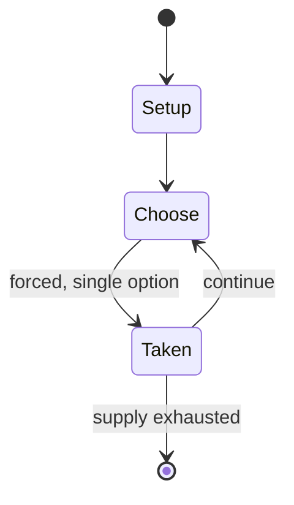

# Gwangsanghui

`gwangsanghui` &nbsp; state: **DEEPENED** &nbsp; method: **heuristic**

## Found layer (recorded, not trusted)

| field | value |
| --- | --- |
| wikidata | Q11064864 |
| wikipedia | Gwangsanghui |
| genres (source) | -- |
| instance of (source) | janggi variant |
| country of origin | -- |

## Declared layer (orders bench work)

| field | value |
| --- | --- |
| year created | -- |
| epoch | -- |
| region | -- |
| media | - |
| players | -- |
| age band | -- |
| exogenous process | -- |
| loss shape | -- |
| live axes | - |
| horizon | -- |
| scoring shape | -- |
| information | -- |
| interaction | -- |
| turn structure | -- |
| tractability | SAMPLING_ONLY |
| randomness | -- |
| luck factor | 0.35 |
| rules complexity | 1.66 |
| strategic depth | 2.0 |
| novelty | 0.0866 |
| solved status | -- |
| strategies | -- |
| algorithms | -- |

## Object model

```
Episode
  players      : ?
  turn_structure: ?
  horizon       : ?
  scoring       : ?

State          -- opaque; no medium or axis evidence was found
Player         -- an agent that selects among legal successors
```

## State transition diagram



## Research item -- turn trace

```
# Gwangsanghui -- simulated turn events
# generated from the DECLARED vector, not from a rulebook.
# structure: exo=None loss=None horizon=None scoring=None axes=-

t=0    SETUP        players=2  pot=0  capacity=5
t=1    FORCED       p1 single legal option taken (pot_gain=+1.7)
t=2    FORCED       p1 single legal option taken (pot_gain=+0.8)
t=3    ENDTURN      turn passes to p2
t=4    FORCED       p2 single legal option taken (pot_gain=+1.9)
t=5    FORCED       p2 single legal option taken (pot_gain=+0.9)
t=6    FORCED       p2 single legal option taken (pot_gain=+1.7)
t=7    FORCED       p2 single legal option taken (pot_gain=+1.5)
t=8    ENDTURN      turn passes to p1
t=9    FORCED       p1 single legal option taken (pot_gain=+0.6)
t=10   FORCED       p1 single legal option taken (pot_gain=+1.6)
t=11   FORCED       p1 single legal option taken (pot_gain=+1.7)
t=12   ENDTURN      turn passes to p2
t=13   FORCED       p2 single legal option taken (pot_gain=+1.2)
t=14   FORCED       p2 single legal option taken (pot_gain=+0.5)
t=15   FORCED       p2 single legal option taken (pot_gain=+1.8)
t=16   FORCED       p2 single legal option taken (pot_gain=+1.9)
t=17   ENDTURN      turn passes to p1
t=18   FORCED       p1 single legal option taken (pot_gain=+1.9)
t=19   ENDTURN      turn passes to p2
t=20   FORCED       p2 single legal option taken (pot_gain=+1.6)
t=21   FORCED       p2 single legal option taken (pot_gain=+1.5)
t=22   FORCED       p2 single legal option taken (pot_gain=+1.6)
t=23   FORCED       p2 single legal option taken (pot_gain=+1.3)
t=24   FORCED       p2 single legal option taken (pot_gain=+1.9)
t=25   FORCED       p2 single legal option taken (pot_gain=+1.7)
t=26   FORCED       p2 single legal option taken (pot_gain=+1.3)

terminal: VARIABLE
```

## Source extract

Many variants of janggi have been developed over the centuries. A few of these variants are
still regularly played, though none are nearly as popular as janggi itself.   == Gwangsanghui ==
Gwangsanghui (광상희; 廣象戱) is an 18th-century janggi variant. It was recorded in Noeyeonjip (뇌연집)
which was written by Nam Yuyong (남유용).   == Sanjangjanggi == Sanjangjanggi (산장장기; 三將象棋) is an
janggi variant with an unusual rule. In sanjangjanggi, the king can escape check only by
capturing the checking piece with the king in the next turn. Thus, double check is an automatic
loss for the side with the checked king since the king cannot capture both checking pieces in a
single move.   == Other variants == Dainyongjanggi (다인용장기) Kkomajanggi (꼬마장기) Dongtakjanggi
(동탁장기) Eopgijanggi (업기장기) Gungjanggi (궁장기) Tapjanggi (탑장기)   == See also == Shogi variant
Xiangqi variant Chess variant   == References ==   == External links == Gwangsanghui, Chris
Bogert (contains links to the primary source and the author's translation)

<sub>Wikipedia, CC BY-SA. Retained as evidence for the structural
classification above. Every rule inferred from it is HYPOTHESIZED
until audited against a rulebook.</sub>
