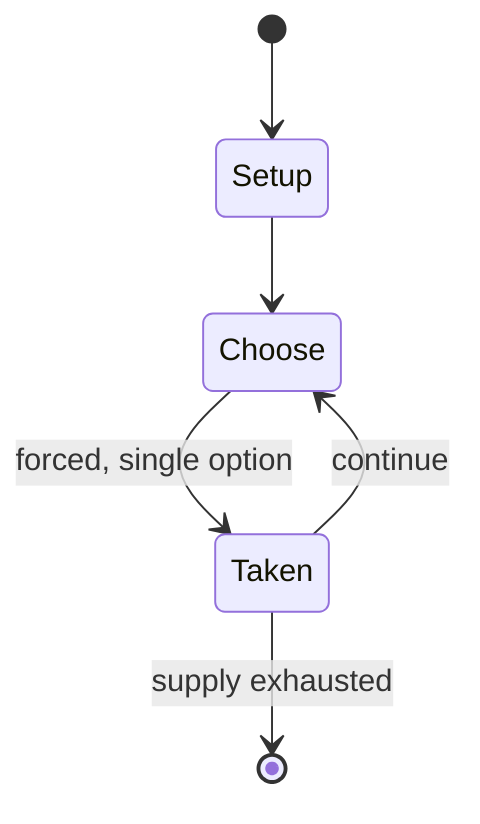

# Haggle

*game*

`haggle` &nbsp; state: **DEEPENED** &nbsp; method: **heuristic**

## Found layer (recorded, not trusted)

| field | value |
| --- | --- |
| wikidata | Q5638715 |
| wikipedia | Haggle (game) |
| genres (source) | -- |
| instance of (source) | party game |
| country of origin | -- |

## Declared layer (orders bench work)

| field | value |
| --- | --- |
| year created | -- |
| epoch | -- |
| region | -- |
| media | PARTY |
| players | -- |
| age band | -- |
| exogenous process | -- |
| loss shape | -- |
| live axes | TRADE |
| horizon | -- |
| scoring shape | SET_COLLECTION_CONVEX |
| information | -- |
| interaction | NEGOTIATION |
| turn structure | -- |
| tractability | INTRACTABLE |
| randomness | HIDDEN_INFO |
| luck factor | 0.35 |
| rules complexity | 2.55 |
| strategic depth | 2.25 |
| novelty | 0.9626 |
| solved status | -- |
| strategies | set_collection |
| algorithms | -- |

## Object model

```
Episode
  players      : ?
  turn_structure: ?
  horizon       : ?
  scoring       : SET_COLLECTION_CONVEX

Offer          -- proposed exchange between two agents
```

## State transition diagram



## Research item -- turn trace

```
# Haggle -- simulated turn events
# generated from the DECLARED vector, not from a rulebook.
# structure: exo=None loss=None horizon=None scoring=SET_COLLECTION_CONVEX axes=TRADE

t=0    SETUP        players=2  pot=0  capacity=6
t=1    FORCED       p1 single legal option taken (pot_gain=+1.2)
t=2    TRADE        p1 offers 2:1 exchange to p2
t=3    FORCED       p1 single legal option taken (pot_gain=+0.5)
t=4    FORCED       p1 single legal option taken (pot_gain=+1.5)
t=5    TRADE        p1 offers 2:1 exchange to p2
t=6    FORCED       p1 single legal option taken (pot_gain=+1.9)
t=7    TRADE        p1 offers 2:1 exchange to p2
t=8    FORCED       p1 single legal option taken (pot_gain=+1.7)
t=9    TRADE        p1 offers 2:1 exchange to p2
t=10   FORCED       p1 single legal option taken (pot_gain=+1.7)
t=11   TRADE        p1 offers 2:1 exchange to p2
t=12   FORCED       p1 single legal option taken (pot_gain=+1.0)
t=13   FORCED       p1 single legal option taken (pot_gain=+0.6)
t=14   FORCED       p1 single legal option taken (pot_gain=+0.7)
t=15   FORCED       p1 single legal option taken (pot_gain=+1.0)
t=16   ENDTURN      turn passes to p2
t=17   FORCED       p2 single legal option taken (pot_gain=+1.5)
t=18   FORCED       p2 single legal option taken (pot_gain=+1.3)
t=19   ENDTURN      turn passes to p1
t=20   FORCED       p1 single legal option taken (pot_gain=+1.2)
t=21   ENDTURN      turn passes to p2
t=22   FORCED       p2 single legal option taken (pot_gain=+1.5)
t=23   ENDTURN      turn passes to p1
t=24   FORCED       p1 single legal option taken (pot_gain=+1.7)
t=25   ENDTURN      turn passes to p2
t=26   FORCED       p2 single legal option taken (pot_gain=+1.8)
t=27   TRADE        p2 offers 2:1 exchange to p1
t=28   ENDTURN      turn passes to p1

terminal: VARIABLE
```

## Conditions

| kind | threshold | effect | trigger |
| --- | --- | --- | --- |
| PENALTY | 2 points | -- | (Typical rules might be "red cards are worth two points each" or "each yellow card doubles your final score".) |

## Source extract

Haggle is a party game designed by Sid Sackson and intended for a large number of players.  It
is rather complex and involved compared to many party games and, as a result, is often played
only at gatherings of people who are known to enjoy gaming at other times. At the start of the
game, each player receives a secret, random, collection of plain, colored cards plus one or more
slips, each one explaining one of the many valuation rules. These rules are made up by the game
organiser before the game is played, and are not told to the players. Instead, different players
will have different sets of knowledge about the rules. (Typical rules might be "red cards are
worth two points each" or "each yellow card doubles your final score".) The objective is for
each player to accumulate the highest scoring collection of cards that they can.  The players
are given a particular amount of time - anything from twenty minutes to the whole party - to mix
with each other.  Players may trade cards on any terms they choose.  They may also trade
information about the rules. Before the end of the game, each player is required to hand in
their final card collection in an envelope.  The referee, who knows

<sub>Wikipedia, CC BY-SA. Retained as evidence for the structural
classification above. Every rule inferred from it is HYPOTHESIZED
until audited against a rulebook.</sub>
