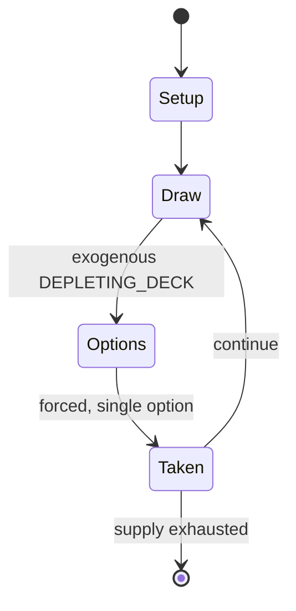

# Hahndreier

*danish-German card game*

`hahndreier` &nbsp; state: **DEEPENED** &nbsp; method: **heuristic**

## Found layer (recorded, not trusted)

| field | value |
| --- | --- |
| wikidata | Q123488429 |
| wikipedia | Hahndreier |
| genres (source) | -- |
| instance of (source) | card game |
| country of origin | Germany |

## Declared layer (orders bench work)

| field | value |
| --- | --- |
| year created | 1800 |
| epoch | INDUSTRIAL |
| region | EUROPE_WEST |
| media | CARD |
| players | -- |
| age band | -- |
| exogenous process | DEPLETING_DECK |
| loss shape | -- |
| live axes | BLUFF |
| horizon | -- |
| scoring shape | SET_COLLECTION_CONVEX |
| information | -- |
| interaction | COMPETITIVE |
| turn structure | -- |
| tractability | EXACT_WITH_CUT |
| randomness | DECK_SHUFFLE |
| luck factor | 0.48 |
| rules complexity | 2.46 |
| strategic depth | 3.0 |
| novelty | 0.6739 |
| solved status | -- |
| strategies | bluffing, memory_recall, set_collection, spatial_packing |
| algorithms | -- |

## Object model

```
Episode
  players      : ?
  turn_structure: ?
  horizon       : ?
  scoring       : SET_COLLECTION_CONVEX

Deck           -- ordered multiset, drawn without replacement
Hand           -- private multiset held by one player
DiscardPile    -- public accumulation of spent cards
Belief         -- what an observer is induced to think is true
```

## State transition diagram



## Research item -- turn trace

```
# Hahndreier -- simulated turn events
# generated from the DECLARED vector, not from a rulebook.
# structure: exo=DEPLETING_DECK loss=None horizon=None scoring=SET_COLLECTION_CONVEX axes=BLUFF

t=0    SETUP        players=2  pot=0  capacity=3
t=1    DRAW         p1 draw from deck -> outcome #1  (p=0.196)
t=2    FORCED       p1 single legal option taken (pot_gain=+1.4)
t=3    DRAW         p1 draw from deck -> outcome #3  (p=0.054)
t=4    FORCED       p1 single legal option taken (pot_gain=+1.4)
t=5    DRAW         p1 draw from deck -> outcome #5  (p=0.133)
t=6    FORCED       p1 single legal option taken (pot_gain=+1.3)
t=7    BLUFF        p1 represents a holding it does not have
t=8    DRAW         p1 draw from deck -> outcome #5  (p=0.203)
t=9    FORCED       p1 single legal option taken (pot_gain=+1.8)
t=10   DRAW         p1 draw from deck -> outcome #1  (p=0.067)
t=11   FORCED       p1 single legal option taken (pot_gain=+0.7)
t=12   DRAW         p1 draw from deck -> outcome #5  (p=0.031)
t=13   FORCED       p1 single legal option taken (pot_gain=+1.0)
t=14   BLUFF        p1 represents a holding it does not have
t=15   ENDTURN      turn passes to p2
t=16   DRAW         p2 draw from deck -> outcome #2  (p=0.138)
t=17   FORCED       p2 single legal option taken (pot_gain=+1.3)
t=18   DRAW         p2 draw from deck -> outcome #5  (p=0.090)
t=19   FORCED       p2 single legal option taken (pot_gain=+1.9)
t=20   BLUFF        p2 represents a holding it does not have
t=21   DRAW         p2 draw from deck -> outcome #1  (p=0.232)
t=22   FORCED       p2 single legal option taken (pot_gain=+0.8)
t=23   DRAW         p2 draw from deck -> outcome #6  (p=0.140)
t=24   FORCED       p2 single legal option taken (pot_gain=+1.7)
t=25   DRAW         p2 draw from deck -> outcome #4  (p=0.265)
t=26   FORCED       p2 single legal option taken (pot_gain=+1.9)
t=27   BLUFF        p2 represents a holding it does not have

terminal: VARIABLE
```

## Conditions

| kind | threshold | effect | trigger |
| --- | --- | --- | --- |
| WIN | -- | -- | The first player to shed all cards is the winner. |

## Source extract

Hahndreier or Hanrei is an 18th-century Danish and north German children's and family round game
played with cards that is still played in some forms today.   == Name == The game is recorded
under numerous different spellings in the literature including: Hahndrei, Hahndrei um’n lüchter,
Hahndreier um’n lüchter, Hahndreier, Hahndreih, Hahndreiher, Hahnendreher um Schluck, Hahnenrei,
Hahnrei, Hahnrei mit Naklapp, Hahnrei-Racker, Hahnrei un Racker, Hahnrei up'n Barg, Hahnrei
verdeckt, Hahnreier, Hohn, Hohnendreier um Sluk, Hohnendreier um een Schluch. Variants include
bedregn, bedregen or bedreegten Hahnrei, neIi Hahn, Nieschierei and verdeckten Hahnrei. Another
name is Racker.   == History == As Hahnrey, it appears in a list of games embedded in a poem by
Johann Christian Trömer in 1755. In 1795 it was clearly well known in Livonia and Estonia, being
equated by Hupel to the Russian game of Durak. In the 19th century, it was found all across
northern Germany. For example, on long winter evenings in the Holstein village of Hardebek
around 1800, it was one of the most popular card games alongside others such as Solo, Sixty-Six,
Brusbart, Black Peter and Hartenlena. In the 1840s it was o

<sub>Wikipedia, CC BY-SA. Retained as evidence for the structural
classification above. Every rule inferred from it is HYPOTHESIZED
until audited against a rulebook.</sub>
