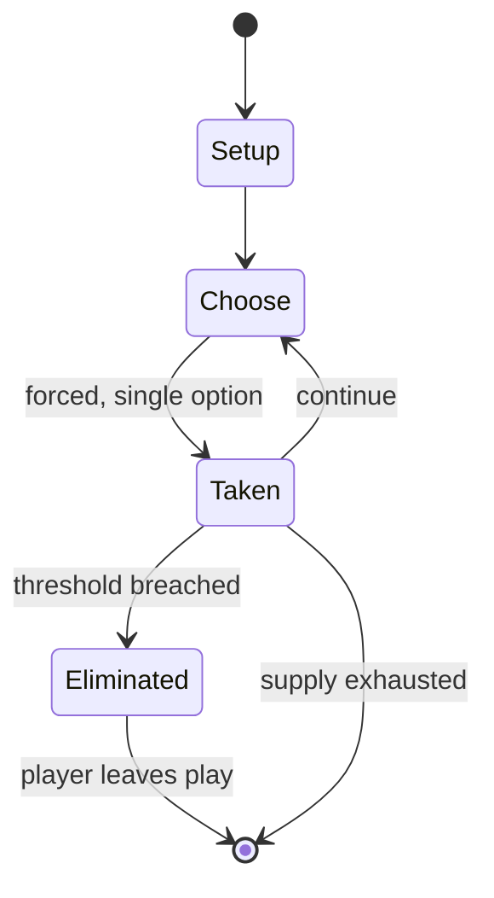

# Hanabi

*card game*

`hanabi` &nbsp; state: **DEEPENED** &nbsp; method: **heuristic**

## Found layer (recorded, not trusted)

| field | value |
| --- | --- |
| wikidata | Q13738509 |
| wikipedia | Hanabi (card game) |
| genres (source) | -- |
| instance of (source) | card game, cooperative game |
| country of origin | -- |

## Declared layer (orders bench work)

| field | value |
| --- | --- |
| year created | 2010 |
| epoch | CONTEMPORARY |
| region | -- |
| media | BOARD, CARD |
| players | 2-5 |
| age band | -- |
| exogenous process | NONE |
| loss shape | ELIMINATION |
| live axes | BLUFF, DISCARD |
| horizon | VARIABLE |
| scoring shape | SET_COLLECTION_CONVEX |
| information | IMPERFECT |
| interaction | COOPERATIVE |
| turn structure | -- |
| tractability | EXACT_WITH_CUT |
| randomness | NONE |
| luck factor | 0.02 |
| rules complexity | 2.68 |
| strategic depth | 3.05 |
| novelty | 0.929 |
| solved status | -- |
| strategies | bluffing, set_collection, signalling |
| algorithms | alpha_zero_self_play |

## Object model

```
Episode
  players      : 2-5
  turn_structure: ?
  horizon       : VARIABLE
  scoring       : SET_COLLECTION_CONVEX

Board          -- spatial substrate; cells carry position and occupancy
Piece          -- movable token owned by a player
Deck           -- ordered multiset, drawn without replacement
Hand           -- private multiset held by one player
DiscardPile    -- public accumulation of spent cards
Belief         -- what an observer is induced to think is true
DiscardChoice  -- what is given up to satisfy a limit
```

## State transition diagram



## Research item -- turn trace

```
# Hanabi -- simulated turn events
# generated from the DECLARED vector, not from a rulebook.
# structure: exo=NONE loss=ELIMINATION horizon=VARIABLE scoring=SET_COLLECTION_CONVEX axes=BLUFF,DISCARD

t=0    SETUP        players=2  pot=0  capacity=8
t=1    FORCED       p1 single legal option taken (pot_gain=+1.6)
t=2    BLUFF        p1 represents a holding it does not have
t=3    FORCED       p1 single legal option taken (pot_gain=+1.6)
t=4    FORCED       p1 single legal option taken (pot_gain=+0.8)
t=5    FORCED       p1 single legal option taken (pot_gain=+1.4)
t=6    DISCARD      p1 discards to hand limit
t=7    BLUFF        p1 represents a holding it does not have
t=8    FORCED       p1 single legal option taken (pot_gain=+1.5)
t=9    DISCARD      p1 discards to hand limit
t=10   BLUFF        p1 represents a holding it does not have
t=11   ENDTURN      turn passes to p2
t=12   FORCED       p2 single legal option taken (pot_gain=+1.2)
t=13   ENDTURN      turn passes to p1
t=14   FORCED       p1 single legal option taken (pot_gain=+1.0)
t=15   DISCARD      p1 discards to hand limit
t=16   BLUFF        p1 represents a holding it does not have
t=17   ENDTURN      turn passes to p2
t=18   FORCED       p2 single legal option taken (pot_gain=+1.9)
t=19   FORCED       p2 single legal option taken (pot_gain=+0.5)
t=20   ENDTURN      turn passes to p1
t=21   FORCED       p1 single legal option taken (pot_gain=+1.4)
t=22   FORCED       p1 single legal option taken (pot_gain=+1.3)
t=23   FORCED       p1 single legal option taken (pot_gain=+1.9)
t=24   FORCED       p1 single legal option taken (pot_gain=+0.5)
t=25   DISCARD      p1 discards to hand limit
t=26   FORCED       p1 single legal option taken (pot_gain=+0.5)

terminal: VARIABLE
```

## Conditions

| kind | threshold | effect | trigger |
| --- | --- | --- | --- |
| PENALTY | 2 cards | -- | Give information: The player points out the cards of either a given number or a given suit in the hand of another player (examples: "This card is your only red card," "These two cards are your only 3s"). |
| ELIMINATE | -- | out of the game | The discarded card is out of the game and can no longer be played. |
| TERMINATE | -- | -- | The game ends immediately when either all fuse tokens are used up, resulting in a game loss, or all 5s have been played successfully, leading to a game win. |

## Source extract

Hanabi (from Japanese 花火, fireworks) is a cooperative card game created by French game designer
Antoine Bauza and published in 2010. Players are aware of other players' cards but not their
own, and attempt to play a series of cards in a specific order to set off a simulated fireworks
show. The types of information that players may give to each other is limited, as is the total
amount of information that can be given during the game. In 2013, Hanabi won the Spiel des
Jahres, an industry award for best board game of the year.   == Gameplay == The Hanabi deck
contains cards in five suits (white, yellow, green, blue, and red): three 1s, two each of 2s,
3s, and 4s, and one 5. The game begins with 8 available information tokens and 3 fuse tokens. To
start the game, players are dealt a hand containing five cards (four for 4 or 5 players). As in
blind man's bluff, players can see each other's cards but they cannot see their own. Play
proceeds around the table; each turn, a player must take one of the following actions:  Give
information: The player points out the cards of either a given number or a given suit in the
hand of another player (examples: "This card is your only red card," "Thes

<sub>Wikipedia, CC BY-SA. Retained as evidence for the structural
classification above. Every rule inferred from it is HYPOTHESIZED
until audited against a rulebook.</sub>
