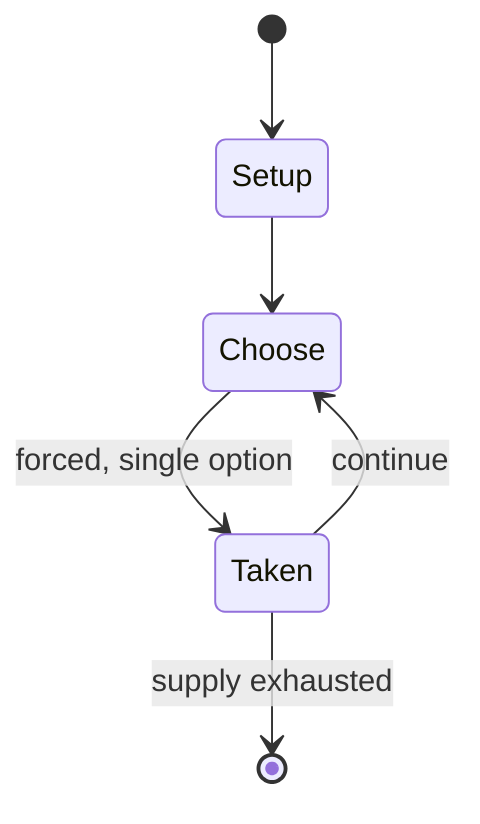

# hand and brain

*chess variant*

`hand_and_brain` &nbsp; state: **DEEPENED** &nbsp; method: **heuristic**

## Found layer (recorded, not trusted)

| field | value |
| --- | --- |
| wikidata | Q102541060 |
| wikipedia | Hand and brain |
| genres (source) | -- |
| instance of (source) | chess variant |
| country of origin | -- |

## Declared layer (orders bench work)

| field | value |
| --- | --- |
| year created | -- |
| epoch | -- |
| region | -- |
| media | - |
| players | -- |
| age band | -- |
| exogenous process | -- |
| loss shape | -- |
| live axes | - |
| horizon | -- |
| scoring shape | -- |
| information | -- |
| interaction | SOLITAIRE |
| turn structure | -- |
| tractability | SAMPLING_ONLY |
| randomness | -- |
| luck factor | 0.35 |
| rules complexity | 1.66 |
| strategic depth | 2.0 |
| novelty | 0.3945 |
| solved status | -- |
| strategies | -- |
| algorithms | -- |

## Object model

```
Episode
  players      : ?
  turn_structure: ?
  horizon       : ?
  scoring       : ?

State          -- opaque; no medium or axis evidence was found
Player         -- an agent that selects among legal successors
```

## State transition diagram



## Research item -- turn trace

```
# hand and brain -- simulated turn events
# generated from the DECLARED vector, not from a rulebook.
# structure: exo=None loss=None horizon=None scoring=None axes=-

t=0    SETUP        players=2  pot=0  capacity=3
t=1    FORCED       p1 single legal option taken (pot_gain=+0.8)
t=2    ENDTURN      turn passes to p2
t=3    FORCED       p2 single legal option taken (pot_gain=+1.3)
t=4    ENDTURN      turn passes to p1
t=5    FORCED       p1 single legal option taken (pot_gain=+1.8)
t=6    FORCED       p1 single legal option taken (pot_gain=+1.4)
t=7    FORCED       p1 single legal option taken (pot_gain=+1.8)
t=8    FORCED       p1 single legal option taken (pot_gain=+1.8)
t=9    FORCED       p1 single legal option taken (pot_gain=+1.6)
t=10   ENDTURN      turn passes to p2
t=11   FORCED       p2 single legal option taken (pot_gain=+1.6)
t=12   FORCED       p2 single legal option taken (pot_gain=+1.0)
t=13   FORCED       p2 single legal option taken (pot_gain=+1.2)
t=14   FORCED       p2 single legal option taken (pot_gain=+1.3)
t=15   ENDTURN      turn passes to p1
t=16   FORCED       p1 single legal option taken (pot_gain=+0.6)
t=17   FORCED       p1 single legal option taken (pot_gain=+1.5)
t=18   FORCED       p1 single legal option taken (pot_gain=+1.3)
t=19   ENDTURN      turn passes to p2
t=20   FORCED       p2 single legal option taken (pot_gain=+1.8)
t=21   ENDTURN      turn passes to p1
t=22   FORCED       p1 single legal option taken (pot_gain=+1.4)
t=23   FORCED       p1 single legal option taken (pot_gain=+1.9)
t=24   FORCED       p1 single legal option taken (pot_gain=+0.7)
t=25   ENDTURN      turn passes to p2
t=26   FORCED       p2 single legal option taken (pot_gain=+1.3)

terminal: VARIABLE
```

## Source extract

Hand and brain is a variant of chess. It is a multiplayer variant featuring team play with teams
featuring one "hand" and one "brain" player.   == Overview and rules == The "hand and brain"
multiplayer variant features pairs facing off; in each pair, one player is designated "hand" and
the other "brain". The game features limited communication, with the "brain" player only able to
call which piece to move. Aside from this, no other communication is permitted as the "hand"
player then chooses which square to move the piece. Time controls can also be implemented for
the variant. Chess.com wrote that "usually, but mainly for entertainment value, the stronger
player takes the brain role and the other one plays the hand."   == History and presence in
online streaming ==  Alexandra Kosteniuk blogged about the variant being played during the 2013
Reykjavík Chess Open. In 2016, English grandmaster Matthew Sadler wrote about playing the
variant with Natasha Regan during a 4NCL weekend. Due to the multiplayer nature of the variant,
it is often played by chess players on stream. The variant is also common in matches featuring
celebrities or figures popular outside of the chess world. Chess.co

<sub>Wikipedia, CC BY-SA. Retained as evidence for the structural
classification above. Every rule inferred from it is HYPOTHESIZED
until audited against a rulebook.</sub>
