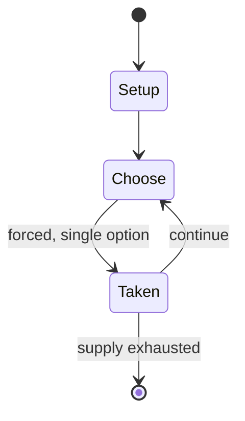

# Handgame

`handgame` &nbsp; state: **DEEPENED** &nbsp; method: **heuristic**

## Found layer (recorded, not trusted)

| field | value |
| --- | --- |
| wikidata | Q5647401 |
| wikipedia | Handgame |
| genres (source) | -- |
| instance of (source) | -- |
| country of origin | -- |

## Declared layer (orders bench work)

| field | value |
| --- | --- |
| year created | -- |
| epoch | -- |
| region | -- |
| media | GAMBLING |
| players | -- |
| age band | -- |
| exogenous process | -- |
| loss shape | -- |
| live axes | - |
| horizon | -- |
| scoring shape | -- |
| information | -- |
| interaction | -- |
| turn structure | -- |
| tractability | SAMPLING_ONLY |
| randomness | HIDDEN_INFO |
| luck factor | 0.35 |
| rules complexity | 1.82 |
| strategic depth | 2.0 |
| novelty | 0.0896 |
| solved status | -- |
| strategies | -- |
| algorithms | -- |

## Object model

```
Episode
  players      : ?
  turn_structure: ?
  horizon       : ?
  scoring       : ?

State          -- opaque; no medium or axis evidence was found
Player         -- an agent that selects among legal successors
```

## State transition diagram



## Research item -- turn trace

```
# Handgame -- simulated turn events
# generated from the DECLARED vector, not from a rulebook.
# structure: exo=None loss=None horizon=None scoring=None axes=-

t=0    SETUP        players=2  pot=0  capacity=8
t=1    FORCED       p1 single legal option taken (pot_gain=+1.0)
t=2    FORCED       p1 single legal option taken (pot_gain=+0.7)
t=3    FORCED       p1 single legal option taken (pot_gain=+1.6)
t=4    ENDTURN      turn passes to p2
t=5    FORCED       p2 single legal option taken (pot_gain=+2.0)
t=6    ENDTURN      turn passes to p1
t=7    FORCED       p1 single legal option taken (pot_gain=+1.5)
t=8    FORCED       p1 single legal option taken (pot_gain=+1.1)
t=9    ENDTURN      turn passes to p2
t=10   FORCED       p2 single legal option taken (pot_gain=+1.5)
t=11   FORCED       p2 single legal option taken (pot_gain=+1.8)
t=12   ENDTURN      turn passes to p1
t=13   FORCED       p1 single legal option taken (pot_gain=+0.8)
t=14   FORCED       p1 single legal option taken (pot_gain=+1.0)
t=15   FORCED       p1 single legal option taken (pot_gain=+1.4)
t=16   FORCED       p1 single legal option taken (pot_gain=+1.0)
t=17   FORCED       p1 single legal option taken (pot_gain=+1.6)
t=18   FORCED       p1 single legal option taken (pot_gain=+1.2)
t=19   FORCED       p1 single legal option taken (pot_gain=+1.7)
t=20   ENDTURN      turn passes to p2
t=21   FORCED       p2 single legal option taken (pot_gain=+0.6)
t=22   FORCED       p2 single legal option taken (pot_gain=+1.4)
t=23   FORCED       p2 single legal option taken (pot_gain=+0.9)
t=24   FORCED       p2 single legal option taken (pot_gain=+1.4)
t=25   ENDTURN      turn passes to p1
t=26   FORCED       p1 single legal option taken (pot_gain=+1.1)

terminal: VARIABLE
```

## Source extract

Handgame, also known as stickgame, is a Native American guessing game, in which marked "bones"
are concealed in the hands of one team while another team guesses their location.   == Gameplay
==  Any number of people can play the Hand Game, but each team (the "hiding" team and the
"guessing" team) must have one pointer on each side. The Hand Game is played with two pairs of
'bones', each pair consisting of one plain and one striped bone. ten sticks are used as counters
with some variations using additional count sticks such as extra stick or "kick Stick" won by
the starting team. The "raw" or "uncooked" counting sticks will be divided evenly between both
opposing teams. Different rules such as which bone will be guessed, the plain or striped bone,
is determined by the traditional format of the tribe or region  - the plain bone or the striped
bone. California, Oklahoma, and Dakota Indians generally call for the striped bone, where as
most other tribes prefer to guess for the plain bone. The two teams, one "hiding" and one
"guessing," sit opposite one another; two members of the "hiding" team take a pair of bones and
hide them, one in each hand, while the team sings, and uses traditio

<sub>Wikipedia, CC BY-SA. Retained as evidence for the structural
classification above. Every rule inferred from it is HYPOTHESIZED
until audited against a rulebook.</sub>
