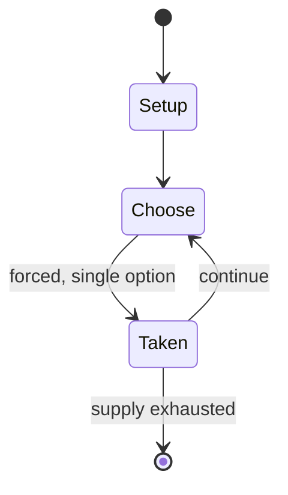

# Hangman (game)

`hangman_game` &nbsp; state: **DEEPENED** &nbsp; method: **heuristic**

## Found layer (recorded, not trusted)

| field | value |
| --- | --- |
| wikidata | Q460875 |
| wikipedia | Hangman (game) |
| genres (source) | -- |
| instance of (source) | -- |
| country of origin | -- |

## Declared layer (orders bench work)

| field | value |
| --- | --- |
| year created | -- |
| epoch | -- |
| region | -- |
| media | PAPER_AND_PENCIL, PUZZLE |
| players | -- |
| age band | -- |
| exogenous process | -- |
| loss shape | -- |
| live axes | - |
| horizon | -- |
| scoring shape | -- |
| information | -- |
| interaction | SOLITAIRE |
| turn structure | -- |
| tractability | SAMPLING_ONLY |
| randomness | -- |
| luck factor | 0.35 |
| rules complexity | 1.85 |
| strategic depth | 2.5 |
| novelty | 0.3965 |
| solved status | -- |
| strategies | memory_recall, probability_estimation |
| algorithms | -- |

## Object model

```
Episode
  players      : ?
  turn_structure: ?
  horizon       : ?
  scoring       : ?

Configuration  -- the arrangement to be resolved
Constraint     -- predicate a legal configuration must satisfy
```

## State transition diagram



## Research item -- turn trace

```
# Hangman (game) -- simulated turn events
# generated from the DECLARED vector, not from a rulebook.
# structure: exo=None loss=None horizon=None scoring=None axes=-

t=0    SETUP        players=2  pot=0  capacity=5
t=1    FORCED       p1 single legal option taken (pot_gain=+1.2)
t=2    FORCED       p1 single legal option taken (pot_gain=+0.9)
t=3    FORCED       p1 single legal option taken (pot_gain=+1.0)
t=4    FORCED       p1 single legal option taken (pot_gain=+0.5)
t=5    FORCED       p1 single legal option taken (pot_gain=+1.4)
t=6    FORCED       p1 single legal option taken (pot_gain=+1.3)
t=7    FORCED       p1 single legal option taken (pot_gain=+0.7)
t=8    FORCED       p1 single legal option taken (pot_gain=+0.8)
t=9    FORCED       p1 single legal option taken (pot_gain=+0.8)
t=10   FORCED       p1 single legal option taken (pot_gain=+1.2)
t=11   FORCED       p1 single legal option taken (pot_gain=+1.8)
t=12   ENDTURN      turn passes to p2
t=13   FORCED       p2 single legal option taken (pot_gain=+1.4)
t=14   FORCED       p2 single legal option taken (pot_gain=+1.7)
t=15   FORCED       p2 single legal option taken (pot_gain=+1.8)
t=16   FORCED       p2 single legal option taken (pot_gain=+1.3)
t=17   FORCED       p2 single legal option taken (pot_gain=+1.2)
t=18   FORCED       p2 single legal option taken (pot_gain=+0.6)
t=19   FORCED       p2 single legal option taken (pot_gain=+0.6)
t=20   ENDTURN      turn passes to p1
t=21   FORCED       p1 single legal option taken (pot_gain=+0.5)
t=22   FORCED       p1 single legal option taken (pot_gain=+1.3)
t=23   ENDTURN      turn passes to p2
t=24   FORCED       p2 single legal option taken (pot_gain=+1.2)
t=25   FORCED       p2 single legal option taken (pot_gain=+0.6)
t=26   FORCED       p2 single legal option taken (pot_gain=+0.7)
t=27   ENDTURN      turn passes to p1

terminal: VARIABLE
```

## Conditions

| kind | threshold | effect | trigger |
| --- | --- | --- | --- |
| TERMINATE | -- | -- | Generally, the game ends once the word is guessed, or if the stick figure is complete—signifying that all guesses have been used. |
| TERMINATE | -- | -- | If the word is correct, the game is over and the guesser wins. |
| BOUNDARY | -- | -- | Another common strategy is to guess vowels first, as English only has five vowels (a, e, i, o, and u, while y may sometimes, but rarely, be used as a vowel) and almost every word has at least one. |

## Source extract

Hangman is a guessing game for two or more players. One player thinks of a word, phrase, or
sentence and the other(s) tries to guess it by suggesting letters or numbers within a certain
number of guesses. Originally a paper-and-pencil game, there are also electronic versions.   ==
History == Though the origins of the game are unknown, a variant is mentioned in a book of
children's games assembled by Alice Gomme in 1894 called Birds, Beasts, and Fishes. This version
lacks the image of a hanged man, instead relying on keeping score as to the number of attempts
it took each player to fill in the blanks. A version which incorporated hanging imagery was
described in a 1902 article in The Philadelphia Inquirer, which stated that it was popular at
"White Cap" parties where guests would wear "white peaked caps with masks".   == Overview ==
The word to guess is represented by a row of dashes representing each letter or number of the
word. Rules may permit or forbid proper nouns (such as names, places, or brands) or other types
of words (such as slang). If the guessing player suggests a letter which occurs in the word, the
other player writes it in all its correct positions. If the suggeste

<sub>Wikipedia, CC BY-SA. Retained as evidence for the structural
classification above. Every rule inferred from it is HYPOTHESIZED
until audited against a rulebook.</sub>
