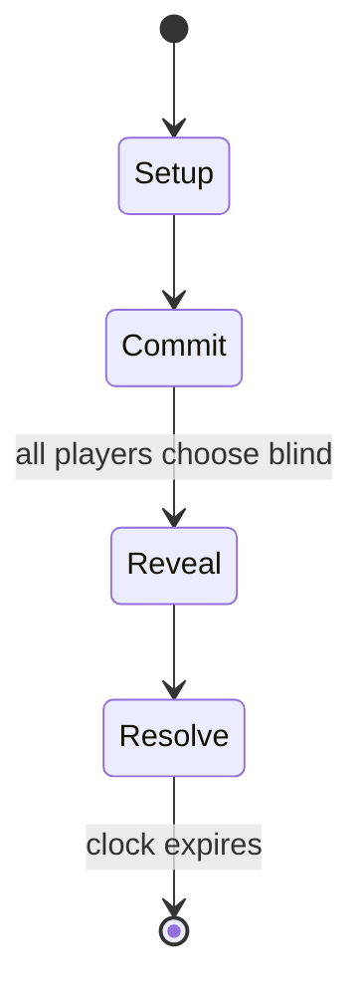

# harri-jasotze

*rural sport in the Basque Country in which stones of various shapes and sizes must be lifted off the ground and onto the shoulder*

`harri_jasotze` &nbsp; state: **DEEPENED** &nbsp; method: **heuristic**

## Found layer (recorded, not trusted)

| field | value |
| --- | --- |
| wikidata | Q627165 |
| wikipedia | Harri-jasotzaileak |
| genres (source) | -- |
| instance of (source) | traditional sport, type of sport |
| country of origin | Spain |

## Declared layer (orders bench work)

| field | value |
| --- | --- |
| year created | -- |
| epoch | -- |
| region | EUROPE_SOUTH |
| media | SPORT |
| players | -- |
| age band | -- |
| exogenous process | -- |
| loss shape | -- |
| live axes | ALLOCATE, COMMIT_BLIND, ORDER |
| horizon | CLOCK_LIMITED |
| scoring shape | -- |
| information | SIMULTANEOUS |
| interaction | COMPETITIVE |
| turn structure | SIMULTANEOUS |
| tractability | SAMPLING_ONLY |
| randomness | SIMULTANEOUS_CHOICE |
| luck factor | 0.3 |
| rules complexity | 2.69 |
| strategic depth | 2.0 |
| novelty | 0.6761 |
| solved status | -- |
| strategies | memory_recall |
| algorithms | -- |

## Object model

```
Episode
  players      : ?
  turn_structure: SIMULTANEOUS
  horizon       : CLOCK_LIMITED
  scoring       : ?

Pitch          -- bounded physical region
Player         -- embodied agent with a foul count
Clock          -- counts down; stoppages are rule events
Official       -- detects infractions and applies penalties
ResourcePool   -- divisible capacity committed across slots
SealedChoice   -- irrevocable choice made without observation
Sequence       -- the permutation under the player's control
```

## State transition diagram



## Research item -- turn trace

```
# harri-jasotze -- simulated turn events
# generated from the DECLARED vector, not from a rulebook.
# structure: exo=None loss=None horizon=CLOCK_LIMITED scoring=None axes=ALLOCATE,COMMIT_BLIND,ORDER

t=0    SETUP        players=2  pot=0  capacity=3
t=1    FORCED       p1 single legal option taken (pot_gain=+0.6)
t=2    ALLOCATE     p1 commits 1 of 5 capacity across 4 slots
t=3    ENDTURN      turn passes to p2
t=4    FORCED       p2 single legal option taken (pot_gain=+0.6)
t=5    ENDTURN      turn passes to p1
t=6    FORCED       p1 single legal option taken (pot_gain=+0.8)
t=7    ALLOCATE     p1 commits 1 of 5 capacity across 3 slots
t=8    FORCED       p1 single legal option taken (pot_gain=+0.9)
t=9    ALLOCATE     p1 commits 2 of 5 capacity across 4 slots
t=10   FORCED       p1 single legal option taken (pot_gain=+1.3)
t=11   FORCED       p1 single legal option taken (pot_gain=+0.8)
t=12   ALLOCATE     p1 commits 3 of 5 capacity across 4 slots
t=13   ENDTURN      turn passes to p2
t=14   FORCED       p2 single legal option taken (pot_gain=+1.3)
t=15   FORCED       p2 single legal option taken (pot_gain=+1.7)
t=16   FORCED       p2 single legal option taken (pot_gain=+1.1)
t=17   FORCED       p2 single legal option taken (pot_gain=+0.7)
t=18   FORCED       p2 single legal option taken (pot_gain=+0.8)
t=19   FORCED       p2 single legal option taken (pot_gain=+0.9)
t=20   ALLOCATE     p2 commits 2 of 5 capacity across 3 slots
t=21   FORCED       p2 single legal option taken (pot_gain=+2.0)
t=22   ALLOCATE     p2 commits 3 of 5 capacity across 4 slots
t=23   ENDTURN      turn passes to p1
t=24   FORCED       p1 single legal option taken (pot_gain=+1.1)
t=25   ALLOCATE     p1 commits 1 of 5 capacity across 3 slots
t=26   FORCED       p1 single legal option taken (pot_gain=+1.6)
t=27   ALLOCATE     p1 commits 3 of 5 capacity across 2 slots

terminal: CLOCK_LIMITED
```

## Source extract

Harri-jasotzeaileak (Basque pronunciation: [ˌharijaˈs̺ots̻e]), or harri-jasotzea, refers to a
popular rural sport in the Basque Country (northern Spain) in which stones of various shapes and
sizes must be lifted off the ground and onto the shoulder. The name is built on the Basque root
harri "stone", the verb jaso "to lift", the agentive suffix -tzaile and the plural ending -ak,
so literally "stone lifters". The sports activity is properly known as harri-jasotzea "stone
lifting". In Spanish it is called levantamiento de piedra (stone lifting) and in French the
sport is called leveurs de pierres.   == Rules ==  There are four main categories of stone in
use today, all of which come with different weights. The weight of the stones is traditionally
measured arroba (12.5 kg) but normally given in kg today.  the zilindroa (cylinder), usually
weighing 8, 9 or 10 arroba (100, 112.5 or 125 kg) the laukizuzena (rectangular), usually
weighing between 10 and 17 arroba (125-212.5 kg) the kuboa (cube), usually weighing between 10
and 17 arroba (125-212.5 kg) the biribila (round), usually weighing 9 or 10 arroba (112.5 or 125
kg) On occasion natural stones are also still used. This can be proble

<sub>Wikipedia, CC BY-SA. Retained as evidence for the structural
classification above. Every rule inferred from it is HYPOTHESIZED
until audited against a rulebook.</sub>
