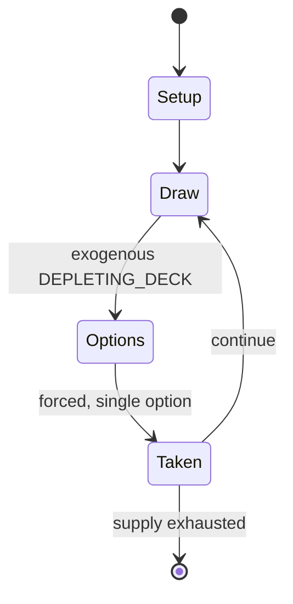

# Harry Potter Trading Card Game

*collectible trading card game*

`harry_potter_trading_card_game` &nbsp; state: **DEEPENED** &nbsp; method: **heuristic**

## Found layer (recorded, not trusted)

| field | value |
| --- | --- |
| wikidata | Q1138931 |
| wikipedia | Harry Potter Trading Card Game |
| genres (source) | -- |
| instance of (source) | collectible card game |
| country of origin | -- |

## Declared layer (orders bench work)

| field | value |
| --- | --- |
| year created | 2001 |
| epoch | CONTEMPORARY |
| region | -- |
| media | CARD, COLLECTIBLE |
| players | 2 |
| age band | -- |
| exogenous process | DEPLETING_DECK |
| loss shape | -- |
| live axes | DISCARD, TRADE |
| horizon | -- |
| scoring shape | -- |
| information | -- |
| interaction | COMPETITIVE |
| turn structure | -- |
| tractability | EXACT_WITH_CUT |
| randomness | -- |
| luck factor | 0.35 |
| rules complexity | 2.92 |
| strategic depth | 2.0 |
| novelty | 0.6734 |
| solved status | -- |
| strategies | -- |
| algorithms | -- |

## Object model

```
Episode
  players      : 2
  turn_structure: ?
  horizon       : ?
  scoring       : ?

Deck           -- ordered multiset, drawn without replacement
Hand           -- private multiset held by one player
DiscardPile    -- public accumulation of spent cards
DiscardChoice  -- what is given up to satisfy a limit
Offer          -- proposed exchange between two agents
```

## State transition diagram



## Research item -- turn trace

```
# Harry Potter Trading Card Game -- simulated turn events
# generated from the DECLARED vector, not from a rulebook.
# structure: exo=DEPLETING_DECK loss=None horizon=None scoring=None axes=DISCARD,TRADE

t=0    SETUP        players=2  pot=0  capacity=3
t=1    DRAW         p1 draw from deck -> outcome #5  (p=0.099)
t=2    FORCED       p1 single legal option taken (pot_gain=+1.2)
t=3    TRADE        p1 offers 2:1 exchange to p2
t=4    DISCARD      p1 discards to hand limit
t=5    DRAW         p1 draw from deck -> outcome #2  (p=0.281)
t=6    FORCED       p1 single legal option taken (pot_gain=+1.4)
t=7    TRADE        p1 offers 2:1 exchange to p2
t=8    DRAW         p1 draw from deck -> outcome #6  (p=0.279)
t=9    FORCED       p1 single legal option taken (pot_gain=+1.7)
t=10   DISCARD      p1 discards to hand limit
t=11   ENDTURN      turn passes to p2
t=12   DRAW         p2 draw from deck -> outcome #1  (p=0.165)
t=13   FORCED       p2 single legal option taken (pot_gain=+0.9)
t=14   DISCARD      p2 discards to hand limit
t=15   DRAW         p2 draw from deck -> outcome #6  (p=0.142)
t=16   FORCED       p2 single legal option taken (pot_gain=+0.8)
t=17   TRADE        p2 offers 2:1 exchange to p1
t=18   DRAW         p2 draw from deck -> outcome #6  (p=0.188)
t=19   FORCED       p2 single legal option taken (pot_gain=+1.8)
t=20   DISCARD      p2 discards to hand limit
t=21   ENDTURN      turn passes to p1
t=22   DRAW         p1 draw from deck -> outcome #2  (p=0.295)
t=23   FORCED       p1 single legal option taken (pot_gain=+1.4)
t=24   TRADE        p1 offers 2:1 exchange to p2
t=25   DRAW         p1 draw from deck -> outcome #6  (p=0.297)
t=26   FORCED       p1 single legal option taken (pot_gain=+1.2)
t=27   TRADE        p1 offers 2:1 exchange to p2

terminal: VARIABLE
```

## Source extract

The Harry Potter Trading Card Game is an out-of-print collectible card game based in the world
of J. K. Rowling's Harry Potter novels. Created by Wizards of the Coast in August 2001, the game
was designed to compete with the Yu-Gi-Oh!, Pokémon and Magic: The Gathering card games. Its
release was timed to coincide with the theatrical premiere of the first film in the series. The
game was praised for the way it immersed children in the Harry Potter universe. At one point the
game was the second best selling toy in the United States; however, it is now out of print.   ==
Game play == The game is for two players, each with 60-card decks (with the addition of a
starting Character; see below). The aim is to force the opposite player to run out of cards from
their deck first. When cards do "damage" to a player, cards from the deck are placed into the
discard pile. Each player begins with a hand of seven cards, and draws a card before each of
their turns.   === Types of cards === There are eight different types of cards in the Harry
Potter Trading Card Game.  Lessons are the basic units of the game. Each provides 1 "Power",
which is needed to play other cards. The number of Lessons in play

<sub>Wikipedia, CC BY-SA. Retained as evidence for the structural
classification above. Every rule inferred from it is HYPOTHESIZED
until audited against a rulebook.</sub>
