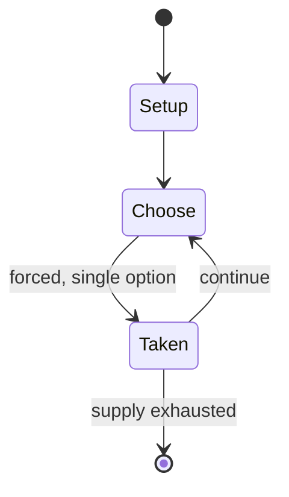

# Hasami shogi

*Variant of shogi*

`hasami_shogi` &nbsp; state: **DEEPENED** &nbsp; method: **heuristic**

## Found layer (recorded, not trusted)

| field | value |
| --- | --- |
| wikidata | Q1085192 |
| wikipedia | Hasami shogi |
| genres (source) | -- |
| instance of (source) | shogi variant |
| country of origin | Japan |

## Declared layer (orders bench work)

| field | value |
| --- | --- |
| year created | -- |
| epoch | -- |
| region | EAST_ASIA |
| media | - |
| players | 2 |
| age band | -- |
| exogenous process | -- |
| loss shape | -- |
| live axes | - |
| horizon | -- |
| scoring shape | WINNER_TAKE_ALL |
| information | -- |
| interaction | COMPETITIVE |
| turn structure | -- |
| tractability | SAMPLING_ONLY |
| randomness | -- |
| luck factor | 0.35 |
| rules complexity | 1.64 |
| strategic depth | 2.0 |
| novelty | 0.5614 |
| solved status | -- |
| strategies | -- |
| algorithms | -- |

## Object model

```
Episode
  players      : 2
  turn_structure: ?
  horizon       : ?
  scoring       : WINNER_TAKE_ALL

State          -- opaque; no medium or axis evidence was found
Player         -- an agent that selects among legal successors
```

## State transition diagram



## Research item -- turn trace

```
# Hasami shogi -- simulated turn events
# generated from the DECLARED vector, not from a rulebook.
# structure: exo=None loss=None horizon=None scoring=WINNER_TAKE_ALL axes=-

t=0    SETUP        players=2  pot=0  capacity=5
t=1    FORCED       p1 single legal option taken (pot_gain=+1.2)
t=2    ENDTURN      turn passes to p2
t=3    FORCED       p2 single legal option taken (pot_gain=+0.7)
t=4    ENDTURN      turn passes to p1
t=5    FORCED       p1 single legal option taken (pot_gain=+2.0)
t=6    FORCED       p1 single legal option taken (pot_gain=+1.7)
t=7    ENDTURN      turn passes to p2
t=8    FORCED       p2 single legal option taken (pot_gain=+0.5)
t=9    FORCED       p2 single legal option taken (pot_gain=+0.5)
t=10   ENDTURN      turn passes to p1
t=11   FORCED       p1 single legal option taken (pot_gain=+0.8)
t=12   FORCED       p1 single legal option taken (pot_gain=+1.9)
t=13   ENDTURN      turn passes to p2
t=14   FORCED       p2 single legal option taken (pot_gain=+1.0)
t=15   FORCED       p2 single legal option taken (pot_gain=+0.8)
t=16   FORCED       p2 single legal option taken (pot_gain=+0.5)
t=17   FORCED       p2 single legal option taken (pot_gain=+1.3)
t=18   ENDTURN      turn passes to p1
t=19   FORCED       p1 single legal option taken (pot_gain=+0.7)
t=20   FORCED       p1 single legal option taken (pot_gain=+1.8)
t=21   ENDTURN      turn passes to p2
t=22   FORCED       p2 single legal option taken (pot_gain=+1.2)
t=23   FORCED       p2 single legal option taken (pot_gain=+1.0)
t=24   FORCED       p2 single legal option taken (pot_gain=+1.3)
t=25   FORCED       p2 single legal option taken (pot_gain=+1.4)
t=26   FORCED       p2 single legal option taken (pot_gain=+0.6)
t=27   ENDTURN      turn passes to p1

terminal: VARIABLE
```

## Conditions

| kind | threshold | effect | trigger |
| --- | --- | --- | --- |
| ELIMINATE | -- | removed | Captured pieces are removed from the game. |

## Source extract

Hasami shogi (はさみ将棋 hasami shōgi, "intercepting chess") is a variant of shogi (Japanese chess).
The game has two main variants, and all Hasami variants, unlike other shogi variants, use only
one type of piece, and the winning objective is not checkmate. One main variant involves
capturing all but one of the opponent's men; the other involves building an unbroken vertical or
horizontal chain of five-in-a-row.  Hasami shogi possesses simple rules while offering complex
strategy. Variant 1 is popular among Japanese children.   == Variant 1 == Play is on a
traditional shogi board, with each player having nine men. Traditional shogi pawns (fu) can be
used as men; unpromoted pawns (歩) for Black (先手 sente), promoted pawns (と) for White (後手 gote).
At the start of the game each player's pieces fill their first rank, with Black's men on the
lower side of the board. Black moves first, then players alternate turns. A player wins by
capturing all but one of their opponent's men.    === Moving === All pieces move the same as a
rook in shogi. (That is, any number of empty cells vertically or horizontally.)  A move consists
of moving a piece to an empty cell of the board. As in shogi there is no j

<sub>Wikipedia, CC BY-SA. Retained as evidence for the structural
classification above. Every rule inferred from it is HYPOTHESIZED
until audited against a rulebook.</sub>
