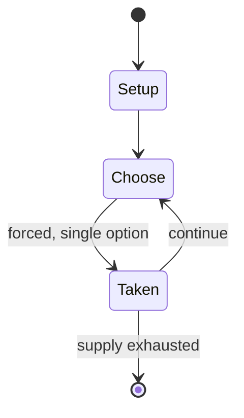

# Haunted House

*1972 arcade game*

`haunted_house` &nbsp; state: **DEEPENED** &nbsp; method: **heuristic**

## Found layer (recorded, not trusted)

| field | value |
| --- | --- |
| wikidata | Q16975489 |
| wikipedia | Haunted House (arcade game) |
| genres (source) | -- |
| instance of (source) | arcade video game |
| country of origin | -- |

## Declared layer (orders bench work)

| field | value |
| --- | --- |
| year created | 1972 |
| epoch | DIGITAL |
| region | -- |
| media | VIDEO |
| players | -- |
| age band | -- |
| exogenous process | -- |
| loss shape | -- |
| live axes | - |
| horizon | -- |
| scoring shape | -- |
| information | -- |
| interaction | -- |
| turn structure | -- |
| tractability | SAMPLING_ONLY |
| randomness | HIDDEN_INFO |
| luck factor | 0.35 |
| rules complexity | 1.64 |
| strategic depth | 2.0 |
| novelty | 0.0876 |
| solved status | -- |
| strategies | -- |
| algorithms | -- |

## Object model

```
Episode
  players      : ?
  turn_structure: ?
  horizon       : ?
  scoring       : ?

WorldState     -- simulation state advanced by the engine
Avatar         -- player-controlled agent
Clock          -- frame or tick counter
```

## State transition diagram



## Research item -- turn trace

```
# Haunted House -- simulated turn events
# generated from the DECLARED vector, not from a rulebook.
# structure: exo=None loss=None horizon=None scoring=None axes=-

t=0    SETUP        players=2  pot=0  capacity=5
t=1    FORCED       p1 single legal option taken (pot_gain=+1.4)
t=2    FORCED       p1 single legal option taken (pot_gain=+1.0)
t=3    FORCED       p1 single legal option taken (pot_gain=+1.3)
t=4    FORCED       p1 single legal option taken (pot_gain=+0.7)
t=5    FORCED       p1 single legal option taken (pot_gain=+1.3)
t=6    FORCED       p1 single legal option taken (pot_gain=+0.9)
t=7    FORCED       p1 single legal option taken (pot_gain=+1.9)
t=8    ENDTURN      turn passes to p2
t=9    FORCED       p2 single legal option taken (pot_gain=+1.2)
t=10   FORCED       p2 single legal option taken (pot_gain=+1.7)
t=11   FORCED       p2 single legal option taken (pot_gain=+0.8)
t=12   FORCED       p2 single legal option taken (pot_gain=+1.4)
t=13   FORCED       p2 single legal option taken (pot_gain=+1.6)
t=14   FORCED       p2 single legal option taken (pot_gain=+0.7)
t=15   FORCED       p2 single legal option taken (pot_gain=+0.5)
t=16   FORCED       p2 single legal option taken (pot_gain=+0.6)
t=17   FORCED       p2 single legal option taken (pot_gain=+1.2)
t=18   FORCED       p2 single legal option taken (pot_gain=+1.9)
t=19   ENDTURN      turn passes to p1
t=20   FORCED       p1 single legal option taken (pot_gain=+0.9)
t=21   FORCED       p1 single legal option taken (pot_gain=+1.9)
t=22   FORCED       p1 single legal option taken (pot_gain=+1.4)
t=23   FORCED       p1 single legal option taken (pot_gain=+1.3)
t=24   ENDTURN      turn passes to p2
t=25   FORCED       p2 single legal option taken (pot_gain=+1.0)
t=26   FORCED       p2 single legal option taken (pot_gain=+1.8)

terminal: VARIABLE
```

## Source extract

Haunted House is an arcade game released in 1972 by Midway Manufacturing Company.   ==
Description == Haunted House is a Dale Gun style rifle game.   == Features == Four Targets x2
Cats x1 Witch x1 Grave Robber 3-Dimensional Playfield Backlight lighting Gun Recoil Adaptive
Difficulty   == Sound effects == Haunted House uses a special 4-channel 8-track player to
produce background music and sound effects. The background sound plays continually, but the
player momentarily changes tracks for the appropriate target hit.   == See also == Arcade game
Haunted House Pinball   == References ==

<sub>Wikipedia, CC BY-SA. Retained as evidence for the structural
classification above. Every rule inferred from it is HYPOTHESIZED
until audited against a rulebook.</sub>
