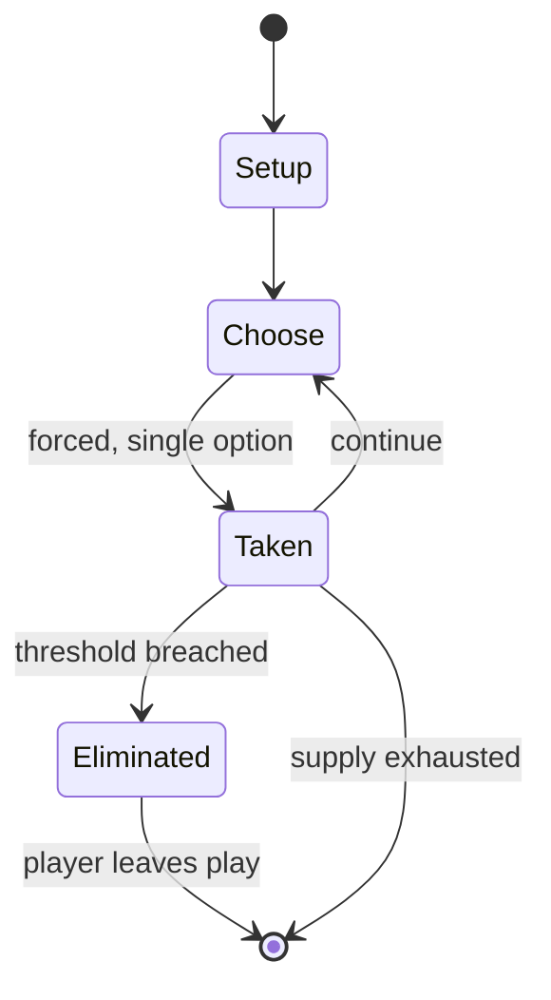

# Hawalis

*traditional mancala game*

`hawalis` &nbsp; state: **DEEPENED** &nbsp; method: **heuristic**

## Found layer (recorded, not trusted)

| field | value |
| --- | --- |
| wikidata | Q1055920 |
| wikipedia | Hawalis |
| genres (source) | abstract strategy game |
| instance of (source) | board game, mancala, two-player game |
| country of origin | -- |

## Declared layer (orders bench work)

| field | value |
| --- | --- |
| year created | -- |
| epoch | -- |
| region | -- |
| media | MANCALA |
| players | 2 |
| age band | -- |
| exogenous process | -- |
| loss shape | ELIMINATION |
| live axes | - |
| horizon | VARIABLE |
| scoring shape | -- |
| information | -- |
| interaction | COMPETITIVE |
| turn structure | -- |
| tractability | SAMPLING_ONLY |
| randomness | -- |
| luck factor | 0.35 |
| rules complexity | 1.76 |
| strategic depth | 2.0 |
| novelty | 0.6 |
| solved status | -- |
| strategies | -- |
| algorithms | -- |

## Object model

```
Episode
  players      : 2
  turn_structure: ?
  horizon       : VARIABLE
  scoring       : ?

Pits           -- cyclic array of counts
Store          -- player's banked seeds
```

## State transition diagram



## Research item -- turn trace

```
# Hawalis -- simulated turn events
# generated from the DECLARED vector, not from a rulebook.
# structure: exo=None loss=ELIMINATION horizon=VARIABLE scoring=None axes=-

t=0    SETUP        players=2  pot=0  capacity=3
t=1    FORCED       p1 single legal option taken (pot_gain=+1.7)
t=2    FORCED       p1 single legal option taken (pot_gain=+1.8)
t=3    FORCED       p1 single legal option taken (pot_gain=+0.8)
t=4    ENDTURN      turn passes to p2
t=5    FORCED       p2 single legal option taken (pot_gain=+0.7)
t=6    FORCED       p2 single legal option taken (pot_gain=+1.1)
t=7    FORCED       p2 single legal option taken (pot_gain=+0.7)
t=8    FORCED       p2 single legal option taken (pot_gain=+1.1)
t=9    FORCED       p2 single legal option taken (pot_gain=+1.1)
t=10   FORCED       p2 single legal option taken (pot_gain=+1.3)
t=11   FORCED       p2 single legal option taken (pot_gain=+1.0)
t=12   FORCED       p2 single legal option taken (pot_gain=+1.1)
t=13   ENDTURN      turn passes to p1
t=14   FORCED       p1 single legal option taken (pot_gain=+1.1)
t=15   FORCED       p1 single legal option taken (pot_gain=+0.7)
t=16   ENDTURN      turn passes to p2
t=17   FORCED       p2 single legal option taken (pot_gain=+1.4)
t=18   FORCED       p2 single legal option taken (pot_gain=+0.7)
t=19   FORCED       p2 single legal option taken (pot_gain=+0.8)
t=20   FORCED       p2 single legal option taken (pot_gain=+1.0)
t=21   ENDTURN      turn passes to p1
t=22   FORCED       p1 single legal option taken (pot_gain=+1.5)
t=23   ENDTURN      turn passes to p2
t=24   FORCED       p2 single legal option taken (pot_gain=+1.8)
t=25   FORCED       p2 single legal option taken (pot_gain=+0.9)
t=26   FORCED       p2 single legal option taken (pot_gain=+0.6)

terminal: VARIABLE
```

## Conditions

| kind | threshold | effect | trigger |
| --- | --- | --- | --- |
| ELIMINATE | -- | -- | If the last seeds fall in a hole of the inner row and the opposite hole in the opponent's half board is not empty, its contents are captured and removed from the game. |
| TERMINATE | -- | -- | The game ends when one of the players is left without any seed in his rows. |

## Source extract

Hawalis is a traditional mancala game played in Oman as well as Zanzibar, where it is known as
Bao la Kiarabu, with slightly different rules. It is closely related to African mancalas such as
Bao (Tanzania, Malawi, Kenya), Njomba (Mozambique and Malawi), Lela (DR Congo), Mulabalaba
(Zambia), Muvalavala (Angola) and Tschuba (South Africa, Mozambique).   == Rules (Oman) ==
Hawalis boards in Oman are composed by 4 rows of 7 holes. At game setup, two seeds are placed in
each hole. Each player owns half of the board (2 rows) of the board. At his or her turn, the
player takes all seeds from a hole and relay-sows them counterclockwise. If there are holes with
more than one seed, then the player must sow starting from one such hole. If the last seeds fall
in a hole of the inner row and the opposite hole in the opponent's half board is not empty, its
contents are captured and removed from the game. If both the opposite hole and that behind it in
the opponent's half board are non empty, all seeds are captured from both of them. The game ends
when one of the players is left without any seed in his rows. The winner of the game is the
player who captures most seeds.   == Rules (Zanzibar) == The

<sub>Wikipedia, CC BY-SA. Retained as evidence for the structural
classification above. Every rule inferred from it is HYPOTHESIZED
until audited against a rulebook.</sub>
