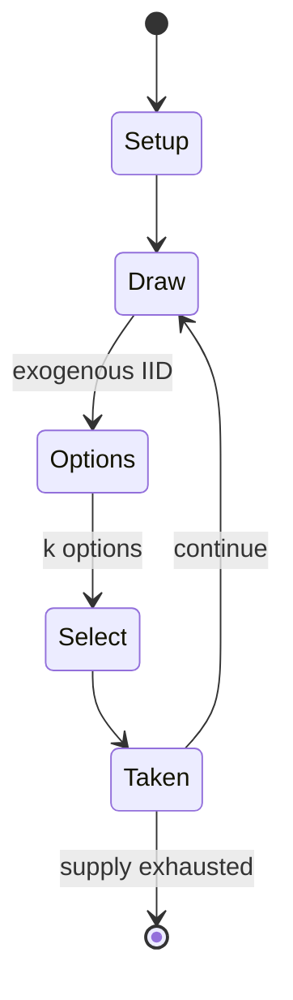

# Hazard (game)

`hazard_game` &nbsp; state: **DEEPENED** &nbsp; method: **heuristic**

## Found layer (recorded, not trusted)

| field | value |
| --- | --- |
| wikidata | Q1592048 |
| wikipedia | Hazard (game) |
| genres (source) | -- |
| instance of (source) | -- |
| country of origin | -- |

## Declared layer (orders bench work)

| field | value |
| --- | --- |
| year created | -- |
| epoch | -- |
| region | -- |
| media | DICE |
| players | -- |
| age band | -- |
| exogenous process | IID |
| loss shape | -- |
| live axes | SELECT |
| horizon | -- |
| scoring shape | -- |
| information | -- |
| interaction | SOLITAIRE |
| turn structure | -- |
| tractability | EXACT_WITH_CUT |
| randomness | DICE |
| luck factor | 0.58 |
| rules complexity | 2.1 |
| strategic depth | 2.12 |
| novelty | 0.6581 |
| solved status | -- |
| strategies | probability_estimation |
| algorithms | -- |

## Object model

```
Episode
  players      : ?
  turn_structure: ?
  horizon       : ?
  scoring       : ?

DicePool       -- n dice, each an iid categorical draw
Roll           -- realised outcome of a pool
OptionSet      -- the choices available after an exogenous draw
```

## State transition diagram



## Research item -- turn trace

```
# Hazard (game) -- simulated turn events
# generated from the DECLARED vector, not from a rulebook.
# structure: exo=IID loss=None horizon=None scoring=None axes=SELECT

t=0    SETUP        players=2  pot=0  capacity=4
t=1    DRAW         p1 roll from d6 pool -> outcome #2  (p=0.108)
t=2    SELECT       p1 2 options; take #1  (pot_gain=+0.8, capacity=-1)
t=3    DRAW         p1 roll from d6 pool -> outcome #3  (p=0.255)
t=4    SELECT       p1 2 options; take #1  (pot_gain=+3.5, capacity=-1)
t=5    DRAW         p1 roll from d6 pool -> outcome #3  (p=0.230)
t=6    SELECT       p1 4 options; take #4  (pot_gain=+3.3, capacity=-1)
t=7    ENDTURN      turn passes to p2
t=8    DRAW         p2 roll from d6 pool -> outcome #3  (p=0.272)
t=9    SELECT       p2 4 options; take #2  (pot_gain=+2.3, capacity=-0)
t=10   DRAW         p2 roll from d6 pool -> outcome #5  (p=0.086)
t=11   SELECT       p2 1 options; take #1  (pot_gain=+3.0, capacity=-1)
t=12   DRAW         p2 roll from d6 pool -> outcome #5  (p=0.002)
t=13   SELECT       p2 2 options; take #1  (pot_gain=+0.9, capacity=-1)
t=14   ENDTURN      turn passes to p1
t=15   DRAW         p1 roll from d6 pool -> outcome #5  (p=0.036)
t=16   SELECT       p1 2 options; take #1  (pot_gain=+2.4, capacity=-2)
t=17   DRAW         p1 roll from d6 pool -> outcome #2  (p=0.091)
t=18   SELECT       p1 3 options; take #2  (pot_gain=+3.4, capacity=-2)
t=19   DRAW         p1 roll from d6 pool -> outcome #3  (p=0.221)
t=20   SELECT       p1 3 options; take #2  (pot_gain=+1.5, capacity=-2)
t=21   DRAW         p1 roll from d6 pool -> outcome #1  (p=0.294)
t=22   SELECT       p1 2 options; take #1  (pot_gain=+2.1, capacity=-1)
t=23   DRAW         p1 roll from d6 pool -> outcome #1  (p=0.284)
t=24   SELECT       p1 3 options; take #2  (pot_gain=+1.2, capacity=-1)
t=25   DRAW         p1 roll from d6 pool -> outcome #3  (p=0.245)
t=26   SELECT       p1 2 options; take #2  (pot_gain=+0.9, capacity=-2)

terminal: VARIABLE
```

## Source extract

Hazard is an early English game played with two dice. It was mentioned in Geoffrey Chaucer's
Canterbury Tales in the 14th century. Despite its complicated rules, hazard was very popular in
the 17th and 18th centuries and was often played for money. Hazard was especially popular at
Crockford's Club in London. In the 19th century, the game craps developed from hazard through a
simplification of the rules. Craps is now popular in North America but neither game remains
popular within the rest of the world.   == Rules == Any number may play, but only one player –
the caster – has the dice at any time. In each round, the caster specifies a number between 5
and 9 inclusive: this is the main. They then throw two dice.  If they roll the main, they win
(throwing in or nicking). If they roll a 2 or a 3, they lose (throwing out or outing). If they
roll an 11 or 12, the result depends on the main: with a main of 5 or 9, they throw out with
both an 11 and a 12; with a main of 6 or 8, they throw out with an 11 but nick with a 12; with a
main of 7, they nick with an 11 but throw out with a 12. If they neither nick nor throw out, the
number thrown is called the chance. They throw the dice again: if

<sub>Wikipedia, CC BY-SA. Retained as evidence for the structural
classification above. Every rule inferred from it is HYPOTHESIZED
until audited against a rulebook.</sub>
