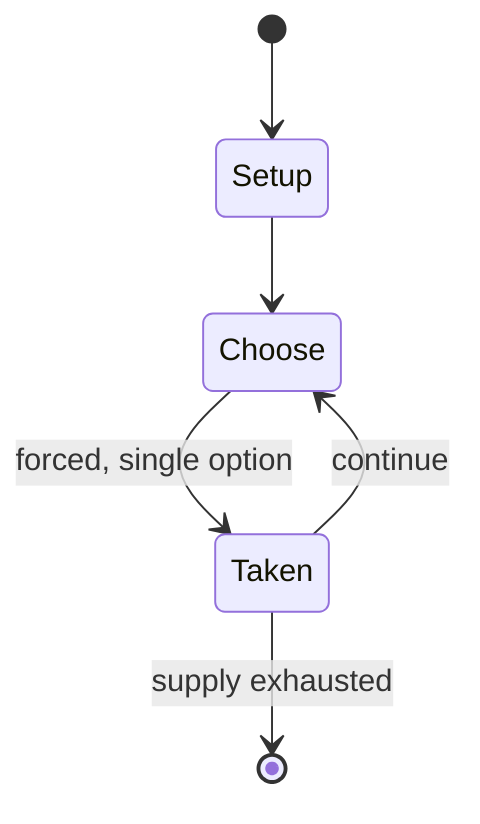

# He loves me... he loves me not

`he_loves_me_he_loves_me_not` &nbsp; state: **DEEPENED** &nbsp; method: **heuristic**

## Found layer (recorded, not trusted)

| field | value |
| --- | --- |
| wikidata | Q3049063 |
| wikipedia | He loves me... he loves me not |
| genres (source) | -- |
| instance of (source) | counting-out game, game |
| country of origin | France |

## Declared layer (orders bench work)

| field | value |
| --- | --- |
| year created | -- |
| epoch | -- |
| region | EUROPE_WEST |
| media | - |
| players | -- |
| age band | -- |
| exogenous process | -- |
| loss shape | -- |
| live axes | - |
| horizon | -- |
| scoring shape | -- |
| information | -- |
| interaction | -- |
| turn structure | -- |
| tractability | SAMPLING_ONLY |
| randomness | -- |
| luck factor | 0.35 |
| rules complexity | 1.71 |
| strategic depth | 2.0 |
| novelty | 0.0876 |
| solved status | -- |
| strategies | -- |
| algorithms | -- |

## Object model

```
Episode
  players      : ?
  turn_structure: ?
  horizon       : ?
  scoring       : ?

State          -- opaque; no medium or axis evidence was found
Player         -- an agent that selects among legal successors
```

## State transition diagram



## Research item -- turn trace

```
# He loves me... he loves me not -- simulated turn events
# generated from the DECLARED vector, not from a rulebook.
# structure: exo=None loss=None horizon=None scoring=None axes=-

t=0    SETUP        players=2  pot=0  capacity=4
t=1    FORCED       p1 single legal option taken (pot_gain=+1.0)
t=2    FORCED       p1 single legal option taken (pot_gain=+1.4)
t=3    FORCED       p1 single legal option taken (pot_gain=+1.9)
t=4    ENDTURN      turn passes to p2
t=5    FORCED       p2 single legal option taken (pot_gain=+0.6)
t=6    ENDTURN      turn passes to p1
t=7    FORCED       p1 single legal option taken (pot_gain=+1.2)
t=8    FORCED       p1 single legal option taken (pot_gain=+1.1)
t=9    FORCED       p1 single legal option taken (pot_gain=+2.0)
t=10   ENDTURN      turn passes to p2
t=11   FORCED       p2 single legal option taken (pot_gain=+1.5)
t=12   FORCED       p2 single legal option taken (pot_gain=+0.9)
t=13   FORCED       p2 single legal option taken (pot_gain=+1.1)
t=14   FORCED       p2 single legal option taken (pot_gain=+1.8)
t=15   ENDTURN      turn passes to p1
t=16   FORCED       p1 single legal option taken (pot_gain=+0.5)
t=17   ENDTURN      turn passes to p2
t=18   FORCED       p2 single legal option taken (pot_gain=+0.8)
t=19   FORCED       p2 single legal option taken (pot_gain=+1.1)
t=20   FORCED       p2 single legal option taken (pot_gain=+0.9)
t=21   FORCED       p2 single legal option taken (pot_gain=+1.1)
t=22   FORCED       p2 single legal option taken (pot_gain=+1.0)
t=23   FORCED       p2 single legal option taken (pot_gain=+0.6)
t=24   ENDTURN      turn passes to p1
t=25   FORCED       p1 single legal option taken (pot_gain=+1.3)
t=26   FORCED       p1 single legal option taken (pot_gain=+1.5)

terminal: VARIABLE
```

## Source extract

He loves me, he loves me not or She loves me, she loves me not (originally effeuiller la
marguerite in French) is a game of French origin, in which one person seeks to determine whether
the object of their affection returns that affection.   == Game == A person playing the game
alternately speaks the phrases "He (or she) loves me," and "He loves me not," while picking one
petal off a flower (usually an ox-eye daisy) for each phrase. The phrase they speak on picking
off the last petal supposedly represents the truth between the object of their affection loving
them or not. The player is typically motivated by attraction to the person they are speaking of
while reciting the phrases. They may seek to reaffirm a pre-existing belief or act out of
whimsy. In the original French version of the game, the petals do not simply indicate whether
the object of the player's affection loves them, but to what extent: un peu or "a little",
beaucoup or "a lot", passionnément or "passionately", à la folie or "to madness", or pas du tout
or "not at all." A humorous twist on the game is "He loves me, he loves me lots."   == Popular
culture == In Part 1 of Goethe's Faust, Gretchen engages in the game. (

<sub>Wikipedia, CC BY-SA. Retained as evidence for the structural
classification above. Every rule inferred from it is HYPOTHESIZED
until audited against a rulebook.</sub>
