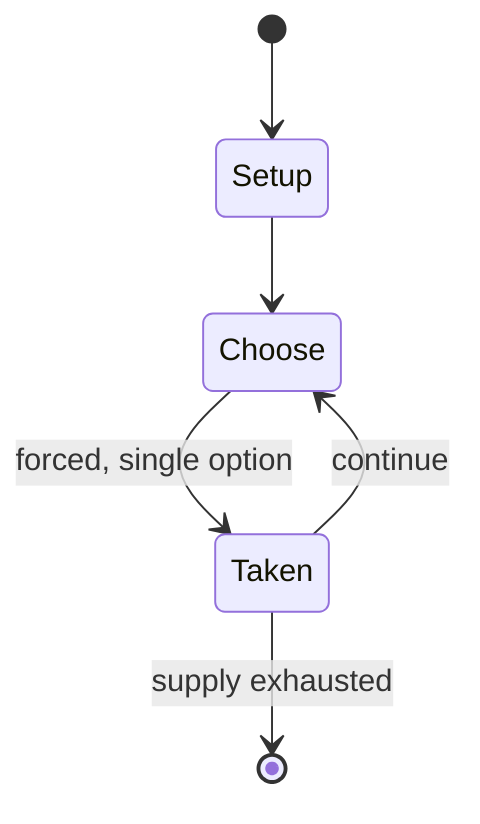

# HeroQuest

*board game*

`heroquest` &nbsp; state: **DEEPENED** &nbsp; method: **heuristic**

## Found layer (recorded, not trusted)

| field | value |
| --- | --- |
| wikidata | Q1464572 |
| wikipedia | HeroQuest |
| genres (source) | fantasy |
| instance of (source) | board game |
| country of origin | -- |

## Declared layer (orders bench work)

| field | value |
| --- | --- |
| year created | 2021 |
| epoch | CONTEMPORARY |
| region | -- |
| media | BOARD, TILE |
| players | 2-5 |
| age band | -- |
| exogenous process | -- |
| loss shape | -- |
| live axes | SPATIAL |
| horizon | -- |
| scoring shape | -- |
| information | -- |
| interaction | SOLITAIRE |
| turn structure | -- |
| tractability | SAMPLING_ONLY |
| randomness | HIDDEN_INFO |
| luck factor | 0.35 |
| rules complexity | 2.53 |
| strategic depth | 2.0 |
| novelty | 0.3965 |
| solved status | -- |
| strategies | -- |
| algorithms | -- |

## Object model

```
Episode
  players      : 2-5
  turn_structure: ?
  horizon       : ?
  scoring       : ?

Board          -- spatial substrate; cells carry position and occupancy
Piece          -- movable token owned by a player
TileBag        -- unordered draw source
Layout         -- placed tiles and their adjacencies
Placement      -- position subject to geometric legality
```

## State transition diagram



## Research item -- turn trace

```
# HeroQuest -- simulated turn events
# generated from the DECLARED vector, not from a rulebook.
# structure: exo=None loss=None horizon=None scoring=None axes=SPATIAL

t=0    SETUP        players=2  pot=0  capacity=5
t=1    FORCED       p1 single legal option taken (pot_gain=+0.8)
t=2    SPATIAL      p1 places at (0,5); adjacency legal
t=3    ENDTURN      turn passes to p2
t=4    FORCED       p2 single legal option taken (pot_gain=+0.5)
t=5    SPATIAL      p2 places at (0,7); adjacency legal
t=6    ENDTURN      turn passes to p1
t=7    FORCED       p1 single legal option taken (pot_gain=+1.9)
t=8    FORCED       p1 single legal option taken (pot_gain=+1.0)
t=9    FORCED       p1 single legal option taken (pot_gain=+0.5)
t=10   FORCED       p1 single legal option taken (pot_gain=+0.5)
t=11   FORCED       p1 single legal option taken (pot_gain=+0.6)
t=12   FORCED       p1 single legal option taken (pot_gain=+0.7)
t=13   SPATIAL      p1 places at (0,2); adjacency legal
t=14   FORCED       p1 single legal option taken (pot_gain=+0.7)
t=15   FORCED       p1 single legal option taken (pot_gain=+2.0)
t=16   FORCED       p1 single legal option taken (pot_gain=+0.5)
t=17   SPATIAL      p1 places at (5,0); adjacency legal
t=18   FORCED       p1 single legal option taken (pot_gain=+1.0)
t=19   SPATIAL      p1 places at (5,6); adjacency legal
t=20   FORCED       p1 single legal option taken (pot_gain=+1.4)
t=21   SPATIAL      p1 places at (5,5); adjacency legal
t=22   FORCED       p1 single legal option taken (pot_gain=+1.5)
t=23   FORCED       p1 single legal option taken (pot_gain=+1.0)
t=24   SPATIAL      p1 places at (0,0); adjacency legal
t=25   FORCED       p1 single legal option taken (pot_gain=+1.4)
t=26   ENDTURN      turn passes to p2

terminal: VARIABLE
```

## Conditions

| kind | threshold | effect | trigger |
| --- | --- | --- | --- |
| ELIMINATE | -- | -- | If a character's body point count falls to zero, they are killed and must be removed from the game. |
| TERMINATE | -- | -- | The game ends when every player has either returned to the spiral staircase, exited by a door or been killed by the evil wizard. |

## Source extract

HeroQuest is an adventure board game created by the American board game manufacturer Milton
Bradley in conjunction with the British company Games Workshop in 1989, and re-released in 2021.
The game is loosely based around archetypes of fantasy role-playing games: the game itself was
actually a game system, allowing the gamemaster (called Morcar in the United Kingdom and Zargon
in North America) to create dungeons of their own design through using the provided game board,
tiles, furnishings and figures. The game manual describes Morcar/Zargon as a former apprentice
of Mentor, and the parchment text is read aloud from Mentor's perspective. Several expansions
have been released, each adding new tiles, traps, and monsters to the core system; the American
localization also added new artifacts.   == History == In the late 1980s, game designer Stephen
Baker moved from Games Workshop (GW) to Milton Bradley and convinced Roger Ford, Milton
Bradley's head of development to allow him to develop a fantasy genre game. Kennedy gave him the
go-ahead if he kept the game simple. Baker contacted his former employer, Games Workshop, to
develop the plastic miniatures that would be needed in the game,

<sub>Wikipedia, CC BY-SA. Retained as evidence for the structural
classification above. Every rule inferred from it is HYPOTHESIZED
until audited against a rulebook.</sub>
