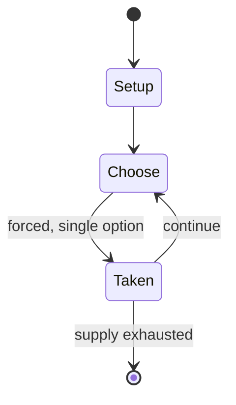

# Hex (board game)

`hex_board_game` &nbsp; state: **DEEPENED** &nbsp; method: **heuristic**

## Found layer (recorded, not trusted)

| field | value |
| --- | --- |
| wikidata | Q844874 |
| wikipedia | Hex (board game) |
| genres (source) | -- |
| instance of (source) | -- |
| country of origin | -- |

## Declared layer (orders bench work)

| field | value |
| --- | --- |
| year created | 1942 |
| epoch | MODERN |
| region | -- |
| media | ABSTRACT, BOARD, PAPER_AND_PENCIL, PUZZLE, TILE |
| players | -- |
| age band | -- |
| exogenous process | NONE |
| loss shape | OPPORTUNITY_ONLY |
| live axes | ORDER, SPATIAL |
| horizon | -- |
| scoring shape | SET_COLLECTION_CONVEX |
| information | PERFECT |
| interaction | SOLITAIRE |
| turn structure | STRICT_TURN |
| tractability | EXACT_WITH_CUT |
| randomness | NONE |
| luck factor | 0.02 |
| rules complexity | 3.0 |
| strategic depth | 3.75 |
| novelty | 0.8428 |
| solved status | SOLVED_STRONG |
| strategies | route_optimisation, set_collection, signalling |
| algorithms | alpha_beta, alpha_zero_self_play, heuristic_evaluation, monte_carlo_tree_search |

## Object model

```
Episode
  players      : ?
  turn_structure: STRICT_TURN
  horizon       : ?
  scoring       : SET_COLLECTION_CONVEX

Board          -- spatial substrate; cells carry position and occupancy
Piece          -- movable token owned by a player
Configuration  -- the arrangement to be resolved
Constraint     -- predicate a legal configuration must satisfy
TileBag        -- unordered draw source
Layout         -- placed tiles and their adjacencies
Sequence       -- the permutation under the player's control
Placement      -- position subject to geometric legality
```

## State transition diagram



## Research item -- turn trace

```
# Hex (board game) -- simulated turn events
# generated from the DECLARED vector, not from a rulebook.
# structure: exo=NONE loss=OPPORTUNITY_ONLY horizon=None scoring=SET_COLLECTION_CONVEX axes=ORDER,SPATIAL

t=0    SETUP        players=2  pot=0  capacity=5
t=1    FORCED       p1 single legal option taken (pot_gain=+0.7)
t=2    SPATIAL      p1 places at (2,7); adjacency legal
t=3    FORCED       p1 single legal option taken (pot_gain=+0.8)
t=4    SPATIAL      p1 places at (2,1); adjacency legal
t=5    FORCED       p1 single legal option taken (pot_gain=+1.7)
t=6    SPATIAL      p1 places at (6,3); adjacency legal
t=7    FORCED       p1 single legal option taken (pot_gain=+0.7)
t=8    ENDTURN      turn passes to p2
t=9    FORCED       p2 single legal option taken (pot_gain=+0.9)
t=10   FORCED       p2 single legal option taken (pot_gain=+0.8)
t=11   FORCED       p2 single legal option taken (pot_gain=+1.2)
t=12   SPATIAL      p2 places at (1,2); adjacency legal
t=13   ENDTURN      turn passes to p1
t=14   FORCED       p1 single legal option taken (pot_gain=+2.0)
t=15   FORCED       p1 single legal option taken (pot_gain=+1.9)
t=16   SPATIAL      p1 places at (2,3); adjacency legal
t=17   FORCED       p1 single legal option taken (pot_gain=+1.3)
t=18   ENDTURN      turn passes to p2
t=19   FORCED       p2 single legal option taken (pot_gain=+1.1)
t=20   SPATIAL      p2 places at (3,1); adjacency legal
t=21   FORCED       p2 single legal option taken (pot_gain=+1.2)
t=22   FORCED       p2 single legal option taken (pot_gain=+0.9)
t=23   FORCED       p2 single legal option taken (pot_gain=+1.1)
t=24   FORCED       p2 single legal option taken (pot_gain=+1.8)
t=25   FORCED       p2 single legal option taken (pot_gain=+0.6)
t=26   ENDTURN      turn passes to p1

terminal: VARIABLE
```

## Conditions

| kind | threshold | effect | trigger |
| --- | --- | --- | --- |
| WIN | -- | -- | The player who completes such a connection wins the game. |
| WIN | -- | -- | When it is clear to both players who will win the game, it is customary, but not required, for the losing player to resign. |
| BOUNDARY | -- | -- | Until 2019, humans remained better than computers at least on big boards such as 19x19, but on 30 October 2019 the program Mootwo won against the human player with the best Elo rank on LittleGolem, also winner of various |
| PENALTY | -- | -- | Its first exposition appears in an in-house technical report in 1952, in which Nash states that "connection and blocking the opponent are equivalent acts". |

## Source extract

Hex (also called Nash) is a two-player abstract strategy board game in which players attempt to
connect opposite sides of a rhombus-shaped board made of hexagonal cells. Hex was invented by
mathematician and poet Piet Hein in 1942 and later rediscovered and popularized by John Nash. It
is traditionally played on an 11×11 rhombus board, although 13×13 and 19×19 boards are also
popular.  It can also be played with paper and pencil on hexagonally ruled graph paper. The
board is composed of hexagons called cells or hexes. Each player is assigned a pair of opposite
sides of the board, which they must try to connect by alternately placing a stone of their color
onto any empty hex. Once placed, the stones are never moved or removed. A player wins when they
successfully connect their sides together through a chain of adjacent stones. Draws are
impossible in Hex due to the topology of the game board. Despite the simplicity of its rules,
the game has deep strategy and sharp tactics. It also has profound mathematical underpinnings
related to the Brouwer fixed-point theorem, matroids and graph connectivity.    == Game type ==
Hex is a finite, two-player perfect information game, and an abstrac

<sub>Wikipedia, CC BY-SA. Retained as evidence for the structural
classification above. Every rule inferred from it is HYPOTHESIZED
until audited against a rulebook.</sub>
