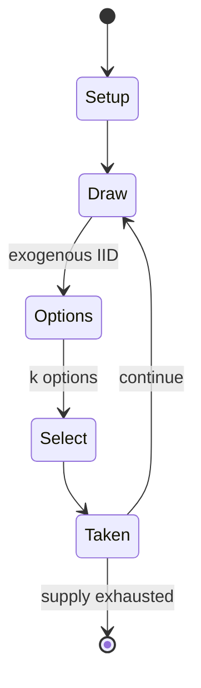

# Hey Pa! There's a Goat on the Roof

*board game*

`hey_pa_there_s_a_goat_on_the_roof` &nbsp; state: **DEEPENED** &nbsp; method: **heuristic**

## Found layer (recorded, not trusted)

| field | value |
| --- | --- |
| wikidata | Q5749389 |
| wikipedia | Hey Pa! There's a Goat on the Roof |
| genres (source) | -- |
| instance of (source) | board game |
| country of origin | -- |

## Declared layer (orders bench work)

| field | value |
| --- | --- |
| year created | 1966 |
| epoch | MODERN |
| region | -- |
| media | BOARD |
| players | -- |
| age band | -- |
| exogenous process | IID |
| loss shape | -- |
| live axes | SELECT |
| horizon | -- |
| scoring shape | -- |
| information | -- |
| interaction | -- |
| turn structure | -- |
| tractability | EXACT_WITH_CUT |
| randomness | SPINNER |
| luck factor | 0.42 |
| rules complexity | 1.99 |
| strategic depth | 2.0 |
| novelty | 0.6405 |
| solved status | -- |
| strategies | -- |
| algorithms | -- |

## Object model

```
Episode
  players      : ?
  turn_structure: ?
  horizon       : ?
  scoring       : ?

Board          -- spatial substrate; cells carry position and occupancy
Piece          -- movable token owned by a player
OptionSet      -- the choices available after an exogenous draw
```

## State transition diagram



## Research item -- turn trace

```
# Hey Pa! There's a Goat on the Roof -- simulated turn events
# generated from the DECLARED vector, not from a rulebook.
# structure: exo=IID loss=None horizon=None scoring=None axes=SELECT

t=0    SETUP        players=2  pot=0  capacity=6
t=1    DRAW         p1 roll from d6 pool -> outcome #4  (p=0.294)
t=2    SELECT       p1 2 options; take #1  (pot_gain=+1.3, capacity=-1)
t=3    DRAW         p1 roll from d6 pool -> outcome #4  (p=0.228)
t=4    SELECT       p1 4 options; take #1  (pot_gain=+2.1, capacity=-0)
t=5    DRAW         p1 roll from d6 pool -> outcome #4  (p=0.297)
t=6    SELECT       p1 1 options; take #1  (pot_gain=+2.1, capacity=-0)
t=7    ENDTURN      turn passes to p2
t=8    DRAW         p2 roll from d6 pool -> outcome #2  (p=0.053)
t=9    SELECT       p2 4 options; take #3  (pot_gain=+0.7, capacity=-1)
t=10   DRAW         p2 roll from d6 pool -> outcome #4  (p=0.084)
t=11   SELECT       p2 1 options; take #1  (pot_gain=+1.2, capacity=-1)
t=12   DRAW         p2 roll from d6 pool -> outcome #5  (p=0.041)
t=13   SELECT       p2 2 options; take #1  (pot_gain=+2.8, capacity=-0)
t=14   ENDTURN      turn passes to p1
t=15   DRAW         p1 roll from d6 pool -> outcome #4  (p=0.098)
t=16   SELECT       p1 2 options; take #2  (pot_gain=+2.6, capacity=-0)
t=17   ENDTURN      turn passes to p2
t=18   DRAW         p2 roll from d6 pool -> outcome #6  (p=0.127)
t=19   SELECT       p2 2 options; take #2  (pot_gain=+2.3, capacity=-0)
t=20   ENDTURN      turn passes to p1
t=21   DRAW         p1 roll from d6 pool -> outcome #1  (p=0.029)
t=22   SELECT       p1 4 options; take #4  (pot_gain=+1.9, capacity=-0)
t=23   DRAW         p1 roll from d6 pool -> outcome #2  (p=0.130)
t=24   SELECT       p1 1 options; take #1  (pot_gain=+1.9, capacity=-2)
t=25   DRAW         p1 roll from d6 pool -> outcome #4  (p=0.116)
t=26   SELECT       p1 4 options; take #4  (pot_gain=+3.2, capacity=-1)

terminal: VARIABLE
```

## Conditions

| kind | threshold | effect | trigger |
| --- | --- | --- | --- |
| WIN | -- | -- | The player with the most cans win the game. |

## Source extract

Hey Pa! There's a Goat on the Roof was a children's board game issued by Parker Brothers in
1966. The main objective to the overall game is to get more cans than any other player. The
player with the most cans win the game.   == Details == The game revolves around a game board
featuring plastic farm-related items sticking out of it. Each player selects a goat as their
playing piece, placing the pieces along the goat pen on the board. Players move goat-shaped
pieces around the board, attempting to complete tasks to win tin can pieces. The first player to
move their goat onto the roof of the barn ends the game, and the winner is then the player with
the most tin cans. Movement is determined by an included spinner, which makes the game run
purely on luck.   === Game pieces === Deck of cards Six Goat player figures A farmer piece A
bell Box of cans   == References ==   == Sources == Hey Pa! There's a Goat on the Roof   at
BoardGameGeek

<sub>Wikipedia, CC BY-SA. Retained as evidence for the structural
classification above. Every rule inferred from it is HYPOTHESIZED
until audited against a rulebook.</sub>
