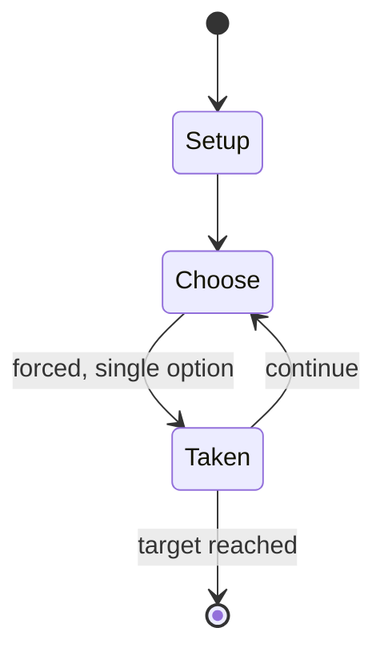

# Hide-and-seek

`hide_and_seek` &nbsp; state: **DEEPENED** &nbsp; method: **heuristic**

## Found layer (recorded, not trusted)

| field | value |
| --- | --- |
| wikidata | Q171957 |
| wikipedia | Hide-and-seek |
| genres (source) | -- |
| instance of (source) | -- |
| country of origin | -- |

## Declared layer (orders bench work)

| field | value |
| --- | --- |
| year created | -- |
| epoch | -- |
| region | -- |
| media | SPORT |
| players | -- |
| age band | CHILD |
| exogenous process | -- |
| loss shape | -- |
| live axes | TIMING |
| horizon | RACE_TO_TARGET |
| scoring shape | RACE_POSITION |
| information | -- |
| interaction | COMPETITIVE |
| turn structure | -- |
| tractability | SAMPLING_ONLY |
| randomness | HIDDEN_INFO |
| luck factor | 0.35 |
| rules complexity | 2.13 |
| strategic depth | 2.25 |
| novelty | 0.6274 |
| solved status | -- |
| strategies | tempo |
| algorithms | -- |

## Object model

```
Episode
  players      : ?
  turn_structure: ?
  horizon       : RACE_TO_TARGET
  scoring       : RACE_POSITION

Pitch          -- bounded physical region
Player         -- embodied agent with a foul count
Clock          -- counts down; stoppages are rule events
Official       -- detects infractions and applies penalties
Initiative     -- who acts, and when, relative to others
```

## State transition diagram



## Research item -- turn trace

```
# Hide-and-seek -- simulated turn events
# generated from the DECLARED vector, not from a rulebook.
# structure: exo=None loss=None horizon=RACE_TO_TARGET scoring=RACE_POSITION axes=TIMING

t=0    SETUP        players=2  pot=0  capacity=7
t=1    FORCED       p1 single legal option taken (pot_gain=+1.8)
t=2    ENDTURN      turn passes to p2
t=3    FORCED       p2 single legal option taken (pot_gain=+1.5)
t=4    ENDTURN      turn passes to p1
t=5    FORCED       p1 single legal option taken (pot_gain=+1.4)
t=6    FORCED       p1 single legal option taken (pot_gain=+1.3)
t=7    FORCED       p1 single legal option taken (pot_gain=+0.5)
t=8    FORCED       p1 single legal option taken (pot_gain=+1.4)
t=9    FORCED       p1 single legal option taken (pot_gain=+1.6)
t=10   FORCED       p1 single legal option taken (pot_gain=+1.9)
t=11   FORCED       p1 single legal option taken (pot_gain=+1.4)
t=12   FORCED       p1 single legal option taken (pot_gain=+1.0)
t=13   FORCED       p1 single legal option taken (pot_gain=+1.5)
t=14   FORCED       p1 single legal option taken (pot_gain=+0.8)
t=15   FORCED       p1 single legal option taken (pot_gain=+1.0)
t=16   FORCED       p1 single legal option taken (pot_gain=+1.9)
t=17   FORCED       p1 single legal option taken (pot_gain=+1.4)
t=18   FORCED       p1 single legal option taken (pot_gain=+1.5)
t=19   ENDTURN      turn passes to p2
t=20   FORCED       p2 single legal option taken (pot_gain=+0.5)
t=21   FORCED       p2 single legal option taken (pot_gain=+1.0)
t=22   ENDTURN      turn passes to p1
t=23   FORCED       p1 single legal option taken (pot_gain=+1.4)
t=24   FORCED       p1 single legal option taken (pot_gain=+0.9)
t=25   FORCED       p1 single legal option taken (pot_gain=+0.9)
t=26   FORCED       p1 single legal option taken (pot_gain=+1.3)

terminal: RACE_TO_TARGET
```

## Conditions

| kind | threshold | effect | trigger |
| --- | --- | --- | --- |
| BOUNDARY | 2 players | -- | Hide-and-seek (sometimes known as hide-and-go-seek) is a children's game in which at least two players (usually at least three) conceal themselves in a set environment, to be found by one or more seekers. |
| WIN | -- | -- | The player found last is the winner. |

## Source extract

Hide-and-seek (sometimes known as hide-and-go-seek) is a children's game in which at least two
players (usually at least three) conceal themselves in a set environment, to be found by one or
more seekers. The game is played by one chosen player (designated as being "it") counting to a
predetermined number with eyes closed while the other players hide. After reaching this number,
the player who is "it" calls "Ready or not, here I come!" or "Coming, ready or not!" and then
attempts to locate all concealed players. The game can end in one of several ways. The most
common way of ending is the player chosen as "it" locates all players; the player found first is
the loser and is chosen to be "it" in the next game. The player found last is the winner.
Another common variation has the seeker counting at "home base"; the hiders can either remain
hidden or they can come out of hiding to race to home base; once they touch it, they are "safe"
and cannot be tagged. The game is an example of an oral tradition, as it is commonly passed by
children.   == Variants ==  Different versions of the game are played around the world, under a
variety of names. One variant is called "sardines", in which onl

<sub>Wikipedia, CC BY-SA. Retained as evidence for the structural
classification above. Every rule inferred from it is HYPOTHESIZED
until audited against a rulebook.</sub>
