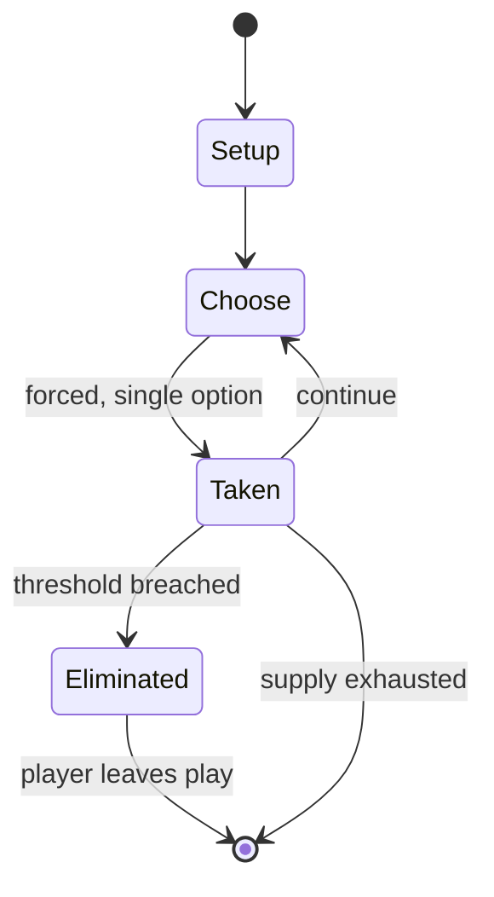

# Hive (game)

`hive_game` &nbsp; state: **DEEPENED** &nbsp; method: **heuristic**

## Found layer (recorded, not trusted)

| field | value |
| --- | --- |
| wikidata | Q1399188 |
| wikipedia | Hive (game) |
| genres (source) | -- |
| instance of (source) | -- |
| country of origin | -- |

## Declared layer (orders bench work)

| field | value |
| --- | --- |
| year created | 2001 |
| epoch | CONTEMPORARY |
| region | -- |
| media | BOARD, TILE |
| players | -- |
| age band | -- |
| exogenous process | NONE |
| loss shape | ELIMINATION |
| live axes | SPATIAL |
| horizon | VARIABLE |
| scoring shape | -- |
| information | PERFECT |
| interaction | COMPETITIVE |
| turn structure | -- |
| tractability | EXACT_WITH_CUT |
| randomness | NONE |
| luck factor | 0.02 |
| rules complexity | 2.13 |
| strategic depth | 2.4 |
| novelty | 0.7294 |
| solved status | -- |
| strategies | spatial_packing, tempo |
| algorithms | -- |

## Object model

```
Episode
  players      : ?
  turn_structure: ?
  horizon       : VARIABLE
  scoring       : ?

Board          -- spatial substrate; cells carry position and occupancy
Piece          -- movable token owned by a player
TileBag        -- unordered draw source
Layout         -- placed tiles and their adjacencies
Placement      -- position subject to geometric legality
```

## State transition diagram



## Research item -- turn trace

```
# Hive (game) -- simulated turn events
# generated from the DECLARED vector, not from a rulebook.
# structure: exo=NONE loss=ELIMINATION horizon=VARIABLE scoring=None axes=SPATIAL

t=0    SETUP        players=2  pot=0  capacity=3
t=1    FORCED       p1 single legal option taken (pot_gain=+1.7)
t=2    ENDTURN      turn passes to p2
t=3    FORCED       p2 single legal option taken (pot_gain=+1.9)
t=4    FORCED       p2 single legal option taken (pot_gain=+1.8)
t=5    SPATIAL      p2 places at (3,7); adjacency legal
t=6    FORCED       p2 single legal option taken (pot_gain=+0.8)
t=7    SPATIAL      p2 places at (1,2); adjacency legal
t=8    FORCED       p2 single legal option taken (pot_gain=+1.0)
t=9    ENDTURN      turn passes to p1
t=10   FORCED       p1 single legal option taken (pot_gain=+1.7)
t=11   ENDTURN      turn passes to p2
t=12   FORCED       p2 single legal option taken (pot_gain=+1.3)
t=13   SPATIAL      p2 places at (1,6); adjacency legal
t=14   FORCED       p2 single legal option taken (pot_gain=+1.6)
t=15   SPATIAL      p2 places at (0,6); adjacency legal
t=16   FORCED       p2 single legal option taken (pot_gain=+1.5)
t=17   SPATIAL      p2 places at (3,5); adjacency legal
t=18   ENDTURN      turn passes to p1
t=19   FORCED       p1 single legal option taken (pot_gain=+1.0)
t=20   FORCED       p1 single legal option taken (pot_gain=+1.5)
t=21   FORCED       p1 single legal option taken (pot_gain=+1.8)
t=22   SPATIAL      p1 places at (7,3); adjacency legal
t=23   FORCED       p1 single legal option taken (pot_gain=+1.9)
t=24   FORCED       p1 single legal option taken (pot_gain=+1.5)
t=25   FORCED       p1 single legal option taken (pot_gain=+2.0)
t=26   FORCED       p1 single legal option taken (pot_gain=+1.8)

terminal: VARIABLE
```

## Conditions

| kind | threshold | effect | trigger |
| --- | --- | --- | --- |
| ELIMINATE | -- | -- | It confers little or no advantage to conceal the faces of unplaced pieces; both players have "perfect information" about the state of the game, and thus by process of elimination any piece not on the board is yet to be p |
| TERMINATE | -- | -- | The game ends when a Queen Bee is captured by surrounding it on all 6 sides by either player's pieces, and the player whose Queen Bee is surrounded loses the game. |
| BOUNDARY | -- | -- | Once placed, a piece may be moved to a new space regardless of what pieces it will touch, except that it must be adjacent to at least one other piece. |
| BOUNDARY | -- | -- | Spider–Bee–Ant (in a V formation with the spider at the point): This is a flexible opening that allows the Bee maximum movement possibilities while also quickly introducing a powerful Ant that can move as needed to block |

## Source extract

Hive is a bug-themed tabletop abstract strategy game, designed by John Yianni and published in
2001 by Gen42 Games.  The object of Hive is to capture the opponent's queen bee by having it
completely surrounded by other pieces (belonging to either player), while avoiding the capture
of one's own queen. Hive shares elements of both tile-based games and board games.  It differs
from other tile-based games in that the tiles, once placed, can then be moved to other positions
according to various rules, much like chess pieces.   == Composition == The game uses hexagonal
tiles to represent the various contents of the hive.  The original two editions used wooden
tiles with full-color illustrations on blue and silver stickers to represent the units, but the
current third edition has been published using black and almond phenolic resin ("Bakelite")
tiles with single-color painted etchings. There are 22 pieces in total making up a Hive set,
with 11 pieces per player, each representing a creature and a different means of moving (the
colors listed are for the third edition of the game; the first and second used full-color
drawings):  1 Queen Bee (Yellow-Gold) 2 Spiders (Brown) 2 Beetles (Purple

<sub>Wikipedia, CC BY-SA. Retained as evidence for the structural
classification above. Every rule inferred from it is HYPOTHESIZED
until audited against a rulebook.</sub>
