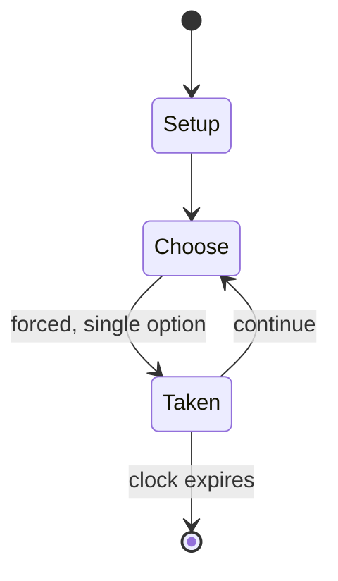

# Hnefatafl

`hnefatafl` &nbsp; state: **DEEPENED** &nbsp; method: **heuristic**

## Found layer (recorded, not trusted)

| field | value |
| --- | --- |
| wikidata | -- |
| wikipedia | Hnefatafl |
| genres (source) | -- |
| instance of (source) | -- |
| country of origin | -- |

## Declared layer (orders bench work)

| field | value |
| --- | --- |
| year created | 2007 |
| epoch | CONTEMPORARY |
| region | -- |
| media | BOARD, DEXTERITY |
| players | -- |
| age band | -- |
| exogenous process | NONE |
| loss shape | OPPORTUNITY_ONLY |
| live axes | BID |
| horizon | CLOCK_LIMITED |
| scoring shape | SURVIVAL |
| information | PERFECT |
| interaction | SOLITAIRE |
| turn structure | STRICT_TURN |
| tractability | SAMPLING_ONLY |
| randomness | NONE |
| luck factor | 0.35 |
| rules complexity | 2.14 |
| strategic depth | 2.0 |
| novelty | 0.765 |
| solved status | -- |
| strategies | probability_estimation |
| algorithms | -- |

## Object model

```
Episode
  players      : ?
  turn_structure: STRICT_TURN
  horizon       : CLOCK_LIMITED
  scoring       : SURVIVAL

Board          -- spatial substrate; cells carry position and occupancy
Piece          -- movable token owned by a player
Auction        -- priced competition resolving to one winner
```

## State transition diagram



## Research item -- turn trace

```
# Hnefatafl -- simulated turn events
# generated from the DECLARED vector, not from a rulebook.
# structure: exo=NONE loss=OPPORTUNITY_ONLY horizon=CLOCK_LIMITED scoring=SURVIVAL axes=BID

t=0    SETUP        players=2  pot=0  capacity=4
t=1    FORCED       p1 single legal option taken (pot_gain=+0.7)
t=2    BID          p1 sealed bid of 3 against 1 rivals
t=3    FORCED       p1 single legal option taken (pot_gain=+1.2)
t=4    ENDTURN      turn passes to p2
t=5    FORCED       p2 single legal option taken (pot_gain=+0.7)
t=6    BID          p2 sealed bid of 3 against 1 rivals
t=7    FORCED       p2 single legal option taken (pot_gain=+1.1)
t=8    ENDTURN      turn passes to p1
t=9    FORCED       p1 single legal option taken (pot_gain=+0.6)
t=10   BID          p1 sealed bid of 9 against 1 rivals
t=11   FORCED       p1 single legal option taken (pot_gain=+1.1)
t=12   BID          p1 sealed bid of 6 against 1 rivals
t=13   FORCED       p1 single legal option taken (pot_gain=+0.7)
t=14   ENDTURN      turn passes to p2
t=15   FORCED       p2 single legal option taken (pot_gain=+1.7)
t=16   ENDTURN      turn passes to p1
t=17   FORCED       p1 single legal option taken (pot_gain=+1.8)
t=18   BID          p1 sealed bid of 7 against 1 rivals
t=19   FORCED       p1 single legal option taken (pot_gain=+0.7)
t=20   BID          p1 sealed bid of 2 against 1 rivals
t=21   FORCED       p1 single legal option taken (pot_gain=+1.4)
t=22   FORCED       p1 single legal option taken (pot_gain=+1.4)
t=23   BID          p1 sealed bid of 6 against 1 rivals
t=24   FORCED       p1 single legal option taken (pot_gain=+0.5)
t=25   FORCED       p1 single legal option taken (pot_gain=+1.0)
t=26   ENDTURN      turn passes to p2

terminal: CLOCK_LIMITED
```

## Conditions

| kind | threshold | effect | trigger |
| --- | --- | --- | --- |
| BOUNDARY | 10 seconds | -- | The term "quickplay" refers to the time limit of ten seconds per move, marked by the sounding of a gong. |
| ELIMINATE | -- | -- | And two move the men in the game, and if one [piece] belonging to the king comes between the attackers, he is dead and is thrown out of the game, and the same if one of the attackers comes between two of the king's men i |
| WIN | -- | -- | If the king can go along the [illegible] line, that side wins the game. |
| WIN | -- | -- | One such solution is by bidding: Players take turns bidding on how many moves it will take them to win the game. |
| BOUNDARY | -- | -- | Tafl gaming was eventually supplanted by chess in the 12th century, but the tafl variant of the Sámi people, tablut, was in play until at least the 18th century. |
| BOUNDARY | -- | -- | Halatafl is the Old Norse name for fox and geese, a game dating from at least the 14th century. |

## Source extract

Tafl games (pronounced [tavl]), also known as hnefatafl games, are a family of ancient Northern
European strategy board games played on a checkered or latticed gameboard with two armies of
uneven numbers. Names of different variants of tafl include hnefatafl, tablut, tawlbwrdd,
brandubh, Ard Rí, and alea evangelii. Games in the tafl family were played in Norway, Sweden,
Denmark, Iceland, Britain, Ireland, and Sápmi. The Roman latrunculi influenced the development
of tafl games during the medieval period. Tafl gaming was eventually supplanted by chess in the
12th century, but the tafl variant of the Sámi people, tablut, was in play until at least the
18th century. The rules for tablut were written down by the Swedish naturalist Linnaeus in 1732,
and these were translated from Latin to English in 1811. All modern tafl games are based on the
1811 translation, which had many errors. New rules were added to amend the issues resulting from
these errors, leading to the creation of a modern family of tafl games. Tablut is now also
played in accordance with its original rules, which have been retranslated.   == Etymology ==
English has borrowed the term from tafl (pronounced [tavl]; Old Nor

<sub>Wikipedia, CC BY-SA. Retained as evidence for the structural
classification above. Every rule inferred from it is HYPOTHESIZED
until audited against a rulebook.</sub>
