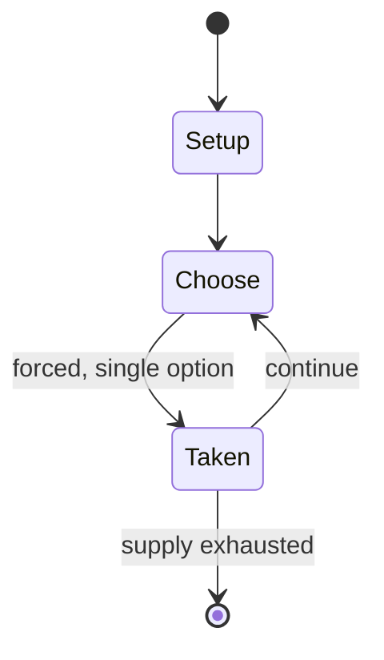

# Hoc Mazarin

*French gambling game*

`hoc_mazarin` &nbsp; state: **DEEPENED** &nbsp; method: **heuristic**

## Found layer (recorded, not trusted)

| field | value |
| --- | --- |
| wikidata | Q108428097 |
| wikipedia | Hoc Mazarin |
| genres (source) | -- |
| instance of (source) | card game |
| country of origin | France |

## Declared layer (orders bench work)

| field | value |
| --- | --- |
| year created | -- |
| epoch | -- |
| region | EUROPE_WEST |
| media | CARD, GAMBLING |
| players | -- |
| age band | -- |
| exogenous process | -- |
| loss shape | -- |
| live axes | BLUFF, ORDER |
| horizon | -- |
| scoring shape | -- |
| information | IMPERFECT |
| interaction | SOLITAIRE |
| turn structure | PRIORITY_QUEUE |
| tractability | SAMPLING_ONLY |
| randomness | -- |
| luck factor | 0.35 |
| rules complexity | 3.09 |
| strategic depth | 2.25 |
| novelty | 0.6646 |
| solved status | -- |
| strategies | bluffing |
| algorithms | -- |

## Object model

```
Episode
  players      : ?
  turn_structure: PRIORITY_QUEUE
  horizon       : ?
  scoring       : ?

Deck           -- ordered multiset, drawn without replacement
Hand           -- private multiset held by one player
DiscardPile    -- public accumulation of spent cards
Belief         -- what an observer is induced to think is true
Sequence       -- the permutation under the player's control
```

## State transition diagram



## Research item -- turn trace

```
# Hoc Mazarin -- simulated turn events
# generated from the DECLARED vector, not from a rulebook.
# structure: exo=None loss=None horizon=None scoring=None axes=BLUFF,ORDER

t=0    SETUP        players=2  pot=0  capacity=6
t=1    FORCED       p1 single legal option taken (pot_gain=+0.5)
t=2    BLUFF        p1 represents a holding it does not have
t=3    FORCED       p1 single legal option taken (pot_gain=+1.1)
t=4    FORCED       p1 single legal option taken (pot_gain=+1.8)
t=5    FORCED       p1 single legal option taken (pot_gain=+0.7)
t=6    FORCED       p1 single legal option taken (pot_gain=+1.5)
t=7    BLUFF        p1 represents a holding it does not have
t=8    FORCED       p1 single legal option taken (pot_gain=+1.9)
t=9    FORCED       p1 single legal option taken (pot_gain=+0.9)
t=10   FORCED       p1 single legal option taken (pot_gain=+1.4)
t=11   BLUFF        p1 represents a holding it does not have
t=12   FORCED       p1 single legal option taken (pot_gain=+0.9)
t=13   BLUFF        p1 represents a holding it does not have
t=14   FORCED       p1 single legal option taken (pot_gain=+1.3)
t=15   BLUFF        p1 represents a holding it does not have
t=16   FORCED       p1 single legal option taken (pot_gain=+0.8)
t=17   ENDTURN      turn passes to p2
t=18   FORCED       p2 single legal option taken (pot_gain=+1.2)
t=19   FORCED       p2 single legal option taken (pot_gain=+1.9)
t=20   BLUFF        p2 represents a holding it does not have
t=21   FORCED       p2 single legal option taken (pot_gain=+2.0)
t=22   ENDTURN      turn passes to p1
t=23   FORCED       p1 single legal option taken (pot_gain=+0.9)
t=24   FORCED       p1 single legal option taken (pot_gain=+1.7)
t=25   BLUFF        p1 represents a holding it does not have
t=26   FORCED       p1 single legal option taken (pot_gain=+1.6)
t=27   BLUFF        p1 represents a holding it does not have

terminal: VARIABLE
```

## Conditions

| kind | threshold | effect | trigger |
| --- | --- | --- | --- |
| TERMINATE | 1 player | -- | The game ends as soon as one player sheds all hand cards, thus becoming the winner. |
| ELIMINATE | -- | out of the game | The rest are placed face down to one side and are out of the game. |
| BOUNDARY | -- | -- | Raising is limited to a maximum of, usually, 20 jetons. |

## Source extract

Hoc Mazarin, also just Hoc, is an historical French gambling game of the Stops family for two or
three players. The game was popular at the court of Versailles in the 17th century and was named
after Cardinal Mazarin, chief minister to the King of France.   == History ==  Hoc Mazarin is
named after Italian prelate Cardinal Mazarin (1602–1661), who served as the chief minister to
the kings of France, Louis XIII and Louis XIV, from 1642 until 1661. Mazarin probably invented
the game and he was certainly much in favour of it while at the court of Versailles. It is
mentioned in the literature as early as 1649, where it is described as "an invention of the
devil". The rules first appeared in 1654 simply under the name of Hoc, even though the name Hoc
Mazarin was already in vogue, but by 1730 they were being printed as rules for Hoc Mazarin which
was described as one of two variants of Hoc. The second variant was Hoc de Lyon or Hoc de Lion
which, however, is nowhere described. Rules for Hoc or Hoc Mazarin continued to be reprinted
until the late 19th century.   == Rules ==   === Overview === Hoc Mazarin is a multi-stake,
vying game with two stages. In the first, each player is dealt 12 c

<sub>Wikipedia, CC BY-SA. Retained as evidence for the structural
classification above. Every rule inferred from it is HYPOTHESIZED
until audited against a rulebook.</sub>
