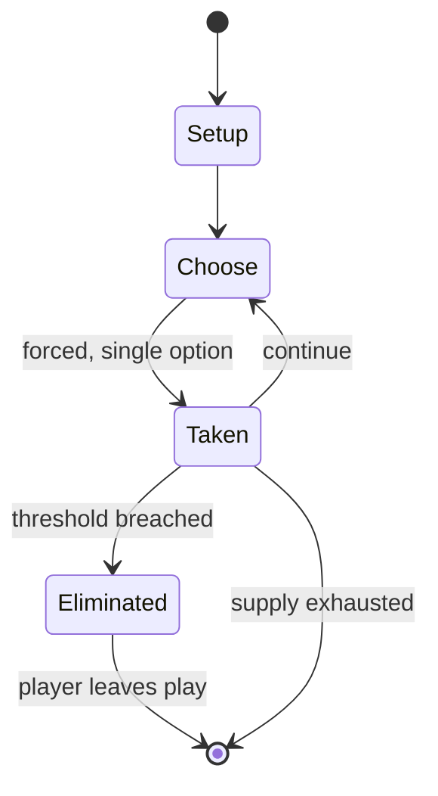

# Hot Potato

*party game*

`hot_potato` &nbsp; state: **DEEPENED** &nbsp; method: **heuristic**

## Found layer (recorded, not trusted)

| field | value |
| --- | --- |
| wikidata | Q5910245 |
| wikipedia | Hot potato |
| genres (source) | -- |
| instance of (source) | ball game, children's game, party game |
| country of origin | United Kingdom |

## Declared layer (orders bench work)

| field | value |
| --- | --- |
| year created | -- |
| epoch | -- |
| region | EUROPE_WEST |
| media | PARTY |
| players | -- |
| age band | CHILD |
| exogenous process | -- |
| loss shape | ELIMINATION |
| live axes | - |
| horizon | -- |
| scoring shape | -- |
| information | -- |
| interaction | -- |
| turn structure | -- |
| tractability | SAMPLING_ONLY |
| randomness | -- |
| luck factor | 0.35 |
| rules complexity | 1.67 |
| strategic depth | 2.0 |
| novelty | 0.4545 |
| solved status | -- |
| strategies | -- |
| algorithms | -- |

## Object model

```
Episode
  players      : ?
  turn_structure: ?
  horizon       : ?
  scoring       : ?

State          -- opaque; no medium or axis evidence was found
Player         -- an agent that selects among legal successors
```

## State transition diagram



## Research item -- turn trace

```
# Hot Potato -- simulated turn events
# generated from the DECLARED vector, not from a rulebook.
# structure: exo=None loss=ELIMINATION horizon=None scoring=None axes=-

t=0    SETUP        players=2  pot=0  capacity=5
t=1    FORCED       p1 single legal option taken (pot_gain=+1.3)
t=2    FORCED       p1 single legal option taken (pot_gain=+1.8)
t=3    FORCED       p1 single legal option taken (pot_gain=+1.0)
t=4    FORCED       p1 single legal option taken (pot_gain=+0.6)
t=5    FORCED       p1 single legal option taken (pot_gain=+1.5)
t=6    ENDTURN      turn passes to p2
t=7    FORCED       p2 single legal option taken (pot_gain=+1.1)
t=8    FORCED       p2 single legal option taken (pot_gain=+1.4)
t=9    FORCED       p2 single legal option taken (pot_gain=+1.4)
t=10   FORCED       p2 single legal option taken (pot_gain=+1.0)
t=11   FORCED       p2 single legal option taken (pot_gain=+0.9)
t=12   FORCED       p2 single legal option taken (pot_gain=+1.8)
t=13   FORCED       p2 single legal option taken (pot_gain=+1.0)
t=14   FORCED       p2 single legal option taken (pot_gain=+1.7)
t=15   ENDTURN      turn passes to p1
t=16   FORCED       p1 single legal option taken (pot_gain=+0.8)
t=17   FORCED       p1 single legal option taken (pot_gain=+1.5)
t=18   FORCED       p1 single legal option taken (pot_gain=+1.7)
t=19   FORCED       p1 single legal option taken (pot_gain=+1.5)
t=20   ENDTURN      turn passes to p2
t=21   FORCED       p2 single legal option taken (pot_gain=+1.7)
t=22   ENDTURN      turn passes to p1
t=23   FORCED       p1 single legal option taken (pot_gain=+0.7)
t=24   FORCED       p1 single legal option taken (pot_gain=+1.8)
t=25   FORCED       p1 single legal option taken (pot_gain=+0.7)
t=26   FORCED       p1 single legal option taken (pot_gain=+1.6)
t=27   ENDTURN      turn passes to p2

terminal: VARIABLE
```

## Conditions

| kind | threshold | effect | trigger |
| --- | --- | --- | --- |
| ELIMINATE | -- | eliminated | The player who is holding the object when the music stops is eliminated. |
| ELIMINATE | -- | -- | Musical chairs – Elimination genre party game |
| PENALTY | -- | -- | The one in whose hand the light expires has to pay the forfeit. |

## Source extract

Hot potato is a party game that involves players gathering in a circle and tossing a small
object such as a beanbag or even a soft ball to each other while music plays. The player who is
holding the object when the music stops is eliminated.   == Origins == The origins of the hot
potato game are not clear. However, it may go back as far as 1888 when Sidney Oldall Addy's
Glossary of Sheffield Words describes a game in which a number of people sit in a row, or in
chairs round a parlor. In this game, a lit candle is handed to the first person, who says:  The
one in whose hand the light expires has to pay the forfeit.   == See also == Bagholder – Slang
for shareholder left holding worthless stocks Musical chairs – Elimination genre party game Pass
the parcel – British party game Passing the buck – English-language idiom meaning "to shift
blame onto another"Pages displaying short descriptions of redirect targets Snap-dragon (game) –
Game involving grabbing fruit out of burning brandy   == References ==

<sub>Wikipedia, CC BY-SA. Retained as evidence for the structural
classification above. Every rule inferred from it is HYPOTHESIZED
until audited against a rulebook.</sub>
