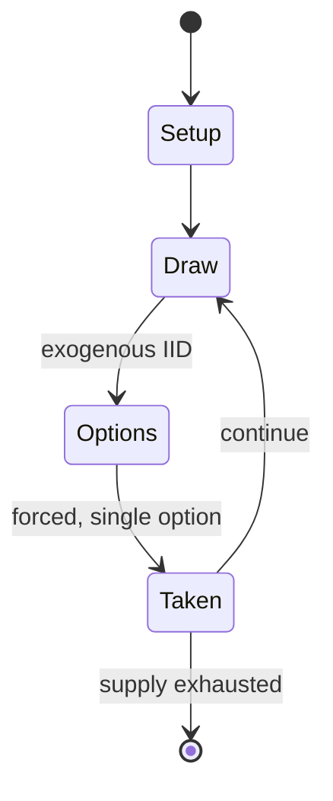

# Hounds and Jackals

*ancient Egyptian board game*

`hounds_and_jackals` &nbsp; state: **DEEPENED** &nbsp; method: **heuristic**

## Found layer (recorded, not trusted)

| field | value |
| --- | --- |
| wikidata | Q1637382 |
| wikipedia | Hounds and jackals |
| genres (source) | -- |
| instance of (source) | board game, tabletop game |
| country of origin | Ancient Egypt |

## Declared layer (orders bench work)

| field | value |
| --- | --- |
| year created | -2000 |
| epoch | DEEP_ANTIQUITY |
| region | AFRICA |
| media | BOARD |
| players | -- |
| age band | -- |
| exogenous process | IID |
| loss shape | -- |
| live axes | TRADE |
| horizon | -- |
| scoring shape | SET_COLLECTION_CONVEX |
| information | -- |
| interaction | SOLITAIRE |
| turn structure | -- |
| tractability | EXACT_WITH_CUT |
| randomness | DICE |
| luck factor | 0.58 |
| rules complexity | 1.79 |
| strategic depth | 2.12 |
| novelty | 0.661 |
| solved status | -- |
| strategies | set_collection |
| algorithms | -- |

## Object model

```
Episode
  players      : ?
  turn_structure: ?
  horizon       : ?
  scoring       : SET_COLLECTION_CONVEX

Board          -- spatial substrate; cells carry position and occupancy
Piece          -- movable token owned by a player
Offer          -- proposed exchange between two agents
```

## State transition diagram



## Research item -- turn trace

```
# Hounds and Jackals -- simulated turn events
# generated from the DECLARED vector, not from a rulebook.
# structure: exo=IID loss=None horizon=None scoring=SET_COLLECTION_CONVEX axes=TRADE

t=0    SETUP        players=2  pot=0  capacity=3
t=1    DRAW         p1 roll from d6 pool -> outcome #4  (p=0.187)
t=2    FORCED       p1 single legal option taken (pot_gain=+2.0)
t=3    DRAW         p1 roll from d6 pool -> outcome #2  (p=0.020)
t=4    FORCED       p1 single legal option taken (pot_gain=+0.5)
t=5    DRAW         p1 roll from d6 pool -> outcome #3  (p=0.131)
t=6    FORCED       p1 single legal option taken (pot_gain=+1.9)
t=7    DRAW         p1 roll from d6 pool -> outcome #5  (p=0.016)
t=8    FORCED       p1 single legal option taken (pot_gain=+1.2)
t=9    DRAW         p1 roll from d6 pool -> outcome #2  (p=0.031)
t=10   FORCED       p1 single legal option taken (pot_gain=+0.7)
t=11   DRAW         p1 roll from d6 pool -> outcome #3  (p=0.138)
t=12   FORCED       p1 single legal option taken (pot_gain=+0.8)
t=13   DRAW         p1 roll from d6 pool -> outcome #2  (p=0.270)
t=14   FORCED       p1 single legal option taken (pot_gain=+2.0)
t=15   DRAW         p1 roll from d6 pool -> outcome #5  (p=0.175)
t=16   FORCED       p1 single legal option taken (pot_gain=+1.5)
t=17   ENDTURN      turn passes to p2
t=18   DRAW         p2 roll from d6 pool -> outcome #6  (p=0.277)
t=19   FORCED       p2 single legal option taken (pot_gain=+1.9)
t=20   DRAW         p2 roll from d6 pool -> outcome #3  (p=0.016)
t=21   FORCED       p2 single legal option taken (pot_gain=+1.3)
t=22   DRAW         p2 roll from d6 pool -> outcome #2  (p=0.011)
t=23   FORCED       p2 single legal option taken (pot_gain=+0.9)
t=24   DRAW         p2 roll from d6 pool -> outcome #3  (p=0.050)
t=25   FORCED       p2 single legal option taken (pot_gain=+0.6)
t=26   ENDTURN      turn passes to p1

terminal: VARIABLE
```

## Conditions

| kind | threshold | effect | trigger |
| --- | --- | --- | --- |
| WIN | -- | -- | As well as gaming rules are alike: the one who reaches the endpoint wins the game as it is in Hounds and Jackals. |

## Source extract

Hounds and jackals or dogs and jackals is the modern name given to an ancient Egyptian tables
game that is known from several examples of gaming boards and gaming pieces found in
excavations. The modern name was invented by Howard Carter, who found one complete gaming set in
a Theban tomb from the reign of ancient Egyptian pharaoh Amenemhat IV that dates to the 12th
Dynasty. The latter game set is one of the best preserved examples and is today in the
Metropolitan Museum of Art in New York. He called it "Hounds contra Jackals". Game historians
prefer to call it "fifty-eight holes". The gaming board has two sets of 29 holes. Gaming pieces
are ten small sticks with either jackal or dog heads. The game appeared in Egypt, around 2000 BC
and was mainly popular in the Middle Kingdom.  In the 1956 movie The Ten Commandments, Pharaoh
Seti (Cedric Hardwicke) and Nefretiri (Anne Baxter) are shown playing the game.   == History ==
Hounds and jackals, also known as 58 holes, is a well-known Bronze Age board game which was
invented in Ancient Egypt 4,000 years ago. It is possible, given the present evidence from
Anatolia and the Caucasus, that this game may not have originated in Egypt after a

<sub>Wikipedia, CC BY-SA. Retained as evidence for the structural
classification above. Every rule inferred from it is HYPOTHESIZED
until audited against a rulebook.</sub>
