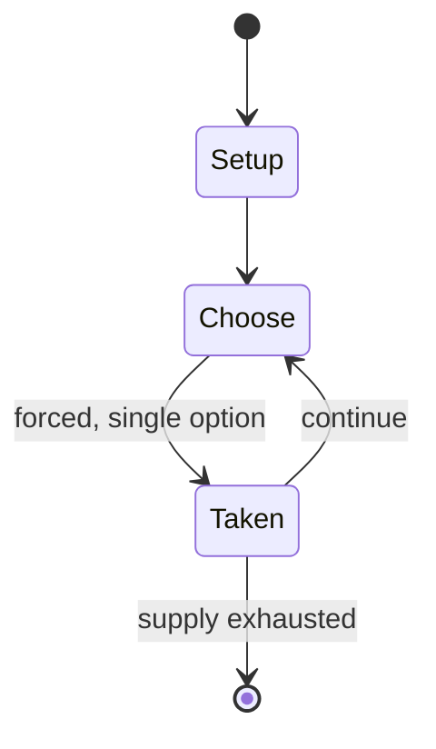

# house

*children's game, in which players take on the roles of a nuclear family (e.g. parents, children, a newborn, pets), often with props, such as toy food, and sometimes with dolls playing certain roles*

`house` &nbsp; state: **DEEPENED** &nbsp; method: **heuristic**

## Found layer (recorded, not trusted)

| field | value |
| --- | --- |
| wikidata | Q1318393 |
| wikipedia | House (game) |
| genres (source) | -- |
| instance of (source) | children's game, traditional game |
| country of origin | -- |

## Declared layer (orders bench work)

| field | value |
| --- | --- |
| year created | -- |
| epoch | -- |
| region | -- |
| media | - |
| players | -- |
| age band | CHILD |
| exogenous process | -- |
| loss shape | -- |
| live axes | - |
| horizon | -- |
| scoring shape | -- |
| information | -- |
| interaction | -- |
| turn structure | -- |
| tractability | SAMPLING_ONLY |
| randomness | -- |
| luck factor | 0.35 |
| rules complexity | 1.74 |
| strategic depth | 2.0 |
| novelty | 0.0877 |
| solved status | -- |
| strategies | -- |
| algorithms | -- |

## Object model

```
Episode
  players      : ?
  turn_structure: ?
  horizon       : ?
  scoring       : ?

State          -- opaque; no medium or axis evidence was found
Player         -- an agent that selects among legal successors
```

## State transition diagram



## Research item -- turn trace

```
# house -- simulated turn events
# generated from the DECLARED vector, not from a rulebook.
# structure: exo=None loss=None horizon=None scoring=None axes=-

t=0    SETUP        players=2  pot=0  capacity=7
t=1    FORCED       p1 single legal option taken (pot_gain=+1.9)
t=2    FORCED       p1 single legal option taken (pot_gain=+0.8)
t=3    FORCED       p1 single legal option taken (pot_gain=+1.1)
t=4    FORCED       p1 single legal option taken (pot_gain=+1.2)
t=5    ENDTURN      turn passes to p2
t=6    FORCED       p2 single legal option taken (pot_gain=+1.7)
t=7    FORCED       p2 single legal option taken (pot_gain=+1.9)
t=8    ENDTURN      turn passes to p1
t=9    FORCED       p1 single legal option taken (pot_gain=+1.9)
t=10   FORCED       p1 single legal option taken (pot_gain=+1.6)
t=11   ENDTURN      turn passes to p2
t=12   FORCED       p2 single legal option taken (pot_gain=+0.8)
t=13   FORCED       p2 single legal option taken (pot_gain=+1.2)
t=14   ENDTURN      turn passes to p1
t=15   FORCED       p1 single legal option taken (pot_gain=+0.9)
t=16   FORCED       p1 single legal option taken (pot_gain=+1.6)
t=17   ENDTURN      turn passes to p2
t=18   FORCED       p2 single legal option taken (pot_gain=+1.4)
t=19   ENDTURN      turn passes to p1
t=20   FORCED       p1 single legal option taken (pot_gain=+1.7)
t=21   FORCED       p1 single legal option taken (pot_gain=+1.1)
t=22   ENDTURN      turn passes to p2
t=23   FORCED       p2 single legal option taken (pot_gain=+0.7)
t=24   FORCED       p2 single legal option taken (pot_gain=+1.2)
t=25   ENDTURN      turn passes to p1
t=26   FORCED       p1 single legal option taken (pot_gain=+0.7)

terminal: VARIABLE
```

## Source extract

House, also referred to as "playing house" or "play grown up", is a traditional children's game.
It is a form of make-believe where players take on the roles of a nuclear family. Common roles
include parents, children, a newborn, and pets.  The game often involves props, such as toy food
or mock-up kitchen appliances. Additionally, dolls or other forms of toys can play the role of
family members. Model houses and play kitchens are toys which are often specifically intended
for playing house. The game is played both at home and in kindergarten or day care.   == In
other cultures == In  Chinese, the game is called "扮家家酒" or "过家家" (playing/living a family). In
Dutch, the game is called "vadertje en moedertje" (little father and little mother). In  German,
the game is called "Mutter, Vater, Kind" (mother, father, child). In Hungarian, the game is
called "papás-mamás" (fatherly-motherly). In Italian, the game is called "mamma casetta"(mother
little home). In Japanese, the game is called "ままごと"(playing cooking). In Persian, the common
term (خاله بازی or مامان بازی) means "mother play" or "auntie play", highlighting that the game
is stereotypically played by girls. In Russian, the game is

<sub>Wikipedia, CC BY-SA. Retained as evidence for the structural
classification above. Every rule inferred from it is HYPOTHESIZED
until audited against a rulebook.</sub>
