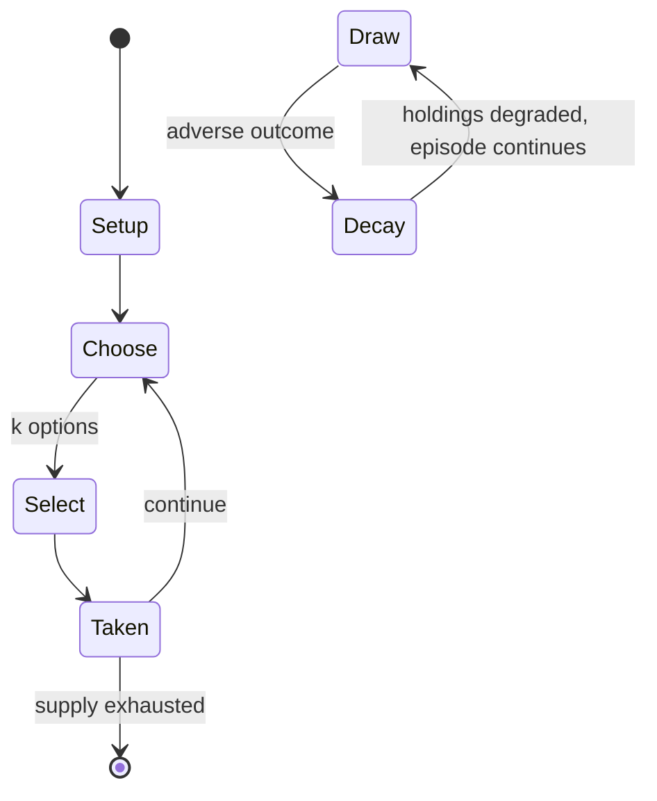

# Humankind

*2021 video game*

`humankind` &nbsp; state: **DEEPENED** &nbsp; method: **heuristic**

## Found layer (recorded, not trusted)

| field | value |
| --- | --- |
| wikidata | Q74705108 |
| wikipedia | Humankind (video game) |
| genres (source) | 4X, grand strategy wargame, turn-based strategy video game |
| instance of (source) | video game |
| country of origin | France |

## Declared layer (orders bench work)

| field | value |
| --- | --- |
| year created | 2021 |
| epoch | CONTEMPORARY |
| region | EUROPE_WEST |
| media | VIDEO |
| players | -- |
| age band | -- |
| exogenous process | -- |
| loss shape | PARTIAL_DECAY |
| live axes | SELECT, TRADE |
| horizon | -- |
| scoring shape | LINEAR_ACCUMULATION |
| information | -- |
| interaction | NEGOTIATION |
| turn structure | -- |
| tractability | SAMPLING_ONLY |
| randomness | -- |
| luck factor | 0.35 |
| rules complexity | 2.94 |
| strategic depth | 2.0 |
| novelty | 0.6906 |
| solved status | -- |
| strategies | -- |
| algorithms | -- |

## Object model

```
Episode
  players      : ?
  turn_structure: ?
  horizon       : ?
  scoring       : LINEAR_ACCUMULATION

WorldState     -- simulation state advanced by the engine
Avatar         -- player-controlled agent
Clock          -- frame or tick counter
OptionSet      -- the choices available after an exogenous draw
Offer          -- proposed exchange between two agents
```

## State transition diagram



## Research item -- turn trace

```
# Humankind -- simulated turn events
# generated from the DECLARED vector, not from a rulebook.
# structure: exo=None loss=PARTIAL_DECAY horizon=None scoring=LINEAR_ACCUMULATION axes=SELECT,TRADE

t=0    SETUP        players=2  pot=0  capacity=5
t=1    SELECT       p1 1 options; take #1  (pot_gain=+2.9, capacity=-2)
t=2    TRADE        p1 offers 2:1 exchange to p2
t=3    SELECT       p1 2 options; take #1  (pot_gain=+0.5, capacity=-2)
t=4    TRADE        p1 offers 2:1 exchange to p2
t=5    ENDTURN      turn passes to p2
t=6    SELECT       p2 2 options; take #2  (pot_gain=+1.3, capacity=-1)
t=7    SELECT       p2 4 options; take #3  (pot_gain=+1.6, capacity=-0)
t=8    SELECT       p2 2 options; take #2  (pot_gain=+1.7, capacity=-2)
t=9    SELECT       p2 1 options; take #1  (pot_gain=+0.8, capacity=-0)
t=10   TRADE        p2 offers 2:1 exchange to p1
t=11   SELECT       p2 1 options; take #1  (pot_gain=+0.8, capacity=-0)
t=12   SELECT       p2 2 options; take #2  (pot_gain=+1.0, capacity=-1)
t=13   SELECT       p2 2 options; take #1  (pot_gain=+1.7, capacity=-0)
t=14   ENDTURN      turn passes to p1
t=15   SELECT       p1 4 options; take #1  (pot_gain=+3.2, capacity=-1)
t=16   SELECT       p1 1 options; take #1  (pot_gain=+1.9, capacity=-1)
t=17   TRADE        p1 offers 2:1 exchange to p2
t=18   SELECT       p1 3 options; take #3  (pot_gain=+0.6, capacity=-0)
t=19   TRADE        p1 offers 2:1 exchange to p2
t=20   SELECT       p1 2 options; take #1  (pot_gain=+1.8, capacity=-2)
t=21   SELECT       p1 2 options; take #1  (pot_gain=+3.4, capacity=-0)
t=22   SELECT       p1 3 options; take #3  (pot_gain=+1.5, capacity=-1)
t=23   SELECT       p1 1 options; take #1  (pot_gain=+0.7, capacity=-0)
t=24   TRADE        p1 offers 2:1 exchange to p2
t=25   SELECT       p1 2 options; take #2  (pot_gain=+1.4, capacity=-0)
t=26   SELECT       p1 2 options; take #1  (pot_gain=+1.1, capacity=-1)

terminal: VARIABLE
```

## Conditions

| kind | threshold | effect | trigger |
| --- | --- | --- | --- |
| PENALTY | -- | -- | A distinguishing feature of Humankind is that within each of the eras, the player selects one of ten civilization types based on historical societies; this selection offers both bonuses and penalties to how the player ca |

## Source extract

Humankind is a turn-based strategy 4X video game by Amplitude Studios and published by Sega. The
game was released for Microsoft Windows and Stadia in August 2021, for macOS in November 2021,
and for PlayStation and Xbox consoles in August 2023. It received generally favorable reviews.
== Gameplay ==  Humankind is a 4X game comparable to the Civilization series. Players lead their
civilization across six major eras of human civilization, starting from the nomadic age,
directing how the civilization should expand, developing cities, controlling military and other
types of units as they interact with other civilizations on the virtual planet, randomly
generated at the start of a new game. A distinguishing feature of Humankind is that within each
of the eras, the player selects one of ten civilization types based on historical societies;
this selection offers both bonuses and penalties to how the player can build out the
civilization. Because a player can select different civilizations as templates to build upon,
there exist potentially one million different civilization patterns that a player can ultimately
develop. Building out cities follows a similar model from Amplitude's Endle

<sub>Wikipedia, CC BY-SA. Retained as evidence for the structural
classification above. Every rule inferred from it is HYPOTHESIZED
until audited against a rulebook.</sub>
