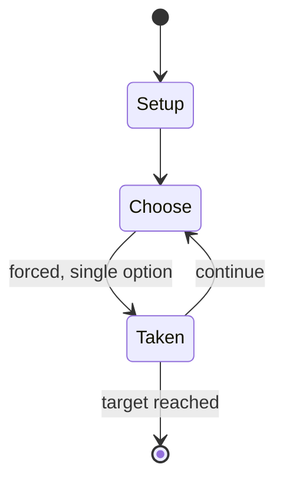

# Hyena chase

`hyena_chase` &nbsp; state: **DEEPENED** &nbsp; method: **heuristic**

## Found layer (recorded, not trusted)

| field | value |
| --- | --- |
| wikidata | Q966029 |
| wikipedia | Hyena chase |
| genres (source) | -- |
| instance of (source) | -- |
| country of origin | -- |

## Declared layer (orders bench work)

| field | value |
| --- | --- |
| year created | -- |
| epoch | -- |
| region | -- |
| media | - |
| players | -- |
| age band | -- |
| exogenous process | -- |
| loss shape | -- |
| live axes | ORDER |
| horizon | RACE_TO_TARGET |
| scoring shape | RACE_POSITION |
| information | -- |
| interaction | -- |
| turn structure | -- |
| tractability | SAMPLING_ONLY |
| randomness | DICE |
| luck factor | 0.58 |
| rules complexity | 1.72 |
| strategic depth | 1.87 |
| novelty | 0.6416 |
| solved status | -- |
| strategies | -- |
| algorithms | -- |

## Object model

```
Episode
  players      : ?
  turn_structure: ?
  horizon       : RACE_TO_TARGET
  scoring       : RACE_POSITION

Sequence       -- the permutation under the player's control
```

## State transition diagram



## Research item -- turn trace

```
# Hyena chase -- simulated turn events
# generated from the DECLARED vector, not from a rulebook.
# structure: exo=None loss=None horizon=RACE_TO_TARGET scoring=RACE_POSITION axes=ORDER

t=0    SETUP        players=2  pot=0  capacity=4
t=1    FORCED       p1 single legal option taken (pot_gain=+0.5)
t=2    FORCED       p1 single legal option taken (pot_gain=+0.9)
t=3    ENDTURN      turn passes to p2
t=4    FORCED       p2 single legal option taken (pot_gain=+1.2)
t=5    FORCED       p2 single legal option taken (pot_gain=+1.3)
t=6    ENDTURN      turn passes to p1
t=7    FORCED       p1 single legal option taken (pot_gain=+1.0)
t=8    FORCED       p1 single legal option taken (pot_gain=+0.9)
t=9    ENDTURN      turn passes to p2
t=10   FORCED       p2 single legal option taken (pot_gain=+1.4)
t=11   FORCED       p2 single legal option taken (pot_gain=+1.5)
t=12   ENDTURN      turn passes to p1
t=13   FORCED       p1 single legal option taken (pot_gain=+1.5)
t=14   FORCED       p1 single legal option taken (pot_gain=+2.0)
t=15   FORCED       p1 single legal option taken (pot_gain=+0.9)
t=16   FORCED       p1 single legal option taken (pot_gain=+1.9)
t=17   FORCED       p1 single legal option taken (pot_gain=+1.8)
t=18   ENDTURN      turn passes to p2
t=19   FORCED       p2 single legal option taken (pot_gain=+0.9)
t=20   FORCED       p2 single legal option taken (pot_gain=+1.1)
t=21   ENDTURN      turn passes to p1
t=22   FORCED       p1 single legal option taken (pot_gain=+0.9)
t=23   ENDTURN      turn passes to p2
t=24   FORCED       p2 single legal option taken (pot_gain=+1.8)
t=25   FORCED       p2 single legal option taken (pot_gain=+1.1)
t=26   ENDTURN      turn passes to p1

terminal: RACE_TO_TARGET
```

## Conditions

| kind | threshold | effect | trigger |
| --- | --- | --- | --- |
| ELIMINATE | -- | -- | The hyena moves at twice the speed of the mothers (double the score of the die), and any mothers the hyena passes on the return journey are eaten and removed from the game. |
| WIN | -- | -- | The first player to get their mother back to the village (an exact throw is not required) wins the game. |

## Source extract

Hyena chase (or Hyena game, or Hyena) is a simple race game originating in North Africa. It
features a spiral track, and players race their pieces along the spiral from the outside to the
centre and back. The first player to finish wins the hyena, which also travels along the spiral.
On the return journey to the outside, the hyena eats any of the players it passes.   == Overview
== The playing area is traditionally marked on the ground, but may be drawn on paper. It has a
sequence of many circles arranged in a spiral, each representing a camp and the end of a day's
journey. The first circle at the outside of the spiral is larger and represents a village, and
the final circle at the centre of the spiral represents a well at an oasis. Each player owns a
piece, representing a mother. The objective of the game is to travel from the village to the
well, then be the first player to return to the village. There is also a piece to represent the
hyena, which is unleashed by the winning player to jeopardise the return of the other mothers.
== Gameplay == All pieces start at the village. The players move their mothers according to the
roll of a die (traditionally pieces of stick were used).

<sub>Wikipedia, CC BY-SA. Retained as evidence for the structural
classification above. Every rule inferred from it is HYPOTHESIZED
until audited against a rulebook.</sub>
