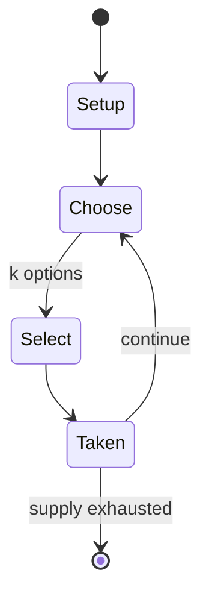

# I spy

`i_spy` &nbsp; state: **DEEPENED** &nbsp; method: **heuristic**

## Found layer (recorded, not trusted)

| field | value |
| --- | --- |
| wikidata | Q2953800 |
| wikipedia | I spy |
| genres (source) | -- |
| instance of (source) | -- |
| country of origin | -- |

## Declared layer (orders bench work)

| field | value |
| --- | --- |
| year created | -- |
| epoch | -- |
| region | -- |
| media | - |
| players | -- |
| age band | -- |
| exogenous process | -- |
| loss shape | -- |
| live axes | SELECT |
| horizon | -- |
| scoring shape | -- |
| information | -- |
| interaction | SOLITAIRE |
| turn structure | -- |
| tractability | SAMPLING_ONLY |
| randomness | -- |
| luck factor | 0.35 |
| rules complexity | 2.01 |
| strategic depth | 2.0 |
| novelty | 0.3843 |
| solved status | -- |
| strategies | -- |
| algorithms | -- |

## Object model

```
Episode
  players      : ?
  turn_structure: ?
  horizon       : ?
  scoring       : ?

OptionSet      -- the choices available after an exogenous draw
```

## State transition diagram



## Research item -- turn trace

```
# I spy -- simulated turn events
# generated from the DECLARED vector, not from a rulebook.
# structure: exo=None loss=None horizon=None scoring=None axes=SELECT

t=0    SETUP        players=2  pot=0  capacity=4
t=1    SELECT       p1 1 options; take #1  (pot_gain=+2.3, capacity=-0)
t=2    ENDTURN      turn passes to p2
t=3    SELECT       p2 4 options; take #2  (pot_gain=+2.7, capacity=-2)
t=4    SELECT       p2 1 options; take #1  (pot_gain=+1.2, capacity=-2)
t=5    SELECT       p2 2 options; take #1  (pot_gain=+3.5, capacity=-0)
t=6    ENDTURN      turn passes to p1
t=7    SELECT       p1 2 options; take #1  (pot_gain=+1.8, capacity=-2)
t=8    SELECT       p1 4 options; take #3  (pot_gain=+2.3, capacity=-2)
t=9    SELECT       p1 4 options; take #1  (pot_gain=+2.2, capacity=-2)
t=10   SELECT       p1 2 options; take #2  (pot_gain=+2.0, capacity=-0)
t=11   SELECT       p1 3 options; take #3  (pot_gain=+0.6, capacity=-1)
t=12   SELECT       p1 2 options; take #2  (pot_gain=+2.4, capacity=-2)
t=13   SELECT       p1 2 options; take #2  (pot_gain=+0.9, capacity=-1)
t=14   ENDTURN      turn passes to p2
t=15   SELECT       p2 1 options; take #1  (pot_gain=+3.4, capacity=-0)
t=16   SELECT       p2 2 options; take #2  (pot_gain=+2.9, capacity=-0)
t=17   SELECT       p2 3 options; take #3  (pot_gain=+1.2, capacity=-1)
t=18   SELECT       p2 2 options; take #2  (pot_gain=+1.0, capacity=-1)
t=19   SELECT       p2 2 options; take #2  (pot_gain=+1.0, capacity=-1)
t=20   SELECT       p2 3 options; take #1  (pot_gain=+1.5, capacity=-0)
t=21   SELECT       p2 3 options; take #3  (pot_gain=+0.7, capacity=-0)
t=22   ENDTURN      turn passes to p1
t=23   SELECT       p1 2 options; take #1  (pot_gain=+2.7, capacity=-0)
t=24   SELECT       p1 4 options; take #2  (pot_gain=+1.4, capacity=-2)
t=25   SELECT       p1 1 options; take #1  (pot_gain=+0.9, capacity=-0)
t=26   SELECT       p1 1 options; take #1  (pot_gain=+3.1, capacity=-2)

terminal: VARIABLE
```

## Source extract

I spy is a guessing game where one player (the spy or it) chooses an object within sight and
announces to the other players that "I spy with my little eye something beginning with...",
naming the first letter of the object. Other players attempt to guess this object. It is often
played as a car game.   == Rules == One player is chosen to be the Spy, and they silently select
an object that is visible to all the players. They do not announce their choice, and instead
say, "I spy with my little eye something beginning with ...", naming the letter the chosen
object starts with (e.g. "I spy with my little eye something beginning with C" if the chosen
object is a cow). Other players then have to guess the chosen object. Traditionally players ask
directly about particular possibilities ("Is it a cat?"). Once a guesser has correctly
identified the object, they become the Spy for the next round and the game starts again. If
younger children are playing who are not so good at guessing, the role of Spy can be passed
around in a set order. The Spy cannot change the object once it has been chosen. The game relies
on trust as the Spy is the only person who knows whether the guessers are correct

<sub>Wikipedia, CC BY-SA. Retained as evidence for the structural
classification above. Every rule inferred from it is HYPOTHESIZED
until audited against a rulebook.</sub>
