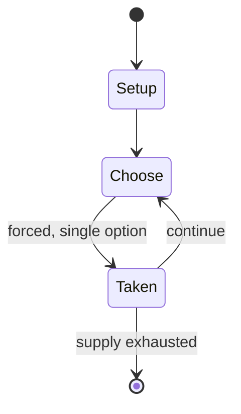

# Igisoro

*board game*

`igisoro` &nbsp; state: **DEEPENED** &nbsp; method: **heuristic**

## Found layer (recorded, not trusted)

| field | value |
| --- | --- |
| wikidata | Q17092289 |
| wikipedia | Igisoro |
| genres (source) | -- |
| instance of (source) | mancala |
| country of origin | -- |

## Declared layer (orders bench work)

| field | value |
| --- | --- |
| year created | -- |
| epoch | -- |
| region | -- |
| media | MANCALA |
| players | 2 |
| age band | -- |
| exogenous process | -- |
| loss shape | -- |
| live axes | SPATIAL |
| horizon | -- |
| scoring shape | -- |
| information | -- |
| interaction | COMPETITIVE |
| turn structure | STRICT_TURN |
| tractability | SAMPLING_ONLY |
| randomness | -- |
| luck factor | 0.35 |
| rules complexity | 2.07 |
| strategic depth | 2.0 |
| novelty | 0.4915 |
| solved status | -- |
| strategies | -- |
| algorithms | -- |

## Object model

```
Episode
  players      : 2
  turn_structure: STRICT_TURN
  horizon       : ?
  scoring       : ?

Pits           -- cyclic array of counts
Store          -- player's banked seeds
Placement      -- position subject to geometric legality
```

## State transition diagram



## Research item -- turn trace

```
# Igisoro -- simulated turn events
# generated from the DECLARED vector, not from a rulebook.
# structure: exo=None loss=None horizon=None scoring=None axes=SPATIAL

t=0    SETUP        players=2  pot=0  capacity=3
t=1    FORCED       p1 single legal option taken (pot_gain=+1.5)
t=2    FORCED       p1 single legal option taken (pot_gain=+0.7)
t=3    SPATIAL      p1 places at (2,4); adjacency legal
t=4    FORCED       p1 single legal option taken (pot_gain=+1.3)
t=5    FORCED       p1 single legal option taken (pot_gain=+0.7)
t=6    FORCED       p1 single legal option taken (pot_gain=+1.9)
t=7    FORCED       p1 single legal option taken (pot_gain=+0.8)
t=8    SPATIAL      p1 places at (2,3); adjacency legal
t=9    FORCED       p1 single legal option taken (pot_gain=+1.6)
t=10   SPATIAL      p1 places at (1,2); adjacency legal
t=11   FORCED       p1 single legal option taken (pot_gain=+1.4)
t=12   ENDTURN      turn passes to p2
t=13   FORCED       p2 single legal option taken (pot_gain=+1.6)
t=14   FORCED       p2 single legal option taken (pot_gain=+0.9)
t=15   SPATIAL      p2 places at (7,1); adjacency legal
t=16   FORCED       p2 single legal option taken (pot_gain=+1.6)
t=17   FORCED       p2 single legal option taken (pot_gain=+0.5)
t=18   FORCED       p2 single legal option taken (pot_gain=+1.8)
t=19   SPATIAL      p2 places at (4,4); adjacency legal
t=20   FORCED       p2 single legal option taken (pot_gain=+1.8)
t=21   SPATIAL      p2 places at (1,5); adjacency legal
t=22   FORCED       p2 single legal option taken (pot_gain=+0.7)
t=23   FORCED       p2 single legal option taken (pot_gain=+1.0)
t=24   FORCED       p2 single legal option taken (pot_gain=+1.6)
t=25   FORCED       p2 single legal option taken (pot_gain=+1.2)
t=26   ENDTURN      turn passes to p1

terminal: VARIABLE
```

## Conditions

| kind | threshold | effect | trigger |
| --- | --- | --- | --- |
| TERMINATE | -- | -- | The game is over and a player has lost when they cannot sow any of their seeds. |

## Source extract

Igisoro is a two-player variant of the mancala family. It is a variant of the Omweso game of the
Baganda people (Uganda), and it is played primarily in Burundi and Rwanda. Igisoro, like Omweso
and other mancalas from Eastern Africa, such as Bao, is played with a 4×8 board of pits and 64
seeds. A player's territory is the two rows of pits closest to them.   == Start == The usual
starting position is shown below. Each player starts with 4 seeds in each pit in the back row of
their territory. However, any player may decide to start with seeds in their front row, or with
some seeds in either row depending on their wishes.   == Turns == On his turn, a player chooses
a pit containing seeds in their territory and sows them placing one seed in each pit as they
move counter-clockwise around their territory. The board below shows the state after the first
player moved the seeds from the pit highlighted in yellow.  At the end of a turn, there are two
ways in which the players turn may continue:  If the pit where the last seed is sown is not
empty, the player picks up all seeds from this pit and begins to sow again, starting from the
next pit. If the pit where the last seed is sown is not empt

<sub>Wikipedia, CC BY-SA. Retained as evidence for the structural
classification above. Every rule inferred from it is HYPOTHESIZED
until audited against a rulebook.</sub>
