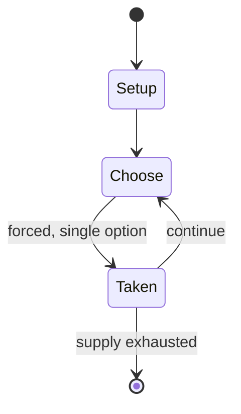

# Illuminati: New World Order

*collectible card game*

`illuminati_new_world_order` &nbsp; state: **DEEPENED** &nbsp; method: **heuristic**

## Found layer (recorded, not trusted)

| field | value |
| --- | --- |
| wikidata | Q3148739 |
| wikipedia | Illuminati: New World Order |
| genres (source) | -- |
| instance of (source) | collectible card game |
| country of origin | United States |

## Declared layer (orders bench work)

| field | value |
| --- | --- |
| year created | 1994 |
| epoch | DIGITAL |
| region | NORTH_AMERICA |
| media | CARD, COLLECTIBLE |
| players | 2-6 |
| age band | -- |
| exogenous process | -- |
| loss shape | -- |
| live axes | - |
| horizon | -- |
| scoring shape | -- |
| information | -- |
| interaction | -- |
| turn structure | STRICT_TURN |
| tractability | SAMPLING_ONLY |
| randomness | -- |
| luck factor | 0.35 |
| rules complexity | 2.17 |
| strategic depth | 2.25 |
| novelty | 0.4324 |
| solved status | -- |
| strategies | spatial_packing |
| algorithms | -- |

## Object model

```
Episode
  players      : 2-6
  turn_structure: STRICT_TURN
  horizon       : ?
  scoring       : ?

Deck           -- ordered multiset, drawn without replacement
Hand           -- private multiset held by one player
DiscardPile    -- public accumulation of spent cards
```

## State transition diagram



## Research item -- turn trace

```
# Illuminati: New World Order -- simulated turn events
# generated from the DECLARED vector, not from a rulebook.
# structure: exo=None loss=None horizon=None scoring=None axes=-

t=0    SETUP        players=2  pot=0  capacity=6
t=1    FORCED       p1 single legal option taken (pot_gain=+0.7)
t=2    ENDTURN      turn passes to p2
t=3    FORCED       p2 single legal option taken (pot_gain=+0.6)
t=4    FORCED       p2 single legal option taken (pot_gain=+1.8)
t=5    ENDTURN      turn passes to p1
t=6    FORCED       p1 single legal option taken (pot_gain=+1.2)
t=7    ENDTURN      turn passes to p2
t=8    FORCED       p2 single legal option taken (pot_gain=+1.3)
t=9    ENDTURN      turn passes to p1
t=10   FORCED       p1 single legal option taken (pot_gain=+1.6)
t=11   FORCED       p1 single legal option taken (pot_gain=+0.6)
t=12   ENDTURN      turn passes to p2
t=13   FORCED       p2 single legal option taken (pot_gain=+1.1)
t=14   FORCED       p2 single legal option taken (pot_gain=+1.6)
t=15   FORCED       p2 single legal option taken (pot_gain=+1.4)
t=16   FORCED       p2 single legal option taken (pot_gain=+1.7)
t=17   ENDTURN      turn passes to p1
t=18   FORCED       p1 single legal option taken (pot_gain=+1.1)
t=19   FORCED       p1 single legal option taken (pot_gain=+1.9)
t=20   FORCED       p1 single legal option taken (pot_gain=+1.4)
t=21   FORCED       p1 single legal option taken (pot_gain=+1.4)
t=22   FORCED       p1 single legal option taken (pot_gain=+0.8)
t=23   ENDTURN      turn passes to p2
t=24   FORCED       p2 single legal option taken (pot_gain=+1.0)
t=25   ENDTURN      turn passes to p1
t=26   FORCED       p1 single legal option taken (pot_gain=+1.7)

terminal: VARIABLE
```

## Source extract

Illuminati: New World Order (INWO) is an out-of-print collectible card game (CCG) that was
released in 1994 by Steve Jackson Games, based on their original boxed game Illuminati, which in
turn was inspired by the 1975 book The Illuminatus! Trilogy by Robert Anton Wilson and Robert
Shea.  An OMNI sealed-deck league patterned after the Atlas Games model was also developed. The
409-card set was sold in packages containing two 55-card starter decks and in 15-card booster
packs.The booster packs contained cards of the types 'Group' and 'Plot', but not 'Illuminati'.
The INWO Factory Set was a collector's set released in April 1995, containing one of each of the
403 cards in the base set plus blank cards and three of each Illuminati card. Steve Jackson
Games published a 144-page player's guide titled The INWO Book in April 1995 that contained
rules, strategies, color prints of all cards, and also included a rare card from the Unlimited
Edition. The limited edition Assassins, the game's first expansion set, was released in mid-1995
and sold in 8-card booster packs. The 100-card expansion set SubGenius was planned for release
in August 1997 and ultimately released in April 1998. The Bavaria

<sub>Wikipedia, CC BY-SA. Retained as evidence for the structural
classification above. Every rule inferred from it is HYPOTHESIZED
until audited against a rulebook.</sub>
