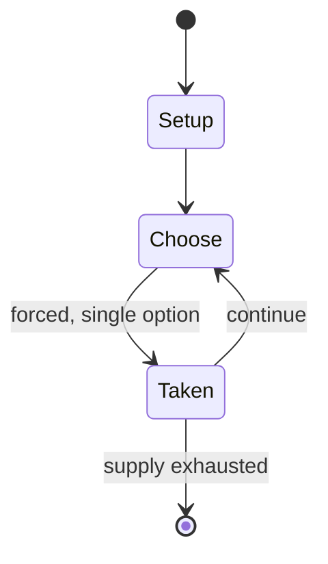

# IMVU

*social networking site*

`imvu` &nbsp; state: **DEEPENED** &nbsp; method: **heuristic**

## Found layer (recorded, not trusted)

| field | value |
| --- | --- |
| wikidata | Q2361202 |
| wikipedia | IMVU |
| genres (source) | -- |
| instance of (source) | social network, software, video game |
| country of origin | United States |

## Declared layer (orders bench work)

| field | value |
| --- | --- |
| year created | 2004 |
| epoch | CONTEMPORARY |
| region | NORTH_AMERICA |
| media | VIDEO |
| players | -- |
| age band | -- |
| exogenous process | -- |
| loss shape | -- |
| live axes | TRADE |
| horizon | -- |
| scoring shape | -- |
| information | -- |
| interaction | NEGOTIATION |
| turn structure | -- |
| tractability | SAMPLING_ONLY |
| randomness | -- |
| luck factor | 0.35 |
| rules complexity | 2.53 |
| strategic depth | 2.25 |
| novelty | 0.5114 |
| solved status | -- |
| strategies | route_optimisation |
| algorithms | -- |

## Object model

```
Episode
  players      : ?
  turn_structure: ?
  horizon       : ?
  scoring       : ?

WorldState     -- simulation state advanced by the engine
Avatar         -- player-controlled agent
Clock          -- frame or tick counter
Offer          -- proposed exchange between two agents
```

## State transition diagram



## Research item -- turn trace

```
# IMVU -- simulated turn events
# generated from the DECLARED vector, not from a rulebook.
# structure: exo=None loss=None horizon=None scoring=None axes=TRADE

t=0    SETUP        players=2  pot=0  capacity=8
t=1    FORCED       p1 single legal option taken (pot_gain=+1.8)
t=2    FORCED       p1 single legal option taken (pot_gain=+1.6)
t=3    FORCED       p1 single legal option taken (pot_gain=+1.1)
t=4    FORCED       p1 single legal option taken (pot_gain=+1.3)
t=5    FORCED       p1 single legal option taken (pot_gain=+0.9)
t=6    ENDTURN      turn passes to p2
t=7    FORCED       p2 single legal option taken (pot_gain=+1.2)
t=8    FORCED       p2 single legal option taken (pot_gain=+1.9)
t=9    TRADE        p2 offers 2:1 exchange to p1
t=10   FORCED       p2 single legal option taken (pot_gain=+0.6)
t=11   FORCED       p2 single legal option taken (pot_gain=+1.5)
t=12   FORCED       p2 single legal option taken (pot_gain=+0.6)
t=13   FORCED       p2 single legal option taken (pot_gain=+0.9)
t=14   ENDTURN      turn passes to p1
t=15   FORCED       p1 single legal option taken (pot_gain=+0.6)
t=16   TRADE        p1 offers 2:1 exchange to p2
t=17   FORCED       p1 single legal option taken (pot_gain=+0.7)
t=18   ENDTURN      turn passes to p2
t=19   FORCED       p2 single legal option taken (pot_gain=+0.8)
t=20   FORCED       p2 single legal option taken (pot_gain=+1.2)
t=21   FORCED       p2 single legal option taken (pot_gain=+1.0)
t=22   ENDTURN      turn passes to p1
t=23   FORCED       p1 single legal option taken (pot_gain=+0.7)
t=24   FORCED       p1 single legal option taken (pot_gain=+0.8)
t=25   FORCED       p1 single legal option taken (pot_gain=+0.9)
t=26   TRADE        p1 offers 2:1 exchange to p2

terminal: VARIABLE
```

## Source extract

IMVU (, stylized as imvu) is an online virtual world and social networking site.   == History ==
IMVU was founded in 2004 and was originally backed by venture investors Menlo Ventures,
AllegisCyber Capital, Justin Greene, Bridgescale Partners, and Best Buy Capital. IMVU members
use 3D avatars to meet new people, chat, create, and play games. In 2014, IMVU had approximately
six million active players, and had the largest virtual goods catalog of more than 6 million
items as of 2011. The business was previously located in Mountain View, California. In March
2020, IMVU introduced Live Rooms, a feature enabling users to host live events such as fashion
shows, lectures, talk shows, and virtual weddings, allowing audience interaction and tipping. In
2022, IMVU partnered with Spectrum Labs to use artificial intelligence that identifies and
rewards healthy behavior in online interactions.   == Name == The company name was neither an
acronym nor an initialism. IMVU co-founder Eric Ries described the accidental process by which
the company acquired its meaningless name, and stated "It's not an acronym; it doesn't stand for
anything".  IMVU's official account had used the backronym "Instant M

<sub>Wikipedia, CC BY-SA. Retained as evidence for the structural
classification above. Every rule inferred from it is HYPOTHESIZED
until audited against a rulebook.</sub>
