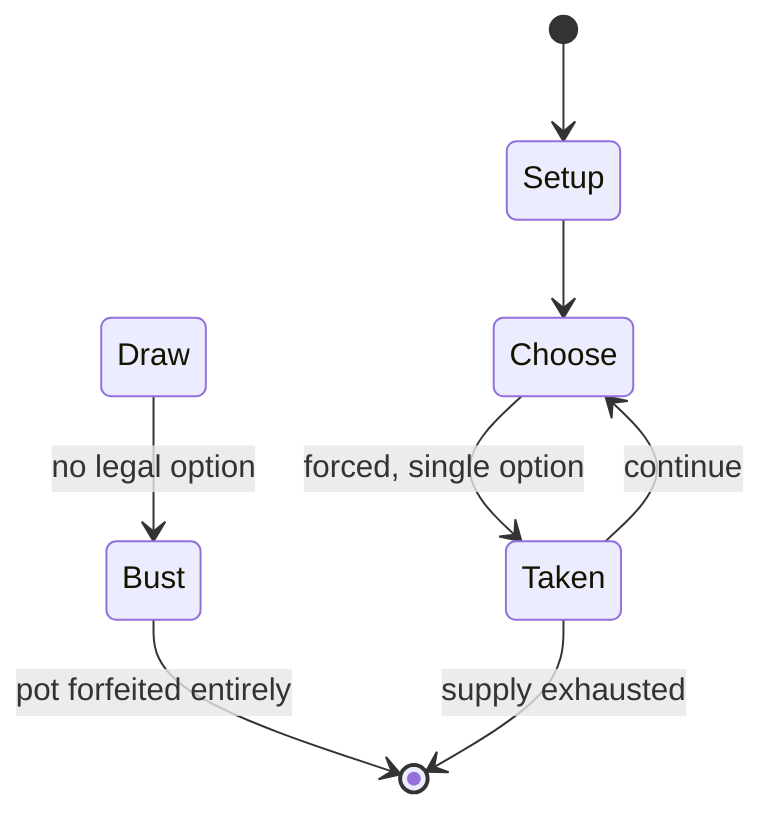

# Incan Gold

`incan_gold` &nbsp; state: **DEEPENED** &nbsp; method: **heuristic**

## Found layer (recorded, not trusted)

| field | value |
| --- | --- |
| wikidata | -- |
| wikipedia | Incan Gold |
| genres (source) | -- |
| instance of (source) | -- |
| country of origin | -- |

## Declared layer (orders bench work)

| field | value |
| --- | --- |
| year created | 2005 |
| epoch | CONTEMPORARY |
| region | -- |
| media | CARD |
| players | -- |
| age band | -- |
| exogenous process | -- |
| loss shape | TOTAL_RUIN |
| live axes | - |
| horizon | -- |
| scoring shape | LINEAR_ACCUMULATION |
| information | -- |
| interaction | -- |
| turn structure | -- |
| tractability | SAMPLING_ONLY |
| randomness | -- |
| luck factor | 0.35 |
| rules complexity | 1.71 |
| strategic depth | 2.0 |
| novelty | 0.4958 |
| solved status | -- |
| strategies | -- |
| algorithms | -- |

## Object model

```
Episode
  players      : ?
  turn_structure: ?
  horizon       : ?
  scoring       : LINEAR_ACCUMULATION

Deck           -- ordered multiset, drawn without replacement
Hand           -- private multiset held by one player
DiscardPile    -- public accumulation of spent cards
```

## State transition diagram



## Research item -- turn trace

```
# Incan Gold -- simulated turn events
# generated from the DECLARED vector, not from a rulebook.
# structure: exo=None loss=TOTAL_RUIN horizon=None scoring=LINEAR_ACCUMULATION axes=-

t=0    SETUP        players=2  pot=0  capacity=5
t=1    FORCED       p1 single legal option taken (pot_gain=+0.6)
t=2    ENDTURN      turn passes to p2
t=3    DEATH        p2 no legal option -- BUST. pot 0.6 -> 0.0
t=4    NOTE         loss_shape=TOTAL_RUIN: entire pot forfeited

terminal: VARIABLE
```

## Conditions

| kind | threshold | effect | trigger |
| --- | --- | --- | --- |
| WIN | 5 rounds | -- | After five rounds, the player with the most treasure is the winner. |
| ELIMINATE | -- | -- | Friedemann Friese suggested that the card "that triggered the bust" be removed from the game and that only one voting token was necessary. |

## Source extract

Diamant is a multiplayer card game designed by Alan R. Moon and Bruno Faidutti, published in
2005 in Germany by Schmidt Spiele, with illustrations provided by Jörg Asselborn, Christof
Tisch, and Claus Stephan. An English-language edition of Diamant was published in 2006, by
Sunriver Games under the name Incan Gold, with illustrations provided by Matthias Catrein. The
rules for Incan Gold and Diamant are the same, but the games have other minor differences.   ==
Gameplay == Players take on the role of adventurers looking for treasure in a diamond mine.
Players search for diamonds while trying to avoid various hazards such as spiders and snakes.
Fearful players can run out of the cave, while daring players can choose to venture on, push
their luck, and risk losing the treasure they have accumulated. After five rounds, the player
with the most treasure is the winner.   === Differences from Incan Gold === In Diamant players
are exploring a cave or diamond mine; in Incan Gold, players are exploring a temple. Incan Gold
comes with artifact cards, but Diamant does not. In Diamant, players have treasure chests; in
Incan Gold players have tents at their camp. In Diamant, players are searchi

<sub>Wikipedia, CC BY-SA. Retained as evidence for the structural
classification above. Every rule inferred from it is HYPOTHESIZED
until audited against a rulebook.</sub>
