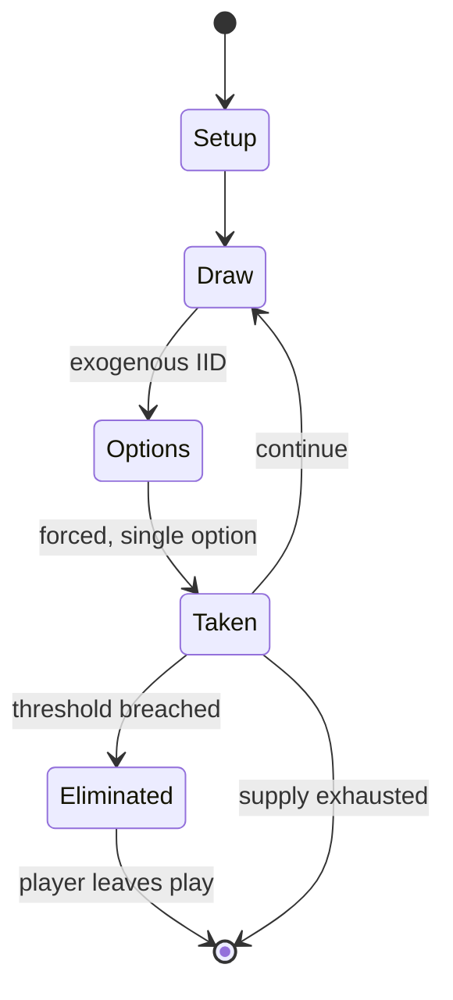

# Inferno (board game)

*board game*

`inferno_board_game` &nbsp; state: **DEEPENED** &nbsp; method: **heuristic**

## Found layer (recorded, not trusted)

| field | value |
| --- | --- |
| wikidata | Q104821874 |
| wikipedia | Inferno (board game) |
| genres (source) | -- |
| instance of (source) | board wargame |
| country of origin | -- |

## Declared layer (orders bench work)

| field | value |
| --- | --- |
| year created | 1996 |
| epoch | DIGITAL |
| region | -- |
| media | BOARD |
| players | 2-5 |
| age band | -- |
| exogenous process | IID |
| loss shape | ELIMINATION |
| live axes | SPATIAL |
| horizon | -- |
| scoring shape | SURVIVAL |
| information | -- |
| interaction | -- |
| turn structure | -- |
| tractability | EXACT_WITH_CUT |
| randomness | DICE |
| luck factor | 0.58 |
| rules complexity | 1.97 |
| strategic depth | 1.87 |
| novelty | 0.7556 |
| solved status | -- |
| strategies | -- |
| algorithms | -- |

## Object model

```
Episode
  players      : 2-5
  turn_structure: ?
  horizon       : ?
  scoring       : SURVIVAL

Board          -- spatial substrate; cells carry position and occupancy
Piece          -- movable token owned by a player
Placement      -- position subject to geometric legality
```

## State transition diagram



## Research item -- turn trace

```
# Inferno (board game) -- simulated turn events
# generated from the DECLARED vector, not from a rulebook.
# structure: exo=IID loss=ELIMINATION horizon=None scoring=SURVIVAL axes=SPATIAL

t=0    SETUP        players=2  pot=0  capacity=5
t=1    DRAW         p1 roll from d6 pool -> outcome #4  (p=0.060)
t=2    FORCED       p1 single legal option taken (pot_gain=+1.6)
t=3    SPATIAL      p1 places at (5,2); adjacency legal
t=4    DRAW         p1 roll from d6 pool -> outcome #5  (p=0.155)
t=5    FORCED       p1 single legal option taken (pot_gain=+1.6)
t=6    SPATIAL      p1 places at (0,2); adjacency legal
t=7    DRAW         p1 roll from d6 pool -> outcome #6  (p=0.267)
t=8    FORCED       p1 single legal option taken (pot_gain=+1.5)
t=9    SPATIAL      p1 places at (1,7); adjacency legal
t=10   DRAW         p1 roll from d6 pool -> outcome #5  (p=0.118)
t=11   FORCED       p1 single legal option taken (pot_gain=+1.1)
t=12   ENDTURN      turn passes to p2
t=13   DRAW         p2 roll from d6 pool -> outcome #3  (p=0.031)
t=14   FORCED       p2 single legal option taken (pot_gain=+0.5)
t=15   DRAW         p2 roll from d6 pool -> outcome #4  (p=0.141)
t=16   FORCED       p2 single legal option taken (pot_gain=+1.5)
t=17   DRAW         p2 roll from d6 pool -> outcome #1  (p=0.110)
t=18   FORCED       p2 single legal option taken (pot_gain=+1.6)
t=19   DRAW         p2 roll from d6 pool -> outcome #5  (p=0.267)
t=20   FORCED       p2 single legal option taken (pot_gain=+0.7)
t=21   SPATIAL      p2 places at (3,2); adjacency legal
t=22   DRAW         p2 roll from d6 pool -> outcome #3  (p=0.183)
t=23   FORCED       p2 single legal option taken (pot_gain=+1.6)
t=24   DRAW         p2 roll from d6 pool -> outcome #1  (p=0.156)
t=25   FORCED       p2 single legal option taken (pot_gain=+0.6)
t=26   SPATIAL      p2 places at (0,0); adjacency legal

terminal: VARIABLE
```

## Conditions

| kind | threshold | effect | trigger |
| --- | --- | --- | --- |
| ELIMINATE | -- | eliminated | Once a group has been defeated, that player is eliminated from the game. |
| WIN | -- | -- | The last player to survive is the winner. |

## Source extract

Inferno is a combat board game that was published by Global Games Company in 1996.   ==
Description == Inferno is a miniatures-based game for 2-5 players that is set in Dante
Alighieri's Inferno. Each player chooses an Archfiend and arms it with spells and weapons, and
also chooses and arms several lieutenants. After each player has created their group of demons,
they battle each other for control of the Abyss. Once a group has been defeated, that player is
eliminated from the game. The last player to survive is the winner.   === Components === The
game comes with   two hex grid maps four cardstock sheets of cutouts that include counters,
chits, and circles a 64-page book of Fiendish history titled "The Tome of the Abyss" a rulebook
two six-sided dice The first issue ("Issue 0") of H.A.V.O.C. Magazine   == Publication history
== Canadian games company Global Games had previously published the board game Legions of Steel
(1992), for which they also marketed associated lines of 25 mm miniatures. In similar fashion,
Global published Inferno in 1996, a board game designed by Marco Pecota that also came with
cardboard counters, but for which Global produced extensive lines of metal mini

<sub>Wikipedia, CC BY-SA. Retained as evidence for the structural
classification above. Every rule inferred from it is HYPOTHESIZED
until audited against a rulebook.</sub>
