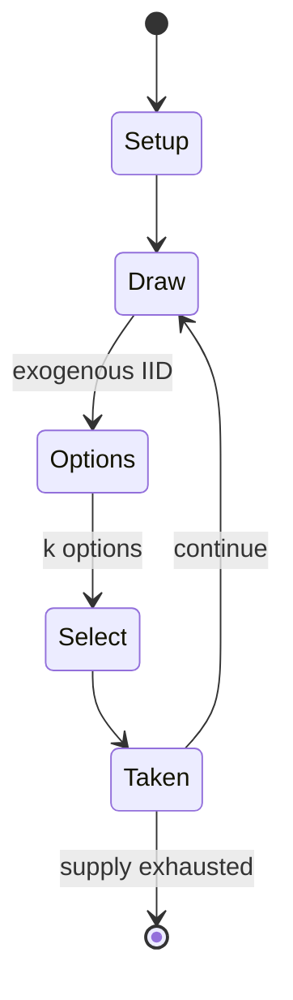

# Inferno (role-playing game)

*fantasy role-playing game*

`inferno_role_playing_game` &nbsp; state: **DEEPENED** &nbsp; method: **heuristic**

## Found layer (recorded, not trusted)

| field | value |
| --- | --- |
| wikidata | Q104821877 |
| wikipedia | Inferno (role-playing game) |
| genres (source) | -- |
| instance of (source) | fantasy role-playing game, tabletop role-playing game |
| country of origin | -- |

## Declared layer (orders bench work)

| field | value |
| --- | --- |
| year created | 1994 |
| epoch | DIGITAL |
| region | -- |
| media | RPG |
| players | -- |
| age band | -- |
| exogenous process | IID |
| loss shape | -- |
| live axes | SELECT |
| horizon | -- |
| scoring shape | -- |
| information | -- |
| interaction | -- |
| turn structure | -- |
| tractability | SAMPLING_ONLY |
| randomness | DICE |
| luck factor | 0.58 |
| rules complexity | 3.22 |
| strategic depth | 1.87 |
| novelty | 0.3846 |
| solved status | -- |
| strategies | -- |
| algorithms | -- |

## Object model

```
Episode
  players      : ?
  turn_structure: ?
  horizon       : ?
  scoring       : ?

Character      -- persistent stat block owned by a player
GameMaster     -- adjudicating agent outside the scoring loop
Scenario       -- authored state the players traverse
OptionSet      -- the choices available after an exogenous draw
```

## State transition diagram



## Research item -- turn trace

```
# Inferno (role-playing game) -- simulated turn events
# generated from the DECLARED vector, not from a rulebook.
# structure: exo=IID loss=None horizon=None scoring=None axes=SELECT

t=0    SETUP        players=2  pot=0  capacity=4
t=1    DRAW         p1 roll from d6 pool -> outcome #2  (p=0.282)
t=2    SELECT       p1 2 options; take #2  (pot_gain=+3.3, capacity=-2)
t=3    DRAW         p1 roll from d6 pool -> outcome #1  (p=0.018)
t=4    SELECT       p1 3 options; take #3  (pot_gain=+0.9, capacity=-2)
t=5    DRAW         p1 roll from d6 pool -> outcome #5  (p=0.238)
t=6    SELECT       p1 4 options; take #4  (pot_gain=+0.8, capacity=-0)
t=7    DRAW         p1 roll from d6 pool -> outcome #5  (p=0.077)
t=8    SELECT       p1 2 options; take #1  (pot_gain=+1.8, capacity=-2)
t=9    DRAW         p1 roll from d6 pool -> outcome #4  (p=0.249)
t=10   SELECT       p1 3 options; take #1  (pot_gain=+2.3, capacity=-0)
t=11   DRAW         p1 roll from d6 pool -> outcome #6  (p=0.029)
t=12   SELECT       p1 4 options; take #1  (pot_gain=+2.9, capacity=-0)
t=13   DRAW         p1 roll from d6 pool -> outcome #5  (p=0.021)
t=14   SELECT       p1 1 options; take #1  (pot_gain=+1.3, capacity=-2)
t=15   ENDTURN      turn passes to p2
t=16   DRAW         p2 roll from d6 pool -> outcome #2  (p=0.287)
t=17   SELECT       p2 1 options; take #1  (pot_gain=+1.6, capacity=-0)
t=18   DRAW         p2 roll from d6 pool -> outcome #5  (p=0.108)
t=19   SELECT       p2 1 options; take #1  (pot_gain=+1.7, capacity=-1)
t=20   ENDTURN      turn passes to p1
t=21   DRAW         p1 roll from d6 pool -> outcome #4  (p=0.002)
t=22   SELECT       p1 1 options; take #1  (pot_gain=+2.7, capacity=-2)
t=23   DRAW         p1 roll from d6 pool -> outcome #6  (p=0.132)
t=24   SELECT       p1 2 options; take #1  (pot_gain=+2.4, capacity=-2)
t=25   DRAW         p1 roll from d6 pool -> outcome #4  (p=0.183)
t=26   SELECT       p1 2 options; take #2  (pot_gain=+1.4, capacity=-0)

terminal: VARIABLE
```

## Source extract

Inferno is a fantasy role-playing game published by Death's Edge Games in 1994.   == Description
== Inferno is a role-playing game set in Hell. The player have a choice between playing a heroic
player character who tries to rescue the souls of the innocent that have been taken by evil
forces and aids damned spirits struggling to achieve redemption; or an evil necromancer seeking
to conquer Hell. In addition to role-playing rules, the book also contains magical spells, and a
compendium of infernal creatures.   === Character generation === Players choose one of four
races (mortal, shade, hellspawn, or imp), and roll dice to create the character's attributes.
Players then choose a class, which also determines faith status from Faithful to Infernal.
Faithful characters are more constrained in terms of actions and magic, but Infernal characters
have no protection from more powerful evil beings. To finish the character, the player purchases
skills using a pool of creation points.   === Skill and combat resolution === To resolve both
skills and combat, the player must roll a twenty-sided die and get the same or less than the
target number. For every two points by which a combat roll succe

<sub>Wikipedia, CC BY-SA. Retained as evidence for the structural
classification above. Every rule inferred from it is HYPOTHESIZED
until audited against a rulebook.</sub>
