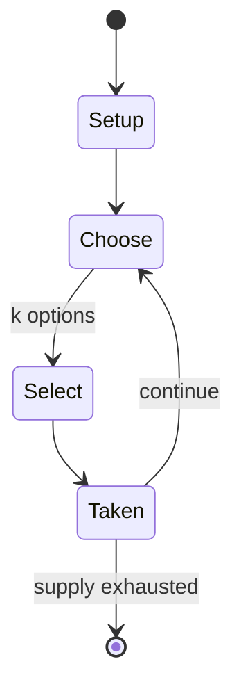

# international draughts

*strategy board game*

`international_draughts` &nbsp; state: **DEEPENED** &nbsp; method: **heuristic**

## Found layer (recorded, not trusted)

| field | value |
| --- | --- |
| wikidata | Q989473 |
| wikipedia | International draughts |
| genres (source) | -- |
| instance of (source) | Variants of draughts, board game, game-based sport, individual sport, type of sport |
| country of origin | -- |

## Declared layer (orders bench work)

| field | value |
| --- | --- |
| year created | 1600 |
| epoch | EARLY_MODERN |
| region | -- |
| media | BOARD, SPORT |
| players | 2 |
| age band | -- |
| exogenous process | -- |
| loss shape | -- |
| live axes | SELECT |
| horizon | -- |
| scoring shape | -- |
| information | -- |
| interaction | SOLITAIRE |
| turn structure | -- |
| tractability | SAMPLING_ONLY |
| randomness | -- |
| luck factor | 0.35 |
| rules complexity | 2.12 |
| strategic depth | 2.25 |
| novelty | 0.3896 |
| solved status | -- |
| strategies | signalling |
| algorithms | -- |

## Object model

```
Episode
  players      : 2
  turn_structure: ?
  horizon       : ?
  scoring       : ?

Board          -- spatial substrate; cells carry position and occupancy
Piece          -- movable token owned by a player
Pitch          -- bounded physical region
Player         -- embodied agent with a foul count
Clock          -- counts down; stoppages are rule events
Official       -- detects infractions and applies penalties
OptionSet      -- the choices available after an exogenous draw
```

## State transition diagram



## Research item -- turn trace

```
# international draughts -- simulated turn events
# generated from the DECLARED vector, not from a rulebook.
# structure: exo=None loss=None horizon=None scoring=None axes=SELECT

t=0    SETUP        players=2  pot=0  capacity=4
t=1    SELECT       p1 4 options; take #4  (pot_gain=+3.4, capacity=-2)
t=2    SELECT       p1 3 options; take #3  (pot_gain=+1.8, capacity=-2)
t=3    ENDTURN      turn passes to p2
t=4    SELECT       p2 1 options; take #1  (pot_gain=+1.4, capacity=-2)
t=5    SELECT       p2 4 options; take #1  (pot_gain=+2.1, capacity=-2)
t=6    SELECT       p2 4 options; take #2  (pot_gain=+0.7, capacity=-1)
t=7    SELECT       p2 2 options; take #2  (pot_gain=+1.9, capacity=-0)
t=8    SELECT       p2 2 options; take #1  (pot_gain=+2.3, capacity=-0)
t=9    SELECT       p2 3 options; take #2  (pot_gain=+2.4, capacity=-2)
t=10   ENDTURN      turn passes to p1
t=11   SELECT       p1 2 options; take #2  (pot_gain=+1.8, capacity=-1)
t=12   ENDTURN      turn passes to p2
t=13   SELECT       p2 3 options; take #1  (pot_gain=+0.7, capacity=-2)
t=14   ENDTURN      turn passes to p1
t=15   SELECT       p1 1 options; take #1  (pot_gain=+3.5, capacity=-1)
t=16   SELECT       p1 4 options; take #1  (pot_gain=+1.9, capacity=-0)
t=17   SELECT       p1 1 options; take #1  (pot_gain=+3.2, capacity=-0)
t=18   SELECT       p1 3 options; take #3  (pot_gain=+0.6, capacity=-2)
t=19   ENDTURN      turn passes to p2
t=20   SELECT       p2 4 options; take #2  (pot_gain=+2.5, capacity=-1)
t=21   ENDTURN      turn passes to p1
t=22   SELECT       p1 3 options; take #1  (pot_gain=+1.5, capacity=-2)
t=23   ENDTURN      turn passes to p2
t=24   SELECT       p2 2 options; take #2  (pot_gain=+2.2, capacity=-1)
t=25   SELECT       p2 2 options; take #2  (pot_gain=+2.7, capacity=-2)
t=26   ENDTURN      turn passes to p1

terminal: VARIABLE
```

## Conditions

| kind | threshold | effect | trigger |
| --- | --- | --- | --- |
| WIN | -- | -- | A game is a draw if neither opponent has the possibility to win the game. |
| BOUNDARY | -- | -- | Before a proposal for a draw can be made, at least 40 moves must have been made by each player. |

## Source extract

International draughts (also called international checkers or  Polish draughts) is a strategy
board game for two players, one of the variants of draughts. The gameboard comprises 10×10
squares in alternating dark and light colours, of which only the 50 dark squares are used. Each
player has 20 pieces, light for one player and dark for the other, at opposite sides of the
board. In conventional diagrams, the board is displayed with the light pieces at the bottom; in
this orientation, the lower-left corner square must be dark.   == History == According to Dutch
draughts historian Arie van der Stoep, it is unknown where the 10×10 square draughts board first
came into use. In the Netherlands, the board was probably used from 1550, and the number of
pieces was extended to 2×20 between 1650 and 1700. The name "Polish draughts" was probably
following a Dutch convention of the time that "unnatural" ideas were considered "Polish".   ==
Rules == The general rule is that all moves and captures are made diagonally. All references to
squares refer to the dark squares only. The main differences from English draughts are: the size
of the board (10×10), pieces can also capture backward (not only fo

<sub>Wikipedia, CC BY-SA. Retained as evidence for the structural
classification above. Every rule inferred from it is HYPOTHESIZED
until audited against a rulebook.</sub>
