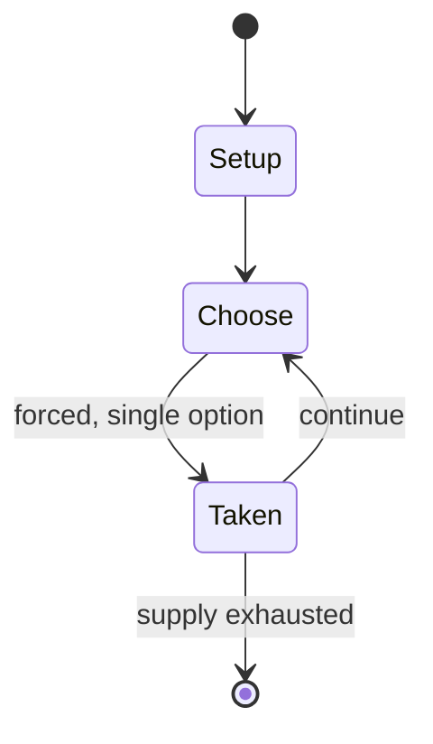

# iRacing

*2008 video game*

`iracing` &nbsp; state: **DEEPENED** &nbsp; method: **heuristic**

## Found layer (recorded, not trusted)

| field | value |
| --- | --- |
| wikidata | Q254255 |
| wikipedia | IRacing |
| genres (source) | racing video game, sim racing |
| instance of (source) | esports discipline, video game |
| country of origin | United States |

## Declared layer (orders bench work)

| field | value |
| --- | --- |
| year created | 2008 |
| epoch | CONTEMPORARY |
| region | NORTH_AMERICA |
| media | VIDEO |
| players | -- |
| age band | -- |
| exogenous process | -- |
| loss shape | -- |
| live axes | - |
| horizon | -- |
| scoring shape | -- |
| information | -- |
| interaction | COMPETITIVE |
| turn structure | -- |
| tractability | SAMPLING_ONLY |
| randomness | -- |
| luck factor | 0.35 |
| rules complexity | 1.7 |
| strategic depth | 2.0 |
| novelty | 0.3541 |
| solved status | -- |
| strategies | -- |
| algorithms | -- |

## Object model

```
Episode
  players      : ?
  turn_structure: ?
  horizon       : ?
  scoring       : ?

WorldState     -- simulation state advanced by the engine
Avatar         -- player-controlled agent
Clock          -- frame or tick counter
```

## State transition diagram



## Research item -- turn trace

```
# iRacing -- simulated turn events
# generated from the DECLARED vector, not from a rulebook.
# structure: exo=None loss=None horizon=None scoring=None axes=-

t=0    SETUP        players=2  pot=0  capacity=8
t=1    FORCED       p1 single legal option taken (pot_gain=+1.0)
t=2    ENDTURN      turn passes to p2
t=3    FORCED       p2 single legal option taken (pot_gain=+1.6)
t=4    FORCED       p2 single legal option taken (pot_gain=+1.7)
t=5    FORCED       p2 single legal option taken (pot_gain=+0.6)
t=6    FORCED       p2 single legal option taken (pot_gain=+0.6)
t=7    FORCED       p2 single legal option taken (pot_gain=+2.0)
t=8    FORCED       p2 single legal option taken (pot_gain=+1.6)
t=9    FORCED       p2 single legal option taken (pot_gain=+0.9)
t=10   FORCED       p2 single legal option taken (pot_gain=+0.9)
t=11   FORCED       p2 single legal option taken (pot_gain=+0.9)
t=12   FORCED       p2 single legal option taken (pot_gain=+2.0)
t=13   FORCED       p2 single legal option taken (pot_gain=+0.8)
t=14   FORCED       p2 single legal option taken (pot_gain=+0.6)
t=15   FORCED       p2 single legal option taken (pot_gain=+1.2)
t=16   FORCED       p2 single legal option taken (pot_gain=+1.3)
t=17   FORCED       p2 single legal option taken (pot_gain=+1.1)
t=18   FORCED       p2 single legal option taken (pot_gain=+0.9)
t=19   FORCED       p2 single legal option taken (pot_gain=+2.0)
t=20   ENDTURN      turn passes to p1
t=21   FORCED       p1 single legal option taken (pot_gain=+1.6)
t=22   ENDTURN      turn passes to p2
t=23   FORCED       p2 single legal option taken (pot_gain=+1.5)
t=24   FORCED       p2 single legal option taken (pot_gain=+1.0)
t=25   FORCED       p2 single legal option taken (pot_gain=+1.7)
t=26   FORCED       p2 single legal option taken (pot_gain=+2.0)

terminal: VARIABLE
```

## Conditions

| kind | threshold | effect | trigger |
| --- | --- | --- | --- |
| ELIMINATE | -- | -- | Players can be penalized in-race or disqualified from a session for incurring too many incident points. |
| BOUNDARY | -- | -- | PC Gamer stated that the game was "not one that will be to everyone's taste", while GameStar back in 2009 concluded "The graphics give the impression of an unfinished beta, but at least the atmosphere between the players |

## Source extract

iRacing is a subscription-based online sim racing video game developed and published by iRacing
Studios in 2008. All in-game sessions are hosted on the publisher's servers. The game simulates
real world cars, tracks, and racing events, and enforces rules of conduct modeled on real auto
racing events.   == Gameplay ==  iRacing primarily focuses on creating an environment in game
that will mimic real-life driving as closely as possible, including the use of LIDAR-scanned
cars and tracks. In most circumstances, players are confined to a cockpit-only view when
driving. iRacing offers a day-night-cycle, offering more dynamic racing due to temperature
variation and limited sight at night. As of 2024, iRacing also added a realistic dynamic weather
model, simulating rain and fog with its respective effects on the track's surface and
temperature. Racing wheels and gamepads are supported, as are adaptive controllers and other
auxiliary input devices. iRacing also supports the use of VR headsets. Support for computer-
controlled opponents was added in late 2019. Initially limited to a small selection of tracks
and cars, the developer has gradually added support for more of the game's content.

<sub>Wikipedia, CC BY-SA. Retained as evidence for the structural
classification above. Every rule inferred from it is HYPOTHESIZED
until audited against a rulebook.</sub>
