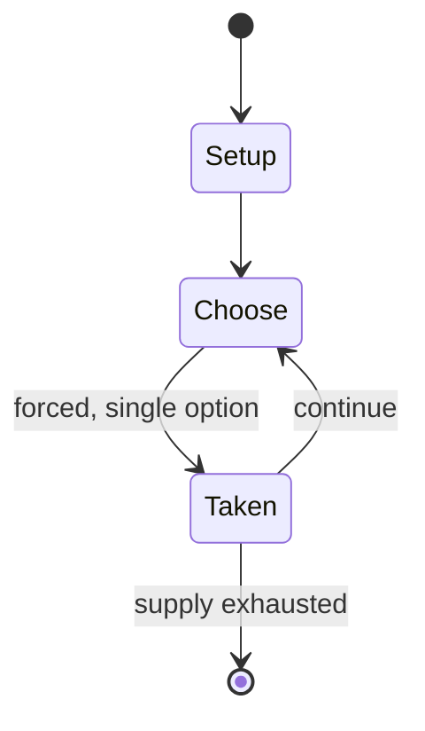

# Jachigi

*Korean stick game*

`jachigi` &nbsp; state: **DEEPENED** &nbsp; method: **heuristic**

## Found layer (recorded, not trusted)

| field | value |
| --- | --- |
| wikidata | Q6110713 |
| wikipedia | Jachigi |
| genres (source) | -- |
| instance of (source) | children's game |
| country of origin | Korea |

## Declared layer (orders bench work)

| field | value |
| --- | --- |
| year created | -- |
| epoch | -- |
| region | EAST_ASIA |
| media | - |
| players | -- |
| age band | CHILD |
| exogenous process | -- |
| loss shape | -- |
| live axes | - |
| horizon | -- |
| scoring shape | -- |
| information | -- |
| interaction | -- |
| turn structure | -- |
| tractability | SAMPLING_ONLY |
| randomness | -- |
| luck factor | 0.35 |
| rules complexity | 1.71 |
| strategic depth | 2.0 |
| novelty | 0.0896 |
| solved status | -- |
| strategies | -- |
| algorithms | -- |

## Object model

```
Episode
  players      : ?
  turn_structure: ?
  horizon       : ?
  scoring       : ?

State          -- opaque; no medium or axis evidence was found
Player         -- an agent that selects among legal successors
```

## State transition diagram



## Research item -- turn trace

```
# Jachigi -- simulated turn events
# generated from the DECLARED vector, not from a rulebook.
# structure: exo=None loss=None horizon=None scoring=None axes=-

t=0    SETUP        players=2  pot=0  capacity=6
t=1    FORCED       p1 single legal option taken (pot_gain=+1.7)
t=2    FORCED       p1 single legal option taken (pot_gain=+1.9)
t=3    ENDTURN      turn passes to p2
t=4    FORCED       p2 single legal option taken (pot_gain=+1.6)
t=5    FORCED       p2 single legal option taken (pot_gain=+0.9)
t=6    FORCED       p2 single legal option taken (pot_gain=+1.8)
t=7    ENDTURN      turn passes to p1
t=8    FORCED       p1 single legal option taken (pot_gain=+0.8)
t=9    FORCED       p1 single legal option taken (pot_gain=+1.6)
t=10   FORCED       p1 single legal option taken (pot_gain=+1.9)
t=11   FORCED       p1 single legal option taken (pot_gain=+1.2)
t=12   FORCED       p1 single legal option taken (pot_gain=+1.6)
t=13   FORCED       p1 single legal option taken (pot_gain=+1.4)
t=14   FORCED       p1 single legal option taken (pot_gain=+1.3)
t=15   FORCED       p1 single legal option taken (pot_gain=+1.9)
t=16   FORCED       p1 single legal option taken (pot_gain=+1.3)
t=17   FORCED       p1 single legal option taken (pot_gain=+1.7)
t=18   FORCED       p1 single legal option taken (pot_gain=+1.4)
t=19   FORCED       p1 single legal option taken (pot_gain=+1.0)
t=20   FORCED       p1 single legal option taken (pot_gain=+0.8)
t=21   FORCED       p1 single legal option taken (pot_gain=+1.6)
t=22   FORCED       p1 single legal option taken (pot_gain=+1.5)
t=23   FORCED       p1 single legal option taken (pot_gain=+1.3)
t=24   FORCED       p1 single legal option taken (pot_gain=+1.0)
t=25   ENDTURN      turn passes to p2
t=26   FORCED       p2 single legal option taken (pot_gain=+0.8)

terminal: VARIABLE
```

## Source extract

Jachigi (Korean: 자치기) is a South Korean game where a long stick and two short sticks is hit and
caught. First, a circular hole is dug on the ground, and a circle is drawn on the outside. After
placing a short stick around the outside of the hole, it is hit with the long stick, and the
rebounding stick (the short one that was just hit), is hit again with the long stick in mid-air,
sending it flying far away.   == History == Jachigi is said to have originated from the game
called gyeokgu, a popular sport in ancient Goryeo used for military purposes. It involved two
teams holding sticks, which were used to shoot a ball in between two goal posts set up in the
middle of a gyeokgu field. The game resembled the modern-day field hockey sport especially as it
was also played on horseback. It was, however, included in the military service examination and
training in the Joseon period. The advent of modern warfare, particularly after Joseon's war
with Japan, made the gyeokgu irrelevant in armed combat and from then on, it transformed into
simpler forms and spread across Korea as popular children's games. It was the basis of the
shuttlecock-kicking game and the jachigi. The jachigi game denote

<sub>Wikipedia, CC BY-SA. Retained as evidence for the structural
classification above. Every rule inferred from it is HYPOTHESIZED
until audited against a rulebook.</sub>
