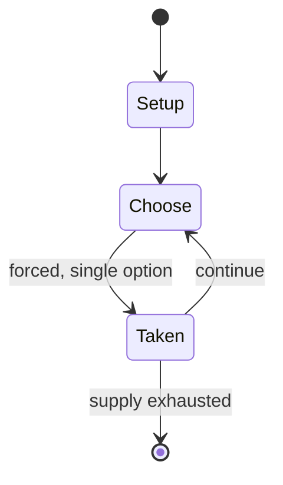

# Jack Move

*2022 video game*

`jack_move` &nbsp; state: **DEEPENED** &nbsp; method: **heuristic**

## Found layer (recorded, not trusted)

| field | value |
| --- | --- |
| wikidata | Q106960102 |
| wikipedia | Jack Move |
| genres (source) | Japanese role-playing video game |
| instance of (source) | video game |
| country of origin | Taiwan |

## Declared layer (orders bench work)

| field | value |
| --- | --- |
| year created | 2022 |
| epoch | CONTEMPORARY |
| region | EAST_ASIA |
| media | VIDEO |
| players | -- |
| age band | -- |
| exogenous process | -- |
| loss shape | -- |
| live axes | - |
| horizon | -- |
| scoring shape | -- |
| information | -- |
| interaction | -- |
| turn structure | -- |
| tractability | SAMPLING_ONLY |
| randomness | -- |
| luck factor | 0.35 |
| rules complexity | 1.63 |
| strategic depth | 2.0 |
| novelty | 0.0896 |
| solved status | -- |
| strategies | -- |
| algorithms | -- |

## Object model

```
Episode
  players      : ?
  turn_structure: ?
  horizon       : ?
  scoring       : ?

WorldState     -- simulation state advanced by the engine
Avatar         -- player-controlled agent
Clock          -- frame or tick counter
```

## State transition diagram



## Research item -- turn trace

```
# Jack Move -- simulated turn events
# generated from the DECLARED vector, not from a rulebook.
# structure: exo=None loss=None horizon=None scoring=None axes=-

t=0    SETUP        players=2  pot=0  capacity=5
t=1    FORCED       p1 single legal option taken (pot_gain=+1.3)
t=2    FORCED       p1 single legal option taken (pot_gain=+0.9)
t=3    ENDTURN      turn passes to p2
t=4    FORCED       p2 single legal option taken (pot_gain=+0.7)
t=5    FORCED       p2 single legal option taken (pot_gain=+1.9)
t=6    FORCED       p2 single legal option taken (pot_gain=+1.3)
t=7    FORCED       p2 single legal option taken (pot_gain=+1.0)
t=8    FORCED       p2 single legal option taken (pot_gain=+1.2)
t=9    FORCED       p2 single legal option taken (pot_gain=+1.6)
t=10   FORCED       p2 single legal option taken (pot_gain=+0.9)
t=11   FORCED       p2 single legal option taken (pot_gain=+0.9)
t=12   FORCED       p2 single legal option taken (pot_gain=+1.3)
t=13   ENDTURN      turn passes to p1
t=14   FORCED       p1 single legal option taken (pot_gain=+0.7)
t=15   FORCED       p1 single legal option taken (pot_gain=+1.6)
t=16   FORCED       p1 single legal option taken (pot_gain=+0.8)
t=17   ENDTURN      turn passes to p2
t=18   FORCED       p2 single legal option taken (pot_gain=+1.4)
t=19   FORCED       p2 single legal option taken (pot_gain=+0.8)
t=20   FORCED       p2 single legal option taken (pot_gain=+1.7)
t=21   FORCED       p2 single legal option taken (pot_gain=+0.7)
t=22   FORCED       p2 single legal option taken (pot_gain=+0.9)
t=23   FORCED       p2 single legal option taken (pot_gain=+1.6)
t=24   FORCED       p2 single legal option taken (pot_gain=+1.6)
t=25   FORCED       p2 single legal option taken (pot_gain=+0.8)
t=26   FORCED       p2 single legal option taken (pot_gain=+1.4)

terminal: VARIABLE
```

## Source extract

Jack Move is a role-playing video game developed by So Romantic and published by HypeTrain
Digital in 2022 for macOS, Windows, Nintendo Switch, PlayStation 4, and Xbox One.   == Gameplay
== Jack Move is a single player turn based role playing game. The combat system of the game is
based around strategic use of three different elements.   == Development == Development of the
game started in 2012, with the creation of a battle system. According to a 2021 interview in
Wireframe Magazine, game was developed in the Unity game engine, making use of 3D environments
in conjunction with a forced perspective, video post-processing and other artistic techniques to
create the illusion of a 2D overworld. The game was influenced by Golden Sun and the Final
Fantasy series, as well as by elements of the film Hackers. A public demo was released on Steam
during the 2021 Steam Summer Festival. In August 2022 an animated trailer was released. The
Windows and macOS versions launched on September 8, 2022, with console versions for Nintendo
Switch, PlayStation 4, and Xbox One following on September 20, 2022.   == Reception ==  Jack
Move received "generally favorable" reviews based on five critics on the

<sub>Wikipedia, CC BY-SA. Retained as evidence for the structural
classification above. Every rule inferred from it is HYPOTHESIZED
until audited against a rulebook.</sub>
