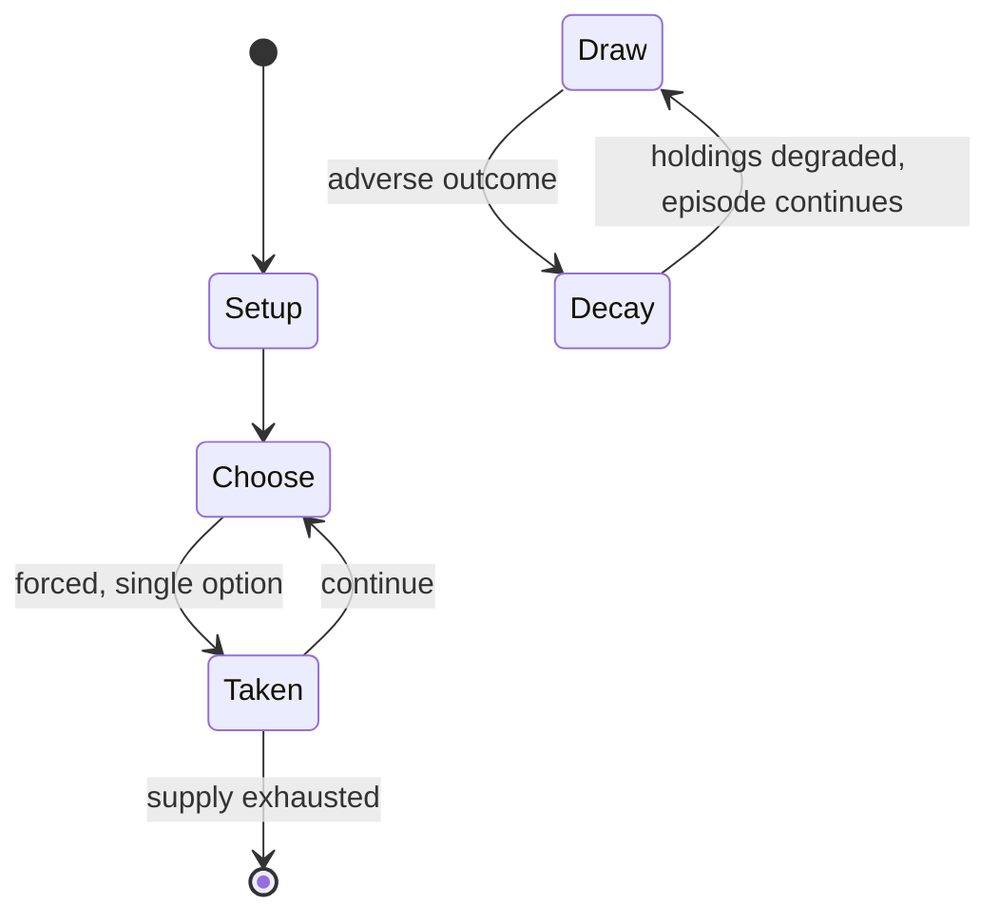

# Japanese mahjong

`japanese_mahjong` &nbsp; state: **DEEPENED** &nbsp; method: **heuristic**

## Found layer (recorded, not trusted)

| field | value |
| --- | --- |
| wikidata | Q1053844 |
| wikipedia | Japanese mahjong |
| genres (source) | -- |
| instance of (source) | -- |
| country of origin | -- |

## Declared layer (orders bench work)

| field | value |
| --- | --- |
| year created | -- |
| epoch | -- |
| region | -- |
| media | TILE |
| players | -- |
| age band | -- |
| exogenous process | -- |
| loss shape | PARTIAL_DECAY |
| live axes | DISCARD |
| horizon | -- |
| scoring shape | SET_COLLECTION_CONVEX |
| information | -- |
| interaction | COMPETITIVE |
| turn structure | -- |
| tractability | SAMPLING_ONLY |
| randomness | -- |
| luck factor | 0.35 |
| rules complexity | 2.2 |
| strategic depth | 2.25 |
| novelty | 0.5787 |
| solved status | -- |
| strategies | set_collection |
| algorithms | -- |

## Object model

```
Episode
  players      : ?
  turn_structure: ?
  horizon       : ?
  scoring       : SET_COLLECTION_CONVEX

TileBag        -- unordered draw source
Layout         -- placed tiles and their adjacencies
DiscardChoice  -- what is given up to satisfy a limit
```

## State transition diagram



## Research item -- turn trace

```
# Japanese mahjong -- simulated turn events
# generated from the DECLARED vector, not from a rulebook.
# structure: exo=None loss=PARTIAL_DECAY horizon=None scoring=SET_COLLECTION_CONVEX axes=DISCARD

t=0    SETUP        players=2  pot=0  capacity=6
t=1    FORCED       p1 single legal option taken (pot_gain=+1.6)
t=2    DISCARD      p1 discards to hand limit
t=3    FORCED       p1 single legal option taken (pot_gain=+0.5)
t=4    DISCARD      p1 discards to hand limit
t=5    FORCED       p1 single legal option taken (pot_gain=+1.9)
t=6    FORCED       p1 single legal option taken (pot_gain=+1.6)
t=7    ENDTURN      turn passes to p2
t=8    FORCED       p2 single legal option taken (pot_gain=+0.6)
t=9    ENDTURN      turn passes to p1
t=10   FORCED       p1 single legal option taken (pot_gain=+1.8)
t=11   FORCED       p1 single legal option taken (pot_gain=+0.6)
t=12   DISCARD      p1 discards to hand limit
t=13   FORCED       p1 single legal option taken (pot_gain=+0.9)
t=14   DISCARD      p1 discards to hand limit
t=15   ENDTURN      turn passes to p2
t=16   FORCED       p2 single legal option taken (pot_gain=+1.6)
t=17   FORCED       p2 single legal option taken (pot_gain=+0.6)
t=18   DISCARD      p2 discards to hand limit
t=19   ENDTURN      turn passes to p1
t=20   FORCED       p1 single legal option taken (pot_gain=+1.5)
t=21   FORCED       p1 single legal option taken (pot_gain=+1.5)
t=22   DISCARD      p1 discards to hand limit
t=23   ENDTURN      turn passes to p2
t=24   FORCED       p2 single legal option taken (pot_gain=+1.9)
t=25   FORCED       p2 single legal option taken (pot_gain=+0.5)
t=26   DISCARD      p2 discards to hand limit
t=27   ENDTURN      turn passes to p1

terminal: VARIABLE
```

## Conditions

| kind | threshold | effect | trigger |
| --- | --- | --- | --- |
| ELIMINATE | 3 player | -- | There is a three player version called sanma (三麻), which eliminates all but the 1 and 9 tiles from the manzu suit, and removes the ability to call "chii". |
| WIN | -- | -- | In Japanese mahjong the first player to complete their hand wins the round. |
| TERMINATE | -- | -- | A game ends when a player's score becomes negative (below zero), or in some rare local rules, at zero points or less. |
| TERMINATE | -- | -- | Some rule sets allow for the last dealer to decide whether to continue playing extra hands in the final round or stop. |
| BOUNDARY | -- | -- | Unlike many variants, a winning hand must have at least one yaku. |
| BOUNDARY | -- | -- | A yakuman is a rare yaku with stringent criteria which automatically scores the maximum number of points, ignoring any other scoring patterns. |
| BOUNDARY | -- | -- | Fu counting is unnecessary if the hand contains at least five han. |
| PENALTY | -- | -- | At the end of a match, players are often given bonus points or penalties depending on their placement (see final points and place). |
| PENALTY | -- | -- | In an optional rule called yakitori (焼き鳥, "grilled bird"), if one did not win a hand in a match, that player pays a penalty. |

## Source extract

Japanese mahjong (Japanese: 麻雀, Hepburn: Mājan), also known as riichi mahjong (リーチ麻雀, rīchi
mājan), is a variant of mahjong. Japanese mahjong shares the same basic rules as other mahjong
variants, but also features a unique set of rules such as riichi (a wager that one's hand will
win without being altered further) and the use of dora (randomly selected tiles that will score
bonus points). The variant is one of a few styles where discarded tiles are ordered rather than
placed in a disorganized pile. This is primarily due to the furiten rule, which takes player
discards into account.  The variant has grown in popularity due to anime, manga, and online
platforms.   == History == In 1924, a soldier named Saburo Hirayama brought the game to Japan.
In Tokyo, he started a mahjong club, parlor, and school.  In the years after, the game
dramatically increased in popularity.  In this process, the game itself was simplified from the
Chinese version. Then later, additional rules were adopted to increase the complexity. Mahjong,
as of 2010, is the most popular table game in Japan. As of 2008, there were approximately 7.6
million mahjong players and about 8,900 mahjong parlors in the country,

<sub>Wikipedia, CC BY-SA. Retained as evidence for the structural
classification above. Every rule inferred from it is HYPOTHESIZED
until audited against a rulebook.</sub>
