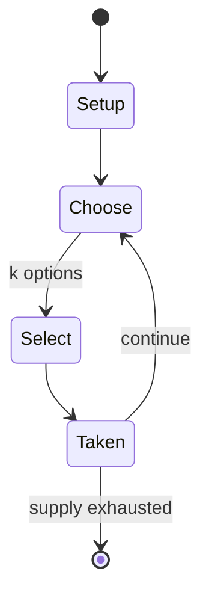

# Jetan

*chess variant*

`jetan` &nbsp; state: **DEEPENED** &nbsp; method: **heuristic**

## Found layer (recorded, not trusted)

| field | value |
| --- | --- |
| wikidata | Q1099092 |
| wikipedia | Jetan |
| genres (source) | -- |
| instance of (source) | chess variant |
| country of origin | -- |

## Declared layer (orders bench work)

| field | value |
| --- | --- |
| year created | 1922 |
| epoch | MODERN |
| region | -- |
| media | GAMBLING |
| players | -- |
| age band | -- |
| exogenous process | -- |
| loss shape | -- |
| live axes | SELECT |
| horizon | -- |
| scoring shape | -- |
| information | -- |
| interaction | COMPETITIVE |
| turn structure | -- |
| tractability | SAMPLING_ONLY |
| randomness | -- |
| luck factor | 0.35 |
| rules complexity | 2.11 |
| strategic depth | 2.0 |
| novelty | 0.3479 |
| solved status | -- |
| strategies | -- |
| algorithms | -- |

## Object model

```
Episode
  players      : ?
  turn_structure: ?
  horizon       : ?
  scoring       : ?

OptionSet      -- the choices available after an exogenous draw
```

## State transition diagram



## Research item -- turn trace

```
# Jetan -- simulated turn events
# generated from the DECLARED vector, not from a rulebook.
# structure: exo=None loss=None horizon=None scoring=None axes=SELECT

t=0    SETUP        players=2  pot=0  capacity=5
t=1    SELECT       p1 1 options; take #1  (pot_gain=+2.0, capacity=-1)
t=2    SELECT       p1 1 options; take #1  (pot_gain=+2.9, capacity=-2)
t=3    SELECT       p1 2 options; take #1  (pot_gain=+2.5, capacity=-1)
t=4    SELECT       p1 2 options; take #2  (pot_gain=+3.1, capacity=-2)
t=5    ENDTURN      turn passes to p2
t=6    SELECT       p2 2 options; take #2  (pot_gain=+0.7, capacity=-2)
t=7    SELECT       p2 3 options; take #2  (pot_gain=+3.3, capacity=-0)
t=8    SELECT       p2 3 options; take #1  (pot_gain=+2.6, capacity=-2)
t=9    SELECT       p2 3 options; take #2  (pot_gain=+0.8, capacity=-2)
t=10   SELECT       p2 3 options; take #1  (pot_gain=+3.5, capacity=-2)
t=11   SELECT       p2 4 options; take #4  (pot_gain=+2.3, capacity=-2)
t=12   SELECT       p2 4 options; take #4  (pot_gain=+2.6, capacity=-1)
t=13   SELECT       p2 3 options; take #3  (pot_gain=+2.6, capacity=-1)
t=14   SELECT       p2 4 options; take #1  (pot_gain=+1.9, capacity=-0)
t=15   SELECT       p2 1 options; take #1  (pot_gain=+2.5, capacity=-0)
t=16   SELECT       p2 1 options; take #1  (pot_gain=+1.1, capacity=-1)
t=17   ENDTURN      turn passes to p1
t=18   SELECT       p1 1 options; take #1  (pot_gain=+1.7, capacity=-2)
t=19   ENDTURN      turn passes to p2
t=20   SELECT       p2 2 options; take #2  (pot_gain=+1.5, capacity=-0)
t=21   SELECT       p2 2 options; take #2  (pot_gain=+0.8, capacity=-0)
t=22   ENDTURN      turn passes to p1
t=23   SELECT       p1 3 options; take #3  (pot_gain=+2.0, capacity=-0)
t=24   SELECT       p1 1 options; take #1  (pot_gain=+1.8, capacity=-2)
t=25   SELECT       p1 2 options; take #1  (pot_gain=+2.5, capacity=-1)
t=26   SELECT       p1 2 options; take #2  (pot_gain=+1.2, capacity=-0)

terminal: VARIABLE
```

## Conditions

| kind | threshold | effect | trigger |
| --- | --- | --- | --- |
| WIN | -- | -- | The lone exception involves the Princess: if one side's piece lands on a square occupied by the other side's Princess, no battle occurs, and the first side wins the game. |

## Source extract

Jetan, also known as Martian chess, is a chess variant first published in 1922. It was created
by Edgar Rice Burroughs as a game played on Barsoom, his fictional version of Mars. The game was
introduced in The Chessmen of Mars, the fifth book in the Barsoom series. Its rules are
described in Chapter 2 and in the Appendix of the book, with an actual game partly described in
Chapter 17.   == Description ==   === Board and pieces ===  Jetan is played on a black and
orange checkered board of 10 ranks by 10 files, with orange pieces on the "north" side and black
pieces on the "south". Each player has the following playing pieces: one Chief, one Princess,
two Fliers; two Dwars (Captains); two Padwars (Lieutenants); two Warriors; two Thoats (Mounted
Warriors); and eight Panthans (Mercenaries). The Chief, Princess, Fliers, Dwars, Padwars and
Warriors are positioned along the rank closest to the player with the Chief at left center, the
Princess at right center, and the Fliers, Dwars, Padwars and Warriors arranged to flank each,
with the Fliers innermost and the Warriors outermost. The Thoats and Panthans are positioned
along the next rank out from the player with the Thoats flanking the Pa

<sub>Wikipedia, CC BY-SA. Retained as evidence for the structural
classification above. Every rule inferred from it is HYPOTHESIZED
until audited against a rulebook.</sub>
