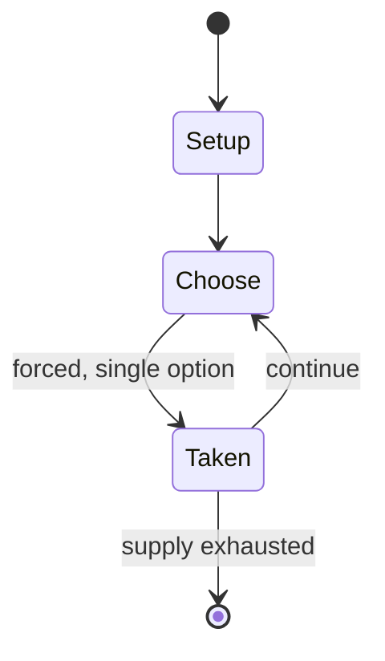

# Jinsei Game

*Japanese board game*

`jinsei_game` &nbsp; state: **DEEPENED** &nbsp; method: **heuristic**

## Found layer (recorded, not trusted)

| field | value |
| --- | --- |
| wikidata | Q6202748 |
| wikipedia | Jinsei Game |
| genres (source) | -- |
| instance of (source) | board game |
| country of origin | Japan |

## Declared layer (orders bench work)

| field | value |
| --- | --- |
| year created | 1968 |
| epoch | MODERN |
| region | EAST_ASIA |
| media | BOARD, VIDEO |
| players | 2-8 |
| age band | -- |
| exogenous process | -- |
| loss shape | -- |
| live axes | - |
| horizon | -- |
| scoring shape | -- |
| information | -- |
| interaction | -- |
| turn structure | -- |
| tractability | SAMPLING_ONLY |
| randomness | -- |
| luck factor | 0.35 |
| rules complexity | 1.69 |
| strategic depth | 2.0 |
| novelty | 0.0877 |
| solved status | -- |
| strategies | -- |
| algorithms | -- |

## Object model

```
Episode
  players      : 2-8
  turn_structure: ?
  horizon       : ?
  scoring       : ?

Board          -- spatial substrate; cells carry position and occupancy
Piece          -- movable token owned by a player
WorldState     -- simulation state advanced by the engine
Avatar         -- player-controlled agent
Clock          -- frame or tick counter
```

## State transition diagram



## Research item -- turn trace

```
# Jinsei Game -- simulated turn events
# generated from the DECLARED vector, not from a rulebook.
# structure: exo=None loss=None horizon=None scoring=None axes=-

t=0    SETUP        players=2  pot=0  capacity=7
t=1    FORCED       p1 single legal option taken (pot_gain=+0.6)
t=2    FORCED       p1 single legal option taken (pot_gain=+1.0)
t=3    FORCED       p1 single legal option taken (pot_gain=+1.5)
t=4    FORCED       p1 single legal option taken (pot_gain=+1.7)
t=5    FORCED       p1 single legal option taken (pot_gain=+0.6)
t=6    FORCED       p1 single legal option taken (pot_gain=+1.9)
t=7    ENDTURN      turn passes to p2
t=8    FORCED       p2 single legal option taken (pot_gain=+0.8)
t=9    FORCED       p2 single legal option taken (pot_gain=+1.6)
t=10   ENDTURN      turn passes to p1
t=11   FORCED       p1 single legal option taken (pot_gain=+0.7)
t=12   ENDTURN      turn passes to p2
t=13   FORCED       p2 single legal option taken (pot_gain=+1.4)
t=14   ENDTURN      turn passes to p1
t=15   FORCED       p1 single legal option taken (pot_gain=+1.6)
t=16   ENDTURN      turn passes to p2
t=17   FORCED       p2 single legal option taken (pot_gain=+1.6)
t=18   ENDTURN      turn passes to p1
t=19   FORCED       p1 single legal option taken (pot_gain=+0.6)
t=20   FORCED       p1 single legal option taken (pot_gain=+1.1)
t=21   ENDTURN      turn passes to p2
t=22   FORCED       p2 single legal option taken (pot_gain=+0.9)
t=23   FORCED       p2 single legal option taken (pot_gain=+0.8)
t=24   FORCED       p2 single legal option taken (pot_gain=+1.6)
t=25   FORCED       p2 single legal option taken (pot_gain=+0.7)
t=26   ENDTURN      turn passes to p1

terminal: VARIABLE
```

## Source extract

Jinsei Game (人生ゲーム; "Life Game") is the Japanese version of the board game that is called The
Game of Life in North America. Unlike The Game of Life, the player starts in their toddler years
and has to go to elementary school, junior high school, and high school before being allowed to
either go to university or start their career. However, the board game has been updated numerous
times like its North American counterpart. It was released in 1968 by toy company called Takara.
It has been enjoyed by Japanese boys and girls for generations. The game has been adapted for
the Famicom, the Super Famicom, the Game Boy, the Saturn, the PlayStation, the Nintendo 64, the
Game Boy Color, the Dreamcast, the Game Boy Advance, the PlayStation 2, the GameCube, the
Nintendo DS, the Wii, and the Nintendo Switch. Most of them are considered to be electronic
board games while RPG Jinsei Game functions more like a role playing game with a post-industrial
theme.   == Video game adaptations ==   === Famicom === Bakushou!! Jinsei Gekijou (1988)
Bakushou!! Star Monomane Shittenou (1990) Bakushou!! Jinsei Gekijou 2 (1991) Bakushou!! Jinsei
Gekijou 3 (1991) Aa Yakyū Jinsei Itchokusen (1992) RPG Jinsei Game

<sub>Wikipedia, CC BY-SA. Retained as evidence for the structural
classification above. Every rule inferred from it is HYPOTHESIZED
until audited against a rulebook.</sub>
