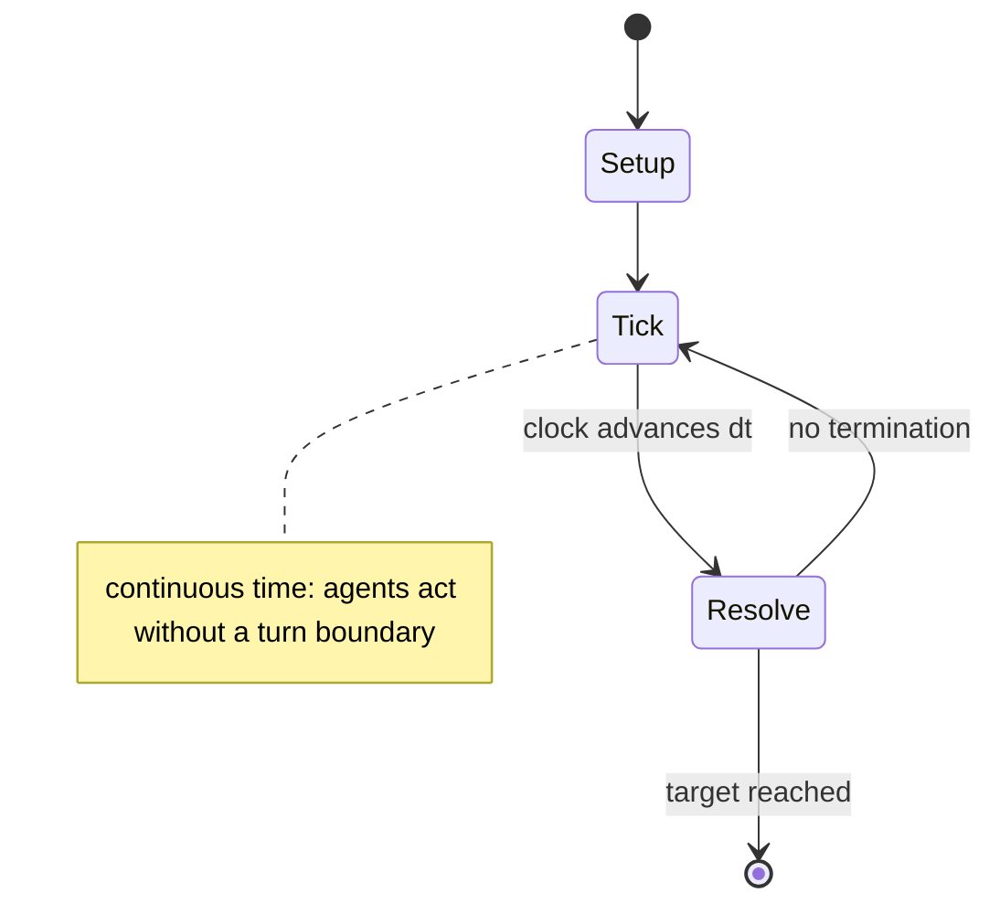

# Jungle Speed

`jungle_speed` &nbsp; state: **DEEPENED** &nbsp; method: **heuristic**

## Found layer (recorded, not trusted)

| field | value |
| --- | --- |
| wikidata | Q17270 |
| wikipedia | Jungle Speed |
| genres (source) | -- |
| instance of (source) | -- |
| country of origin | -- |

## Declared layer (orders bench work)

| field | value |
| --- | --- |
| year created | -- |
| epoch | -- |
| region | -- |
| media | CARD |
| players | -- |
| age band | CHILD |
| exogenous process | DEPLETING_DECK |
| loss shape | -- |
| live axes | DISCARD |
| horizon | RACE_TO_TARGET |
| scoring shape | -- |
| information | SIMULTANEOUS |
| interaction | SOLITAIRE |
| turn structure | REAL_TIME |
| tractability | SAMPLING_ONLY |
| randomness | DECK_DEPLETING, DECK_SHUFFLE, SIMULTANEOUS_CHOICE |
| luck factor | 0.48 |
| rules complexity | 2.77 |
| strategic depth | 2.25 |
| novelty | 0.0938 |
| solved status | -- |
| strategies | blocking |
| algorithms | -- |

## Object model

```
Episode
  players      : ?
  turn_structure: REAL_TIME
  horizon       : RACE_TO_TARGET
  scoring       : ?

Deck           -- ordered multiset, drawn without replacement
Hand           -- private multiset held by one player
DiscardPile    -- public accumulation of spent cards
DiscardChoice  -- what is given up to satisfy a limit
```

## State transition diagram



## Research item -- clock trace

```
# Jungle Speed -- simulated clock trace (no turn boundary)
# generated from the DECLARED vector, not from a rulebook.
# structure: exo=DEPLETING_DECK loss=None horizon=RACE_TO_TARGET scoring=None axes=DISCARD

clk=0.000s  START        agents=4  clock=free running
clk=0.914s  CONTEST      a4 and a1 contend for the same resource
clk=3.327s  SCORE        a3 scores (+3)
clk=6.231s  SCORE        a1 scores (+2)
clk=6.663s  ACTION       a3 acts continuously; no turn boundary crossed
clk=9.507s  INFRACTION   a4 commits infraction (count=1)
clk=12.107s  SCORE        a2 scores (+1)
clk=13.881s  ACTION       a1 acts continuously; no turn boundary crossed
clk=16.590s  CONTEST      a1 and a2 contend for the same resource
clk=17.331s  ACTION       a4 acts continuously; no turn boundary crossed
clk=17.571s  INFRACTION   a4 commits infraction (count=2)
clk=19.602s  SCORE        a1 scores (+1)
clk=20.247s  SCORE        a3 scores (+2)
clk=21.846s  INFRACTION   a1 commits infraction (count=1)
clk=23.877s  SCORE        a4 scores (+3)
clk=24.529s  ACTION       a2 acts continuously; no turn boundary crossed
clk=25.556s  ACTION       a2 acts continuously; no turn boundary crossed
clk=27.539s  STOPPAGE     clock halts; state frozen
clk=28.549s  ACTION       a3 acts continuously; no turn boundary crossed
clk=30.986s  STOPPAGE     clock halts; state frozen
clk=31.800s  ACTION       a2 acts continuously; no turn boundary crossed
clk=33.750s  CONTEST      a1 and a2 contend for the same resource
clk=36.528s  ACTION       a4 acts continuously; no turn boundary crossed
clk=37.425s  ACTION       a1 acts continuously; no turn boundary crossed
clk=38.377s  ACTION       a1 acts continuously; no turn boundary crossed
clk=39.013s  ACTION       a2 acts continuously; no turn boundary crossed
clk=40.207s  ACTION       a4 acts continuously; no turn boundary crossed

note: elapsed time, not move count, is the episode's ordering variable.
```

## Conditions

| kind | threshold | effect | trigger |
| --- | --- | --- | --- |
| WIN | -- | -- | The winner is the first player to get rid of all their cards and have them passed onto other players or the pot. |
| WIN | -- | -- | The first to place their hand on the totem is the winner of the round, while the last person is the loser. |
| TERMINATE | -- | -- | Once the round ends, normal play resumes. |
| PENALTY | -- | -- | If a player commits one of the following errors, or "Fouls", they must take all the cards currently in play (the discard piles of all the other players plus all the cards in the pot) and place them at the bottom of their |

## Source extract

Jungle Speed is a card game created by Thomas Vuarchex and Pierric Yakovenko in 1991. First
self-published and now published by Asmodee Editions, it is played with non-standard playing
cards. An expansion and all-in set have been published.   == Rules == The game revolves around
matching cards with identical symbols, and it has some similarities to the children's game
Slapjack. Complexity is added by some visual similarities between some of the symbols, as well
as additional rules.  Cards are shuffled and dealt to each player face down, ensuring that all
players have an equal number of cards in their stacks. A wooden (or rubber) cylinder called a
"Totem" is placed in the center of the table, equidistant from all players. Any remaining cards
that cannot be distributed equitably are placed under the totem in an area known as the "Pot".
Players take turns playing the top card from their stacks in a clockwise rotation. Each player
does this by flipping their card over in the direction of their opponents, so that their
opponents get the first glance at their card to avoid unfair advantage. The card is then quickly
placed in front of the player's pile. Thus players form discard piles in

<sub>Wikipedia, CC BY-SA. Retained as evidence for the structural
classification above. Every rule inferred from it is HYPOTHESIZED
until audited against a rulebook.</sub>
