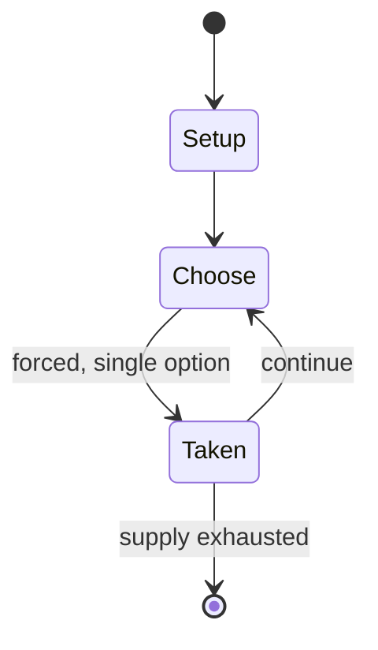

# Junk Yard

*pinball game*

`junk_yard` &nbsp; state: **DEEPENED** &nbsp; method: **heuristic**

## Found layer (recorded, not trusted)

| field | value |
| --- | --- |
| wikidata | Q20926324 |
| wikipedia | Junk Yard (pinball) |
| genres (source) | -- |
| instance of (source) | video game |
| country of origin | -- |

## Declared layer (orders bench work)

| field | value |
| --- | --- |
| year created | 1996 |
| epoch | DIGITAL |
| region | -- |
| media | VIDEO |
| players | -- |
| age band | -- |
| exogenous process | -- |
| loss shape | -- |
| live axes | - |
| horizon | -- |
| scoring shape | -- |
| information | -- |
| interaction | -- |
| turn structure | -- |
| tractability | SAMPLING_ONLY |
| randomness | -- |
| luck factor | 0.35 |
| rules complexity | 1.74 |
| strategic depth | 2.0 |
| novelty | 0.0914 |
| solved status | -- |
| strategies | -- |
| algorithms | -- |

## Object model

```
Episode
  players      : ?
  turn_structure: ?
  horizon       : ?
  scoring       : ?

WorldState     -- simulation state advanced by the engine
Avatar         -- player-controlled agent
Clock          -- frame or tick counter
```

## State transition diagram



## Research item -- turn trace

```
# Junk Yard -- simulated turn events
# generated from the DECLARED vector, not from a rulebook.
# structure: exo=None loss=None horizon=None scoring=None axes=-

t=0    SETUP        players=2  pot=0  capacity=8
t=1    FORCED       p1 single legal option taken (pot_gain=+1.8)
t=2    FORCED       p1 single legal option taken (pot_gain=+1.9)
t=3    FORCED       p1 single legal option taken (pot_gain=+1.9)
t=4    FORCED       p1 single legal option taken (pot_gain=+0.7)
t=5    ENDTURN      turn passes to p2
t=6    FORCED       p2 single legal option taken (pot_gain=+1.1)
t=7    FORCED       p2 single legal option taken (pot_gain=+1.3)
t=8    FORCED       p2 single legal option taken (pot_gain=+1.5)
t=9    FORCED       p2 single legal option taken (pot_gain=+1.5)
t=10   FORCED       p2 single legal option taken (pot_gain=+1.0)
t=11   FORCED       p2 single legal option taken (pot_gain=+0.8)
t=12   FORCED       p2 single legal option taken (pot_gain=+1.1)
t=13   FORCED       p2 single legal option taken (pot_gain=+1.5)
t=14   FORCED       p2 single legal option taken (pot_gain=+0.7)
t=15   FORCED       p2 single legal option taken (pot_gain=+0.5)
t=16   FORCED       p2 single legal option taken (pot_gain=+1.0)
t=17   FORCED       p2 single legal option taken (pot_gain=+1.0)
t=18   FORCED       p2 single legal option taken (pot_gain=+0.6)
t=19   FORCED       p2 single legal option taken (pot_gain=+1.7)
t=20   ENDTURN      turn passes to p1
t=21   FORCED       p1 single legal option taken (pot_gain=+1.2)
t=22   FORCED       p1 single legal option taken (pot_gain=+1.9)
t=23   FORCED       p1 single legal option taken (pot_gain=+0.9)
t=24   FORCED       p1 single legal option taken (pot_gain=+0.6)
t=25   ENDTURN      turn passes to p2
t=26   FORCED       p2 single legal option taken (pot_gain=+1.8)

terminal: VARIABLE
```

## Source extract

Junk Yard is a pinball game released by Williams Electronics in 1996. The game uses the DCS
sound system. The game was advertised with the slogan "The meanest game in the whole darn
town.".   == Design == The prototype differs from the production version. Dwight Sullivan
published the in-game story of creating the various contraptions. The junkyard is located near
Tony's Palace which is shown on the backglass, and was the location used in WHO Dunnit.   ==
Description == The playfield of Junk Yard contains different toys e.g. a crane with a wrecking
ball - a pinball hanging from a chain, a toilet that flushes the ball and a doghouse with an
attack dog. The player assumes the role of an inventor who is locked inside a junkyard after it
has closed for the night and must find a way to escape. The goal is to collect pieces of junk
and build various machines (shown on the blueprint in the center of the playfield), each of
which enables a mode or mini-game when completed. Once all the modes have been played, the
player can start one more mode involving a battle against the junkyard owner in outer space. A
devil and angel give tips to the player on what to do. Slingshots are lit by control

<sub>Wikipedia, CC BY-SA. Retained as evidence for the structural
classification above. Every rule inferred from it is HYPOTHESIZED
until audited against a rulebook.</sub>
