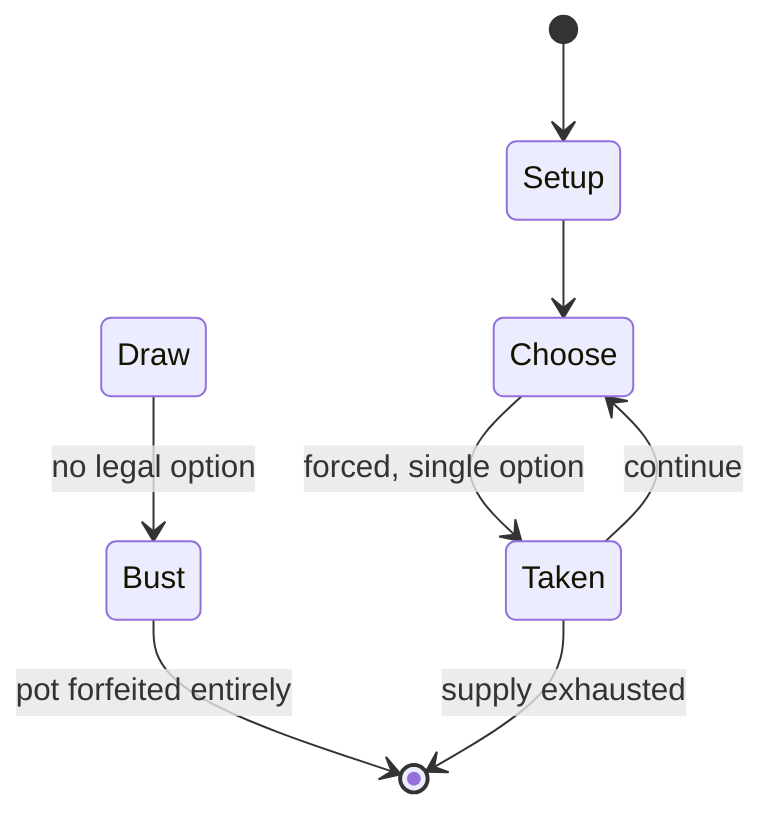

# Jurassic Park

*pinball game*

`jurassic_park` &nbsp; state: **DEEPENED** &nbsp; method: **heuristic**

## Found layer (recorded, not trusted)

| field | value |
| --- | --- |
| wikidata | Q4890320 |
| wikipedia | Jurassic Park (pinball) |
| genres (source) | -- |
| instance of (source) | pinball machine game, video game |
| country of origin | -- |

## Declared layer (orders bench work)

| field | value |
| --- | --- |
| year created | 1993 |
| epoch | DIGITAL |
| region | -- |
| media | VIDEO |
| players | -- |
| age band | -- |
| exogenous process | -- |
| loss shape | TOTAL_RUIN |
| live axes | - |
| horizon | -- |
| scoring shape | -- |
| information | -- |
| interaction | COOPERATIVE |
| turn structure | -- |
| tractability | SAMPLING_ONLY |
| randomness | -- |
| luck factor | 0.35 |
| rules complexity | 1.91 |
| strategic depth | 2.0 |
| novelty | 0.671 |
| solved status | -- |
| strategies | -- |
| algorithms | -- |

## Object model

```
Episode
  players      : ?
  turn_structure: ?
  horizon       : ?
  scoring       : ?

WorldState     -- simulation state advanced by the engine
Avatar         -- player-controlled agent
Clock          -- frame or tick counter
```

## State transition diagram



## Research item -- turn trace

```
# Jurassic Park -- simulated turn events
# generated from the DECLARED vector, not from a rulebook.
# structure: exo=None loss=TOTAL_RUIN horizon=None scoring=None axes=-

t=0    SETUP        players=2  pot=0  capacity=6
t=1    FORCED       p1 single legal option taken (pot_gain=+0.8)
t=2    ENDTURN      turn passes to p2
t=3    DEATH        p2 no legal option -- BUST. pot 0.8 -> 0.0
t=4    NOTE         loss_shape=TOTAL_RUIN: entire pot forfeited

terminal: VARIABLE
```

## Conditions

| kind | threshold | effect | trigger |
| --- | --- | --- | --- |
| BOUNDARY | -- | -- | System Boot: Shoot the Bunker, the Control Room, and the Power Shed scoops to collect a maximum of 30 million points. |

## Source extract

There have been five pinball adaptations of the Jurassic Park franchise beginning with a
physical table released by Data East pinball in 1993, the same month the original film released.
Sega's 1997 release The Lost World: Jurassic Park is based on the second movie of the series. A
virtual table developed by Zen Studios for the franchise's 25th anniversary in 2018 released as
DLC for the video game Pinball FX3. Another physical table was released by Stern Pinball in
2019, with a further version released by Stern Pinball in 2021.  All five tables have different
designs.   == Original Data East version ==   === Design === The table was initially planned to
be based on Cadillacs and Dinosaurs as a favor to Bernie Stolar, then Executive Vice-President
of Sony. Data East were pleased when they lost this license to Williams, and replaced it with
Jurassic Park. The most prominent feature of the table is the animated T-Rex head which can pick
up and swallow the ball, which was protected by a patent. After observing it at the Rock and
Roll McDonald’s test location Williams complained to Data East that the T-Rex following the ball
around the table violated a patent used on FunHouse, and Data

<sub>Wikipedia, CC BY-SA. Retained as evidence for the structural
classification above. Every rule inferred from it is HYPOTHESIZED
until audited against a rulebook.</sub>
