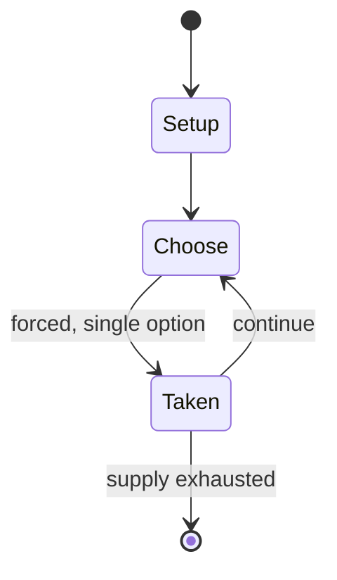

# Just One

*2018 party game*

`just_one` &nbsp; state: **DEEPENED** &nbsp; method: **heuristic**

## Found layer (recorded, not trusted)

| field | value |
| --- | --- |
| wikidata | Q63973259 |
| wikipedia | Just One (board game) |
| genres (source) | -- |
| instance of (source) | card game, cooperative board game, party game, word game |
| country of origin | -- |

## Declared layer (orders bench work)

| field | value |
| --- | --- |
| year created | 2018 |
| epoch | CONTEMPORARY |
| region | -- |
| media | BOARD, CARD, PARTY |
| players | 3-7 |
| age band | -- |
| exogenous process | -- |
| loss shape | -- |
| live axes | DISCARD |
| horizon | -- |
| scoring shape | -- |
| information | SIMULTANEOUS |
| interaction | COOPERATIVE |
| turn structure | -- |
| tractability | SAMPLING_ONLY |
| randomness | HIDDEN_INFO |
| luck factor | 0.35 |
| rules complexity | 2.04 |
| strategic depth | 2.0 |
| novelty | 0.6449 |
| solved status | -- |
| strategies | -- |
| algorithms | -- |

## Object model

```
Episode
  players      : 3-7
  turn_structure: ?
  horizon       : ?
  scoring       : ?

Board          -- spatial substrate; cells carry position and occupancy
Piece          -- movable token owned by a player
Deck           -- ordered multiset, drawn without replacement
Hand           -- private multiset held by one player
DiscardPile    -- public accumulation of spent cards
DiscardChoice  -- what is given up to satisfy a limit
```

## State transition diagram



## Research item -- turn trace

```
# Just One -- simulated turn events
# generated from the DECLARED vector, not from a rulebook.
# structure: exo=None loss=None horizon=None scoring=None axes=DISCARD

t=0    SETUP        players=3  pot=0  capacity=6
t=1    FORCED       p1 single legal option taken (pot_gain=+1.9)
t=2    DISCARD      p1 discards to hand limit
t=3    ENDTURN      turn passes to p2
t=4    FORCED       p2 single legal option taken (pot_gain=+0.7)
t=5    ENDTURN      turn passes to p3
t=6    FORCED       p3 single legal option taken (pot_gain=+2.0)
t=7    FORCED       p3 single legal option taken (pot_gain=+2.0)
t=8    DISCARD      p3 discards to hand limit
t=9    ENDTURN      turn passes to p1
t=10   FORCED       p1 single legal option taken (pot_gain=+1.5)
t=11   DISCARD      p1 discards to hand limit
t=12   FORCED       p1 single legal option taken (pot_gain=+1.1)
t=13   ENDTURN      turn passes to p2
t=14   FORCED       p2 single legal option taken (pot_gain=+1.5)
t=15   DISCARD      p2 discards to hand limit
t=16   FORCED       p2 single legal option taken (pot_gain=+1.5)
t=17   FORCED       p2 single legal option taken (pot_gain=+0.9)
t=18   DISCARD      p2 discards to hand limit
t=19   ENDTURN      turn passes to p3
t=20   FORCED       p3 single legal option taken (pot_gain=+1.4)
t=21   FORCED       p3 single legal option taken (pot_gain=+0.5)
t=22   DISCARD      p3 discards to hand limit
t=23   FORCED       p3 single legal option taken (pot_gain=+0.5)
t=24   DISCARD      p3 discards to hand limit
t=25   FORCED       p3 single legal option taken (pot_gain=+1.6)
t=26   FORCED       p3 single legal option taken (pot_gain=+1.0)

terminal: VARIABLE
```

## Conditions

| kind | threshold | effect | trigger |
| --- | --- | --- | --- |
| TERMINATE | -- | -- | The game ends immediately if the deck is empty. |

## Source extract

Just One is a cooperative party game for 3 to 7 players, designed by Ludovic Roudy and Bruno
Sautter, illustrated by Éric Azagury and Florian Poullet, and published by Repos Production. In
each round of the game, players write down a one word clue for the round's guesser. They must
then attempt to guess the secret word based on the submitted clues with identical ones removed.
Released in 2018, the game has been nominated for numerous awards.   == Gameplay ==  Just One is
a cooperative board game for three to seven players. 13 cards are drawn before each game,
forming the deck. On each round, one player is made the guesser, drawing a card, and, without
looking at it, naming a number from one to five, which correspond to different keywords. All
other players then read the chosen word and write one one-word clue on their whiteboard, hidden
from others' views. All clues are revealed at once, with exact duplicates and very similar words
being excluded. The guesser then attempts to guess the keyword based on the clues shown to them.
If the guess is correct, the group gains one point, while an incorrect guess leads to the next
card in the deck being discarded. The guesser may also pass, p

<sub>Wikipedia, CC BY-SA. Retained as evidence for the structural
classification above. Every rule inferred from it is HYPOTHESIZED
until audited against a rulebook.</sub>
