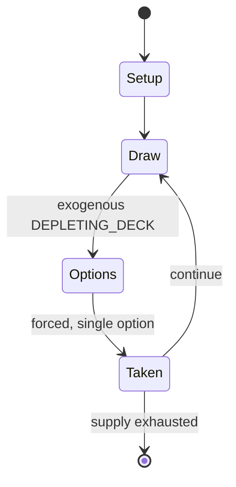

# Kabufuda

*Japanese playing cards*

`kabufuda` &nbsp; state: **DEEPENED** &nbsp; method: **heuristic**

## Found layer (recorded, not trusted)

| field | value |
| --- | --- |
| wikidata | Q1639025 |
| wikipedia | Kabufuda |
| genres (source) | -- |
| instance of (source) | card game |
| country of origin | Japan |

## Declared layer (orders bench work)

| field | value |
| --- | --- |
| year created | -- |
| epoch | -- |
| region | EAST_ASIA |
| media | CARD, GAMBLING |
| players | 2-5 |
| age band | -- |
| exogenous process | DEPLETING_DECK |
| loss shape | -- |
| live axes | TRADE |
| horizon | -- |
| scoring shape | SET_COLLECTION_CONVEX |
| information | -- |
| interaction | NEGOTIATION |
| turn structure | -- |
| tractability | INTRACTABLE |
| randomness | HIDDEN_INFO |
| luck factor | 0.35 |
| rules complexity | 2.54 |
| strategic depth | 2.0 |
| novelty | 0.9538 |
| solved status | -- |
| strategies | set_collection, tableau_building |
| algorithms | -- |

## Object model

```
Episode
  players      : 2-5
  turn_structure: ?
  horizon       : ?
  scoring       : SET_COLLECTION_CONVEX

Deck           -- ordered multiset, drawn without replacement
Hand           -- private multiset held by one player
DiscardPile    -- public accumulation of spent cards
Offer          -- proposed exchange between two agents
```

## State transition diagram



## Research item -- turn trace

```
# Kabufuda -- simulated turn events
# generated from the DECLARED vector, not from a rulebook.
# structure: exo=DEPLETING_DECK loss=None horizon=None scoring=SET_COLLECTION_CONVEX axes=TRADE

t=0    SETUP        players=2  pot=0  capacity=8
t=1    DRAW         p1 draw from deck -> outcome #3  (p=0.066)
t=2    FORCED       p1 single legal option taken (pot_gain=+0.7)
t=3    ENDTURN      turn passes to p2
t=4    DRAW         p2 draw from deck -> outcome #5  (p=0.180)
t=5    FORCED       p2 single legal option taken (pot_gain=+1.6)
t=6    DRAW         p2 draw from deck -> outcome #5  (p=0.178)
t=7    FORCED       p2 single legal option taken (pot_gain=+1.3)
t=8    TRADE        p2 offers 2:1 exchange to p1
t=9    DRAW         p2 draw from deck -> outcome #1  (p=0.206)
t=10   FORCED       p2 single legal option taken (pot_gain=+1.4)
t=11   ENDTURN      turn passes to p1
t=12   DRAW         p1 draw from deck -> outcome #1  (p=0.115)
t=13   FORCED       p1 single legal option taken (pot_gain=+1.3)
t=14   ENDTURN      turn passes to p2
t=15   DRAW         p2 draw from deck -> outcome #1  (p=0.209)
t=16   FORCED       p2 single legal option taken (pot_gain=+1.7)
t=17   ENDTURN      turn passes to p1
t=18   DRAW         p1 draw from deck -> outcome #4  (p=0.191)
t=19   FORCED       p1 single legal option taken (pot_gain=+1.1)
t=20   ENDTURN      turn passes to p2
t=21   DRAW         p2 draw from deck -> outcome #3  (p=0.012)
t=22   FORCED       p2 single legal option taken (pot_gain=+1.3)
t=23   TRADE        p2 offers 2:1 exchange to p1
t=24   DRAW         p2 draw from deck -> outcome #1  (p=0.143)
t=25   FORCED       p2 single legal option taken (pot_gain=+1.4)
t=26   DRAW         p2 draw from deck -> outcome #2  (p=0.115)
t=27   FORCED       p2 single legal option taken (pot_gain=+0.6)
t=28   TRADE        p2 offers 2:1 exchange to p1

terminal: VARIABLE
```

## Conditions

| kind | threshold | effect | trigger |
| --- | --- | --- | --- |
| PENALTY | -- | -- | If the player loses, the bet is forfeited to the dealer. |

## Source extract

Kabufuda (株札（かぶふだ）) are Japanese playing cards used for gambling games such as Oicho-Kabu mainly
used in the Kansai region. Like the related hanafuda (lit. 'flower cards'), kabufuda is a
descendant of mekuri karuta, which ultimately descends from 16th-century Portuguese playing
cards. Since suits are irrelevant in kabu games, decks used for those games became single-suited
during the 18th century. Like in baccarat, the object of most kabu games is to get a total
closest to nine. Early kabufuda decks had three ranks of face cards but since they have no
value, only the knaves were kept in most variants. The word kabu is believed to derive from the
Portuguese slang cavo meaning a stake, bet, or wager. Closely related are the gabo games played
with Korean tujeon cards and the Indian Ganjapa game of komi.   == Cards == Kabufuda cards, like
hanafuda, are smaller and stiffer than Western playing cards.  The standard Kabufuda pattern
deck contains 40 cards, representing the numbers 1 through 10, with four cards for each number.
Additionally, a blank card is often included as a spare. Standard Kabufuda uses only the Latin
suit of clubs from mekuri karuta and old Portuguese cards. One of the

<sub>Wikipedia, CC BY-SA. Retained as evidence for the structural
classification above. Every rule inferred from it is HYPOTHESIZED
until audited against a rulebook.</sub>
