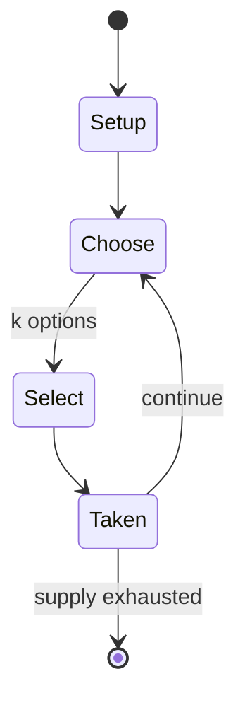

# Kancho

*practical joke in East Asian countries*

`kancho` &nbsp; state: **DEEPENED** &nbsp; method: **heuristic**

## Found layer (recorded, not trusted)

| field | value |
| --- | --- |
| wikidata | Q1199365 |
| wikipedia | Kanchō |
| genres (source) | -- |
| instance of (source) | children's game |
| country of origin | -- |

## Declared layer (orders bench work)

| field | value |
| --- | --- |
| year created | -- |
| epoch | -- |
| region | -- |
| media | - |
| players | -- |
| age band | CHILD |
| exogenous process | -- |
| loss shape | -- |
| live axes | ORDER, SELECT |
| horizon | -- |
| scoring shape | -- |
| information | -- |
| interaction | -- |
| turn structure | -- |
| tractability | SAMPLING_ONLY |
| randomness | -- |
| luck factor | 0.35 |
| rules complexity | 2.32 |
| strategic depth | 2.0 |
| novelty | 0.0866 |
| solved status | -- |
| strategies | -- |
| algorithms | -- |

## Object model

```
Episode
  players      : ?
  turn_structure: ?
  horizon       : ?
  scoring       : ?

Sequence       -- the permutation under the player's control
OptionSet      -- the choices available after an exogenous draw
```

## State transition diagram



## Research item -- turn trace

```
# Kancho -- simulated turn events
# generated from the DECLARED vector, not from a rulebook.
# structure: exo=None loss=None horizon=None scoring=None axes=ORDER,SELECT

t=0    SETUP        players=2  pot=0  capacity=5
t=1    SELECT       p1 1 options; take #1  (pot_gain=+1.9, capacity=-0)
t=2    SELECT       p1 3 options; take #1  (pot_gain=+0.9, capacity=-1)
t=3    SELECT       p1 4 options; take #2  (pot_gain=+1.2, capacity=-2)
t=4    SELECT       p1 2 options; take #1  (pot_gain=+1.1, capacity=-2)
t=5    SELECT       p1 4 options; take #2  (pot_gain=+2.4, capacity=-1)
t=6    SELECT       p1 1 options; take #1  (pot_gain=+2.8, capacity=-1)
t=7    SELECT       p1 4 options; take #3  (pot_gain=+2.2, capacity=-2)
t=8    ENDTURN      turn passes to p2
t=9    SELECT       p2 1 options; take #1  (pot_gain=+2.2, capacity=-2)
t=10   SELECT       p2 1 options; take #1  (pot_gain=+1.3, capacity=-0)
t=11   SELECT       p2 1 options; take #1  (pot_gain=+0.9, capacity=-0)
t=12   SELECT       p2 3 options; take #2  (pot_gain=+3.4, capacity=-0)
t=13   SELECT       p2 1 options; take #1  (pot_gain=+1.5, capacity=-0)
t=14   SELECT       p2 1 options; take #1  (pot_gain=+2.7, capacity=-2)
t=15   SELECT       p2 3 options; take #3  (pot_gain=+1.1, capacity=-2)
t=16   SELECT       p2 4 options; take #4  (pot_gain=+1.8, capacity=-2)
t=17   ENDTURN      turn passes to p1
t=18   SELECT       p1 3 options; take #2  (pot_gain=+1.8, capacity=-1)
t=19   SELECT       p1 4 options; take #2  (pot_gain=+2.0, capacity=-2)
t=20   SELECT       p1 1 options; take #1  (pot_gain=+1.7, capacity=-2)
t=21   SELECT       p1 1 options; take #1  (pot_gain=+1.6, capacity=-1)
t=22   SELECT       p1 3 options; take #1  (pot_gain=+3.4, capacity=-2)
t=23   SELECT       p1 3 options; take #1  (pot_gain=+2.0, capacity=-1)
t=24   ENDTURN      turn passes to p2
t=25   SELECT       p2 3 options; take #1  (pot_gain=+3.3, capacity=-2)
t=26   SELECT       p2 1 options; take #1  (pot_gain=+3.3, capacity=-0)

terminal: VARIABLE
```

## Source extract

Kanchō (カンチョー; pronounced [kaɲtɕoː]) is a prank performed by clasping the hands together in the
shape of a finger gun and poking the anus of an unsuspecting person, often while exclaiming
"Kan-cho!" It is a common prank in East Asian countries such as Japan. In Korea, it is called
ttongchim (똥침; 똥針, pronounced [t͈oŋ.tɕʰim]), and in China, qiānnián shā (千年殺, "thousand-year" or
"immortal kill"). The word "kanchō" is a slang adoption of the Japanese word for enema (浣腸,
kanchō). In accordance with widespread practice, the word is generally written in katakana when
used in its slang sense and in kanji when used for enemas in the medical sense. In English-
speaking countries, the term "goosing" generally refers to a comparatively mild poke, prod, or
pinch on or between the buttocks with the tips of the fingers and thumb, in imitation of a
harmless bite on the butt from a goose. This does not typically involve direct contact with or
penetration of the anus. However, the kanchō prank may also be informally known as "goosing" in
some contexts. Unlike traditional goosing, kanchō involves directly targeting the anus, which
means that performing it without consent in jurisdictions such as the U

<sub>Wikipedia, CC BY-SA. Retained as evidence for the structural
classification above. Every rule inferred from it is HYPOTHESIZED
until audited against a rulebook.</sub>
